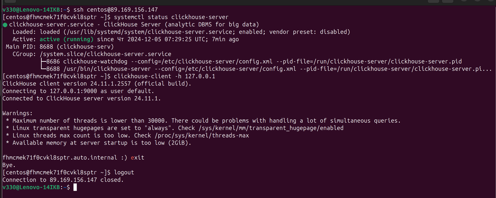
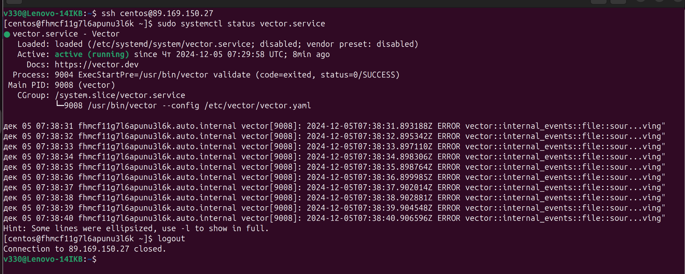
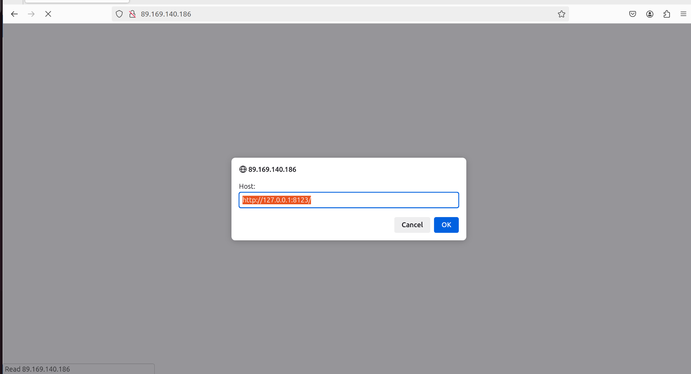

## Домашнее задание к занятию «Работа с roles»  

***
### Основная часть  
Результат ansible playbook  

  - Результат запуска на хостe clickhouse  
  

  - Результат запуска на хостe vector  
  

  - Результат запуска lighthouse  
  

[Ссылка на репозиторий vector-role](https://github.com/t937on/vector-role/blob/v1.1.1/README.md)  
  
[Ссылка на репозиторий lighthouse-role](https://github.com/t937on/lighthouse-role/blob/v1.1.1/README.md)  

***  
Файлы и скриншоты по задаче можно посмотреть [здесь](/),  
проект с изменённым [playbook](playbook/)  

