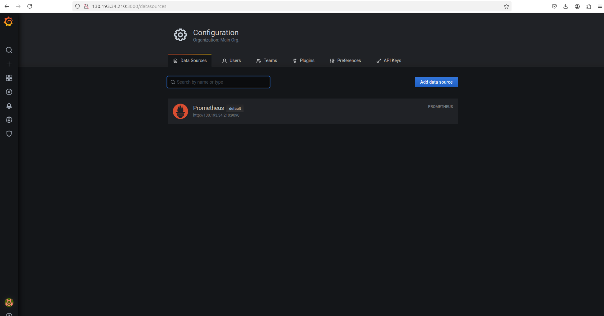
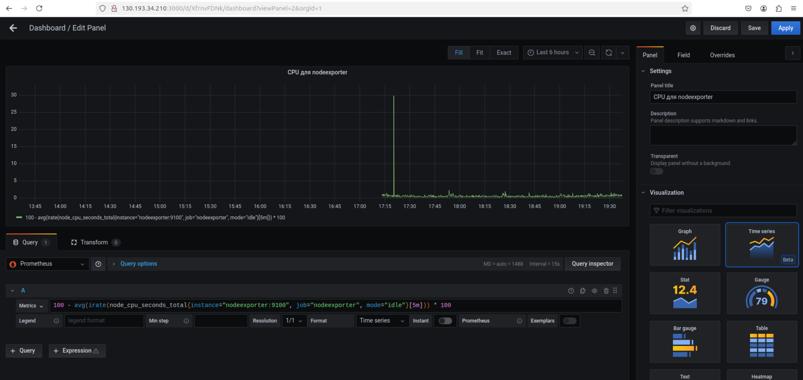
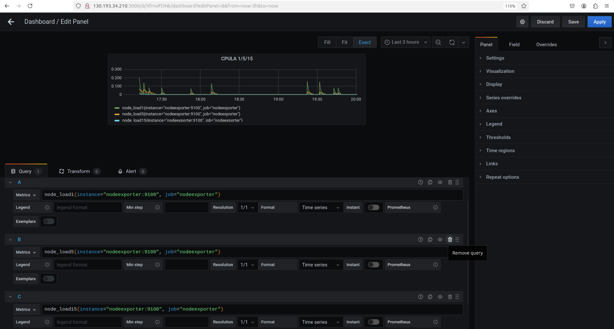
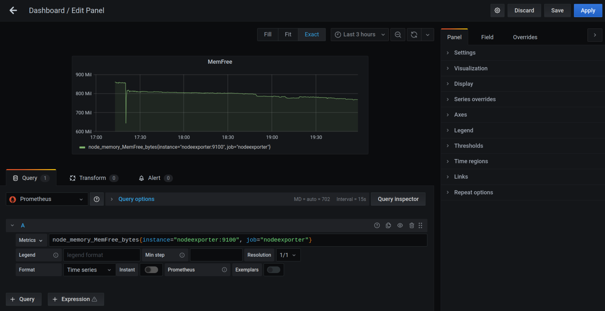
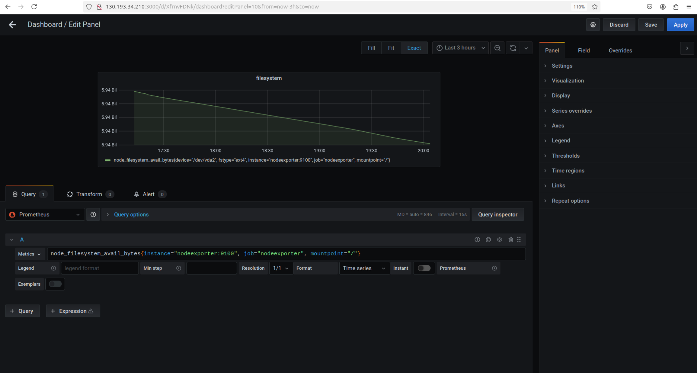
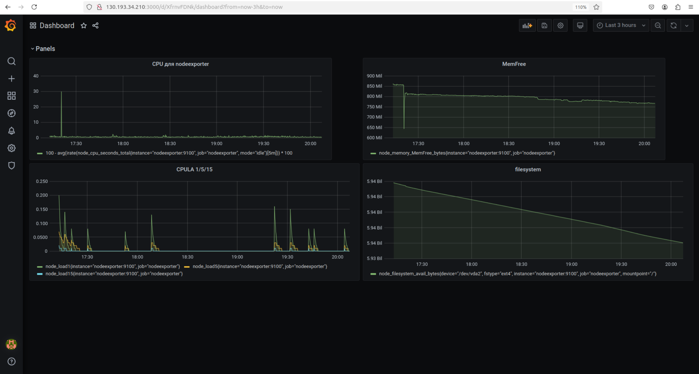
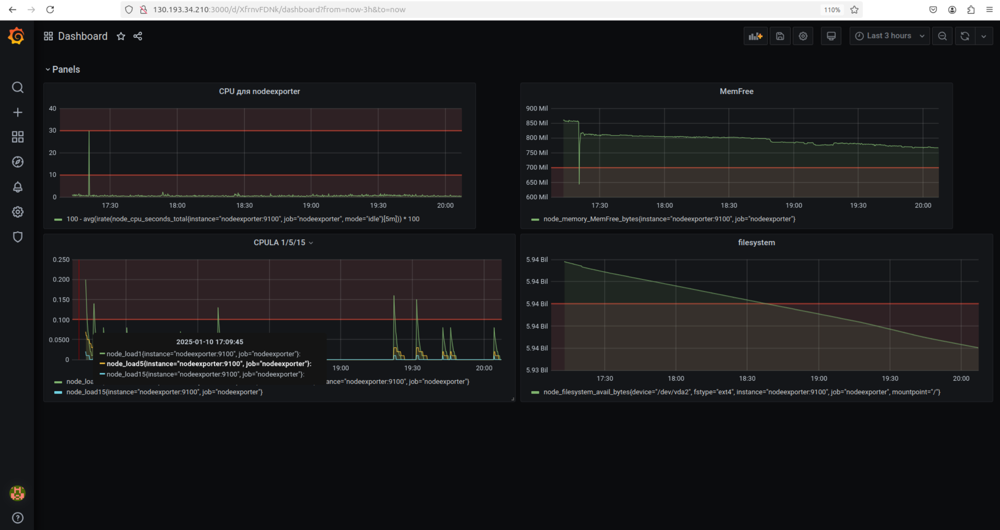
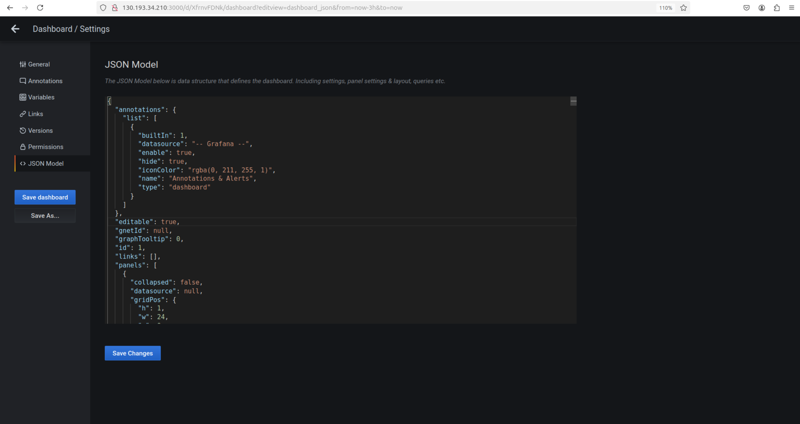

## Домашнее задание к занятию 14 «Средство визуализации Grafana»  
  
***  
### Обязательные задания  
1. Список подключенных Datasource  
  

2. promql-запросы для выдачи метрик  
  
  
  
  
  
  
  
  
скриншот Dashboard  
  

3. скриншот Dashboard  
  

4. JSON MODEL  
  
  
листинг [этого](JSON_MODEL.json) файла
  
  
***  
Файлы и скриншоты по задаче можно посмотреть [здесь](/)  

