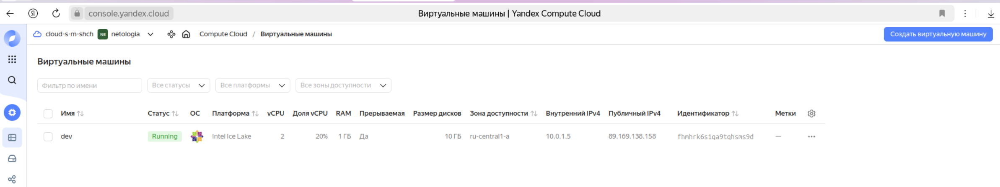
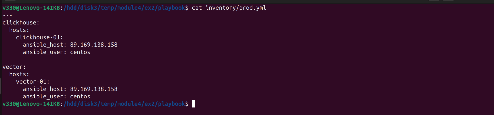
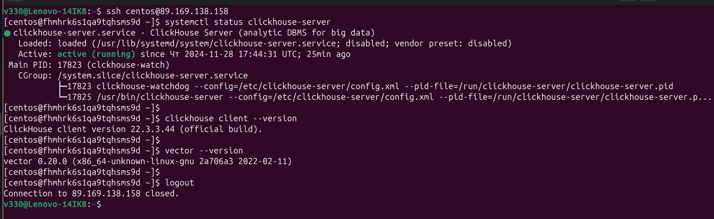
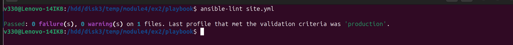
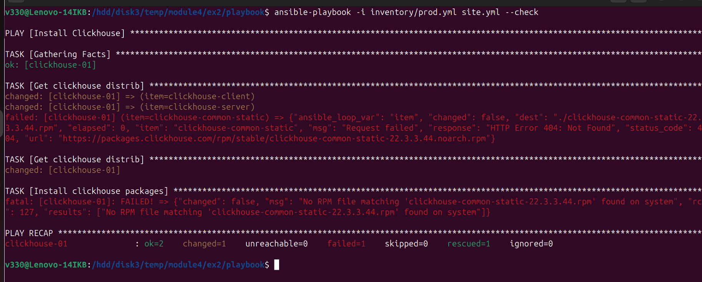
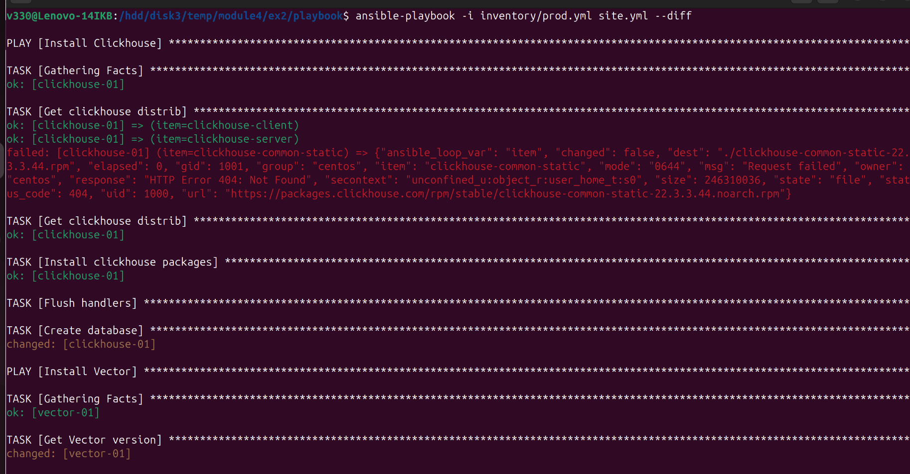
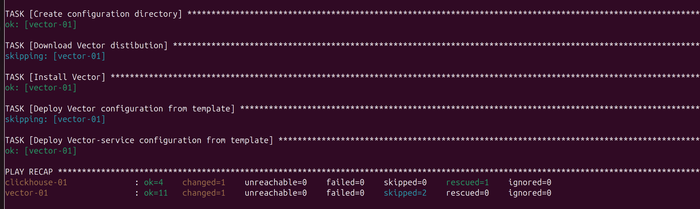
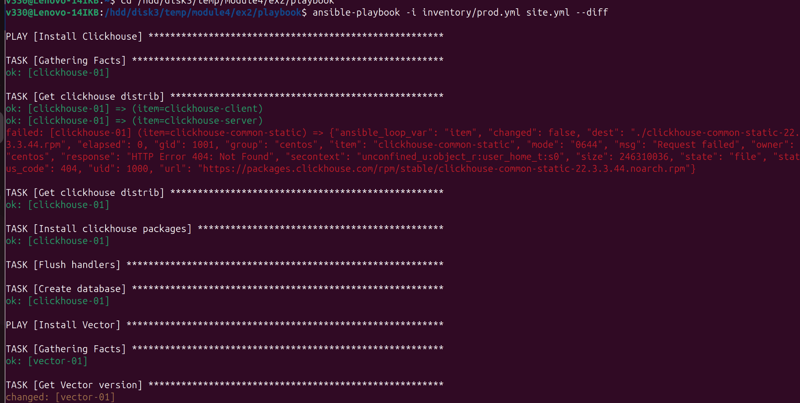
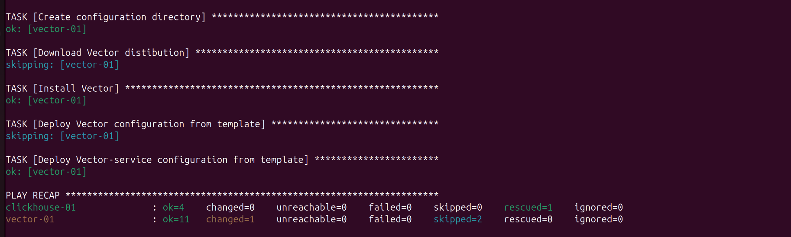

## Домашнее задание к занятию «Работа с Playbook»  

***  
### Подготовка к выполнению  
4. Подготовка хостов  
  

***
### Основная часть  
1. inventory-файл `prod.yml`  
  

2. Документация ansible playbook  
playbook `site.yml` предназначен для управления установкой и разворачивания конфигураций `Clickhouse` и `Vector`  
playbook содержит два play с названиями `Install Clickhouse` и `Install Vector`  
Каждый play связан с хостами группы `clickhouse` и `vector` соответственно  
Параметры хостов описаны в  inventory-файл `prod.yml`, имеют следующие параметры:  
  - ansible_host - IP адрес виртуальной машины в яндекс-облако  
  - ansible_user - login пользователя с привелигированными правами  
  
play `Install Vector` содержит следующие tasks:  
  - Get Vector version - предназначен для проверки версии Vector  
  - Create/Change directory - предназначен для создания и/или изменения прав доступа  
  - Download Vector distibution - предназначен для скачивания дистрибутива Vector  
  - Unarchive Vector distribution - предназначени для разархивирования скачанного дистрибутива  
  - Install Vector - предназначен для установки пакета  
  - Deploy from template - предназначен для создания конфигурационного файла на основании шаблона template-файла jinja2  
  
play `Install Vector` содержит обработчики:  
  - Restart Vector - предназначен для перезапуска Vector  
  
Результат запуска на хосте  
  

5. Исправление ошибок  
  

6. Запуск с флагом `--check`  
  

7. Запуск с флагом `--diff`  
  

  

8. Далее последующие запуски дают одинаковый результат  
  

  

***  
Файлы и скриншоты по задаче можно посмотреть [здесь](/),  
проект с изменённым [playbook](playbook/)  

