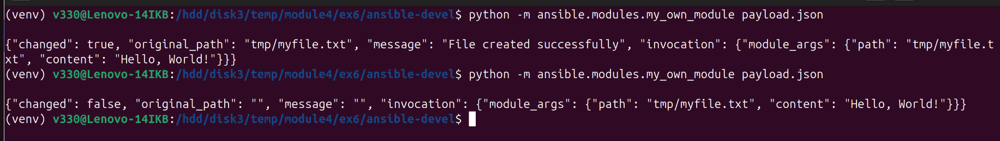
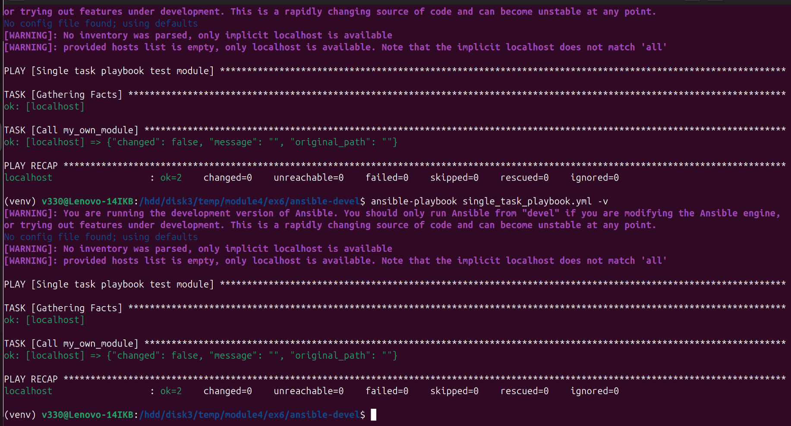
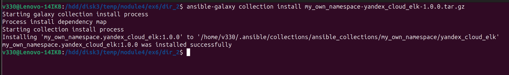
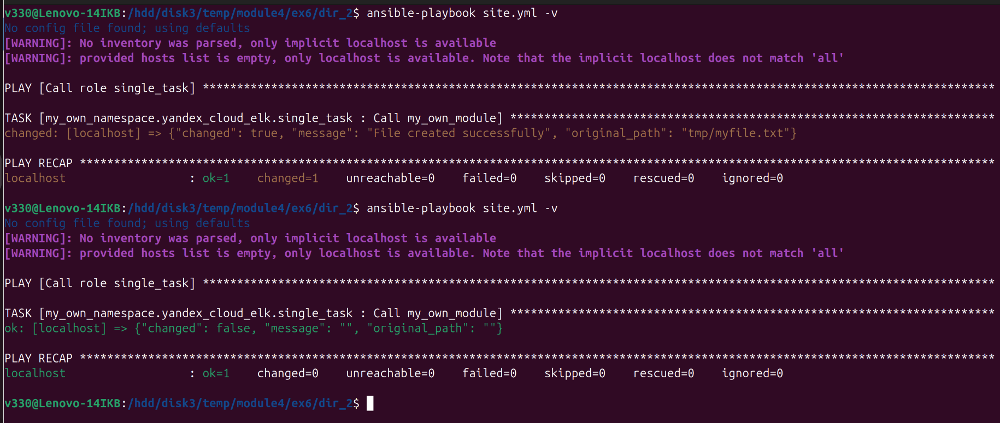

## Домашнее задание к занятию «Создание собственных модулей»  

***
### Основная часть  
4. Проверка module на исполняемость локально  
  

6. Проверка через playbook на идемпотентность  
  

15. Установка collection из локального архива  
  

16. Запуск playbook  
  

17.  
[Ссылка на collection](my_own_namespace/yandex_cloud_elk/)  
  
[Ссылка на tar.gz архив](dir_2/my_own_namespace-yandex_cloud_elk-1.0.0.tar.gz)  

***  
Файлы и скриншоты по задаче можно посмотреть [здесь](/)  

