## Домашнее задание к занятию «Введение в Ansible»  

***  
### Подготовка к выполнению  
1. версия Ansible  
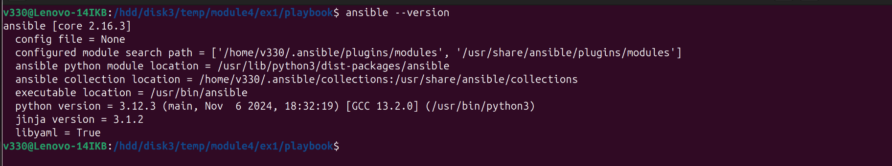  

***
### Основная часть  
1. факт `some_fact` имеет значение `12` хоста `localhost`  
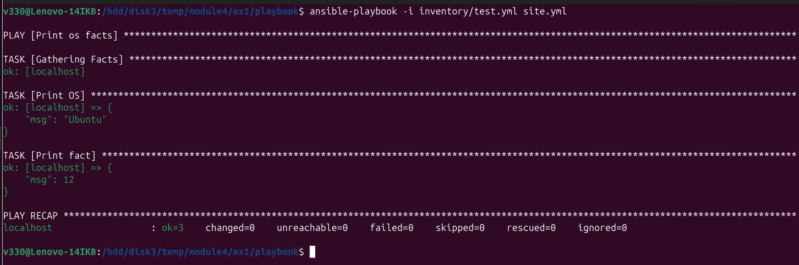  

2. Переменные `group_vars`  
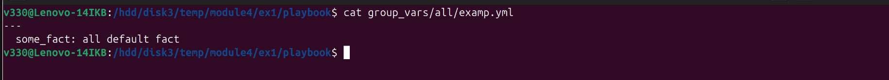  

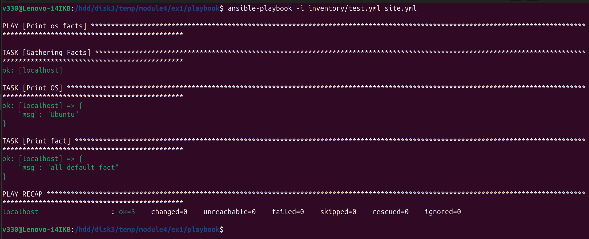  

3. Окружение для проведения дальнейших испытаний  
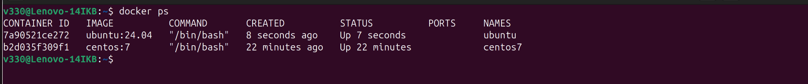  

4. факт `some_fact` имеет значения:
  - для хоста `centos7`: el  
  - для хоста `ubuntu`: deb  
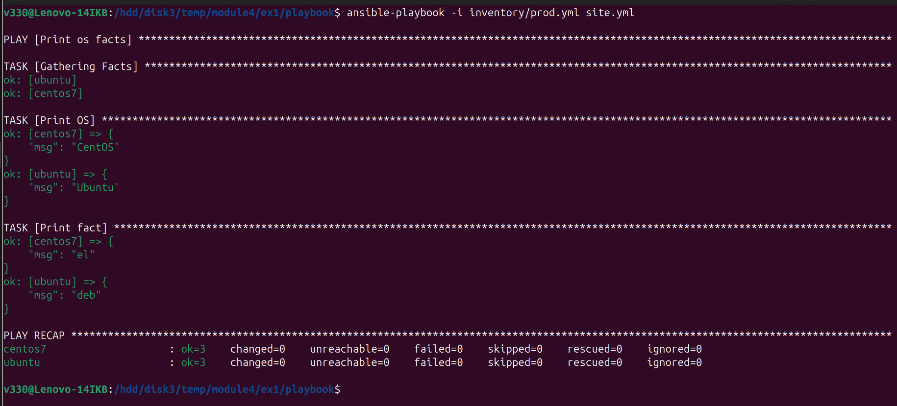  

5. Изменение `some_fact`  
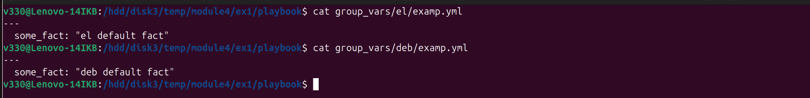  

6. 
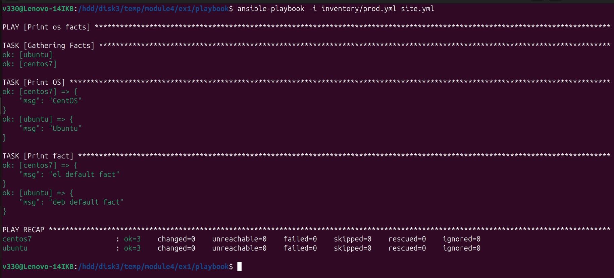  

7. Шифрование фактов  
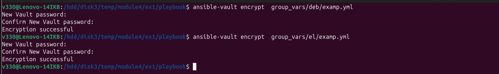  

8. Работоспособность с шифрованием  
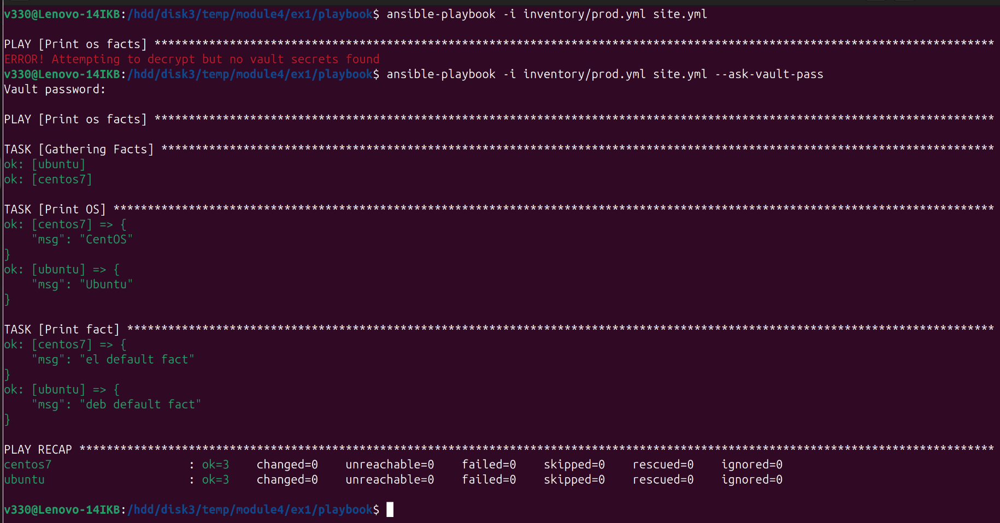  

9. Плагин для работы на `control node`  
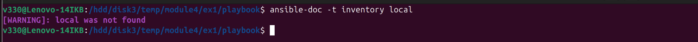  

10. Новая группа хостов с именем ` local`  
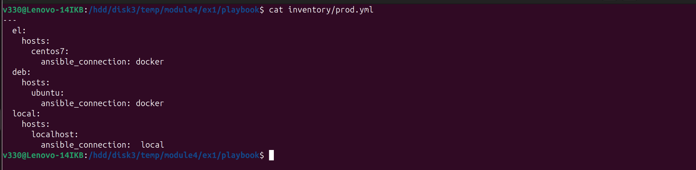  

11. `playbook` на окружении `prod.yml`  
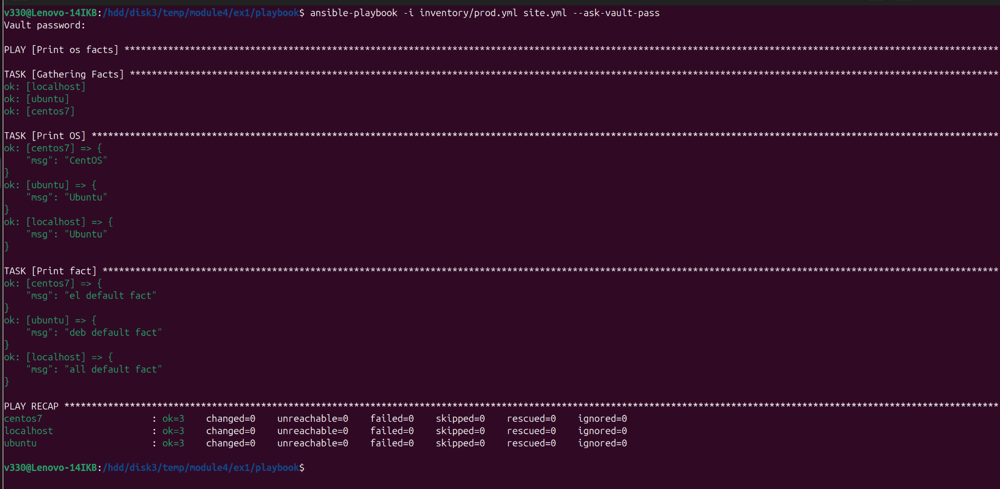  

Файлы и скриншоты по задаче можно посмотреть [здесь](/)  
репозиторий с изменённым [playbook](playbook/)  

***  
### Необязательная часть  
1. Расшифрование файлов с переменными  
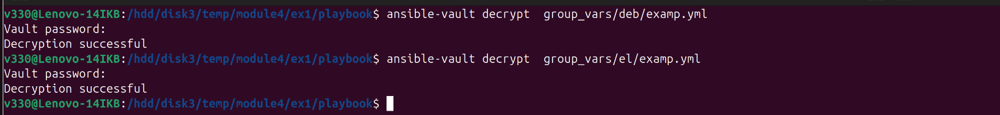  

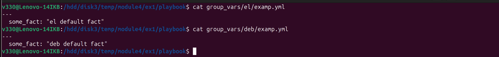  

2. Шифрование отдельного значения  
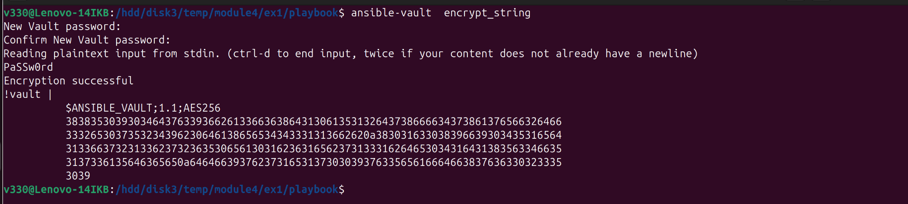  

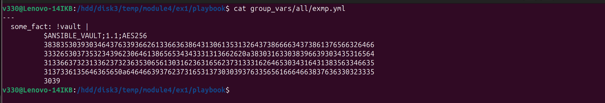  

3. `playbook` на окружении `prod.yml`  
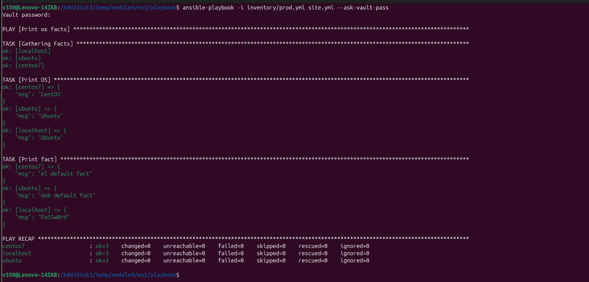  

4. Новая группа хостов с именем `fedora`  
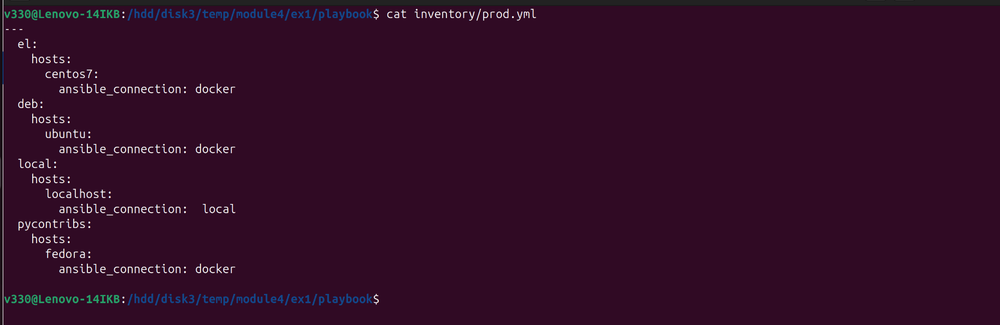  

5. Скрипт на bash  
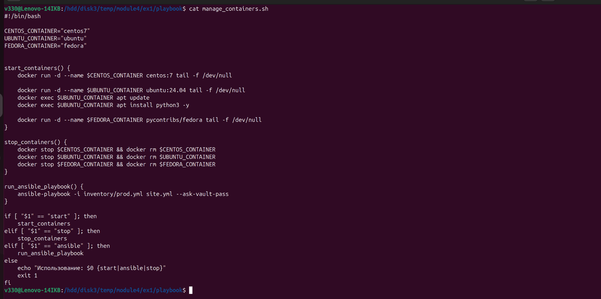  

Результат  
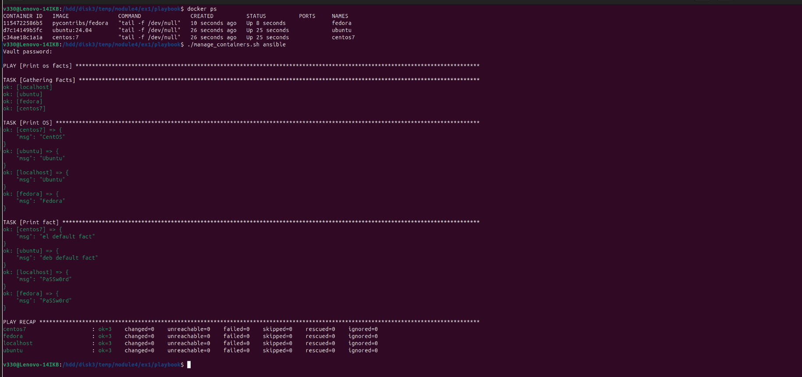  

Файлы и скриншоты по задаче можно посмотреть [здесь](/)  
репозиторий с изменённым [playbook](2/)  

