# Домашнее задание к занятию «Организация сети»
  
***  
### Задание 1. Yandex Cloud 
1. Подготовка Terraform  
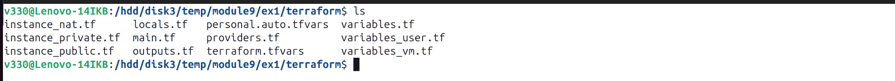  
  
2. Output Terraform   
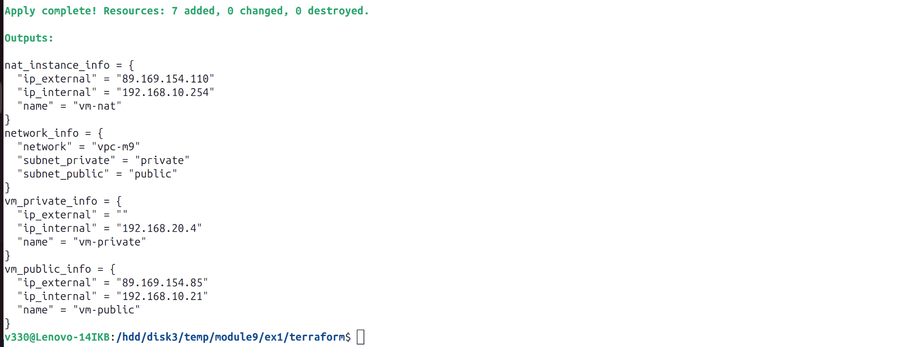  
  
3. Создать VPC   
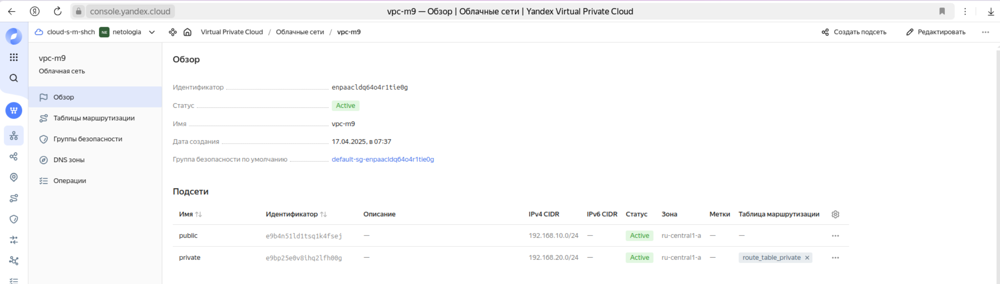  
  
4. Создать в VPC subnet с названием public, private   
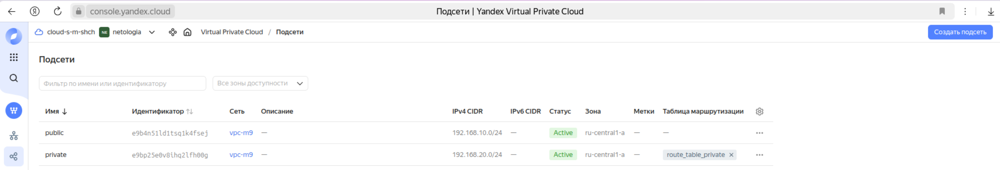  

5. Создать route table   
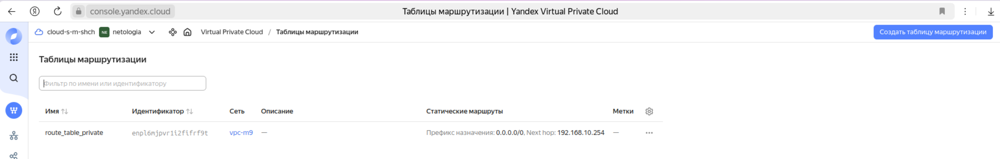  

6. Создать NAT-инстанс, присвоив ему адрес 192.168.10.254, виртуалку с публичным IP, виртуалку с внутренним IP   
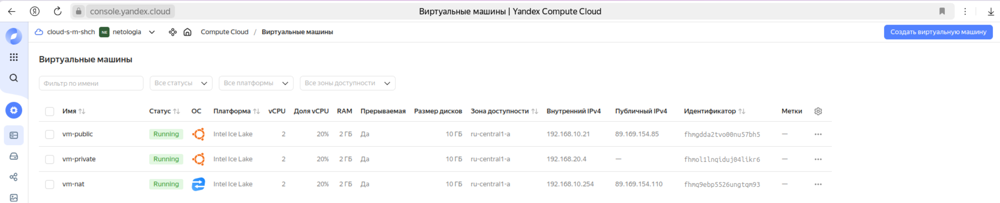  
  
7. Подключиться к виртуалке с публичным IP и убедиться, что есть доступ к интернету   
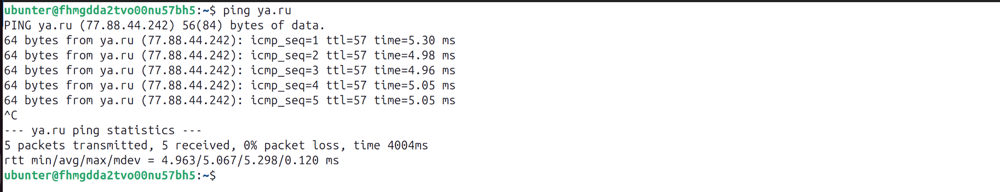  
  
8. Подключиться к виртуалке с внутренним IP через виртуалку с публичным IP и убедиться, что есть доступ к интернету   
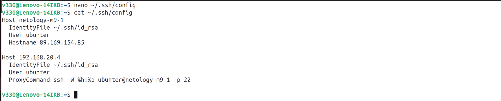  
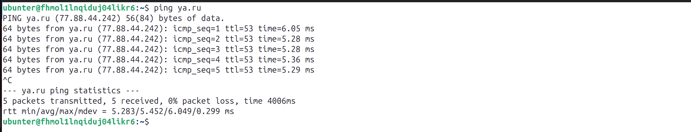  
 
9. Выполнить проверку, остановить NAT-инстанс    
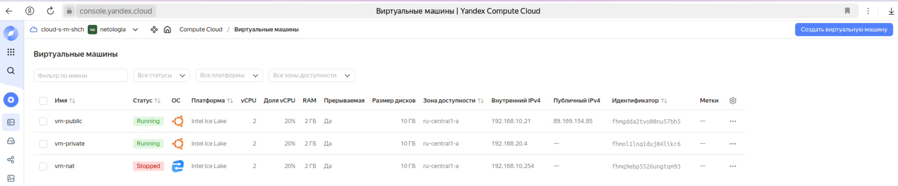  

10. NAT-инстанс остановлен. Подключиться к виртуалке с публичным IP и убедиться, что есть доступ к интернету   
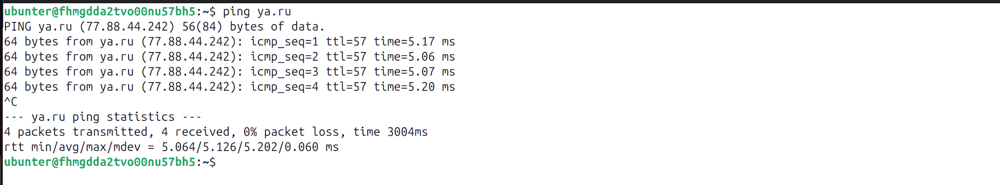  
  
11. NAT-инстанс остановлен. Подключиться к виртуалке с внутренним IP через виртуалку с публичным IP и убедиться, что нет доступа к интернету   
  
  
***  
Файлы и скриншоты по задаче можно посмотреть [здесь](/)  

