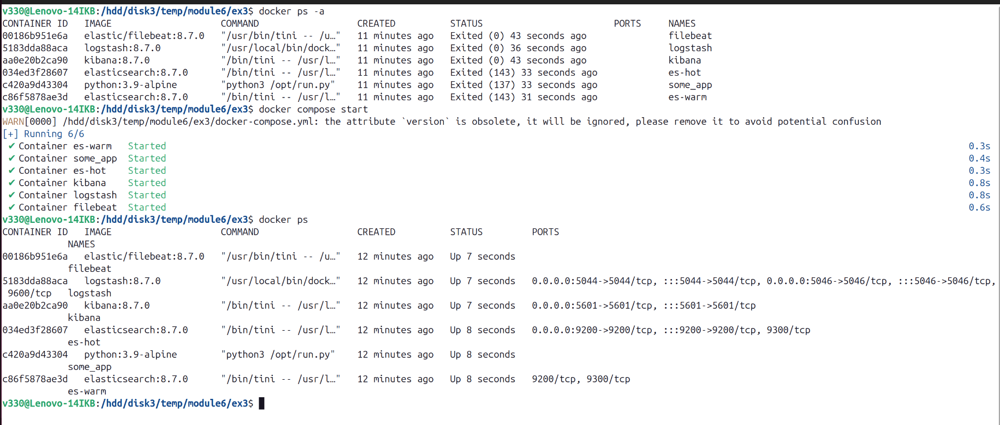
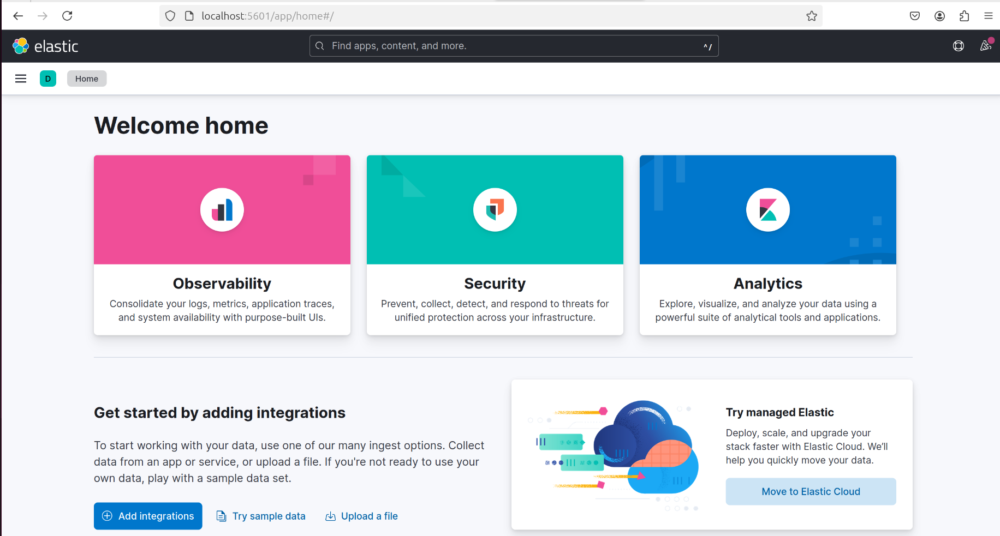
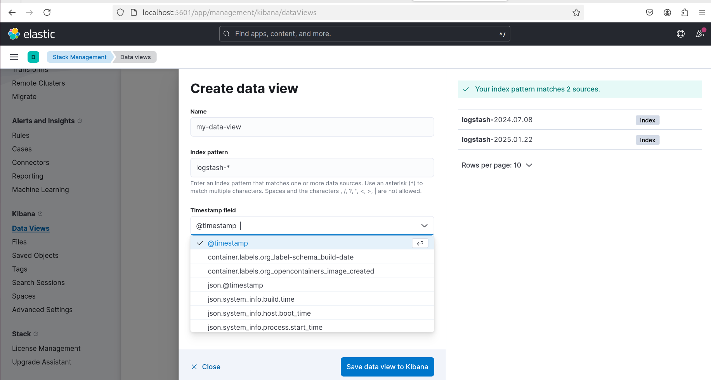
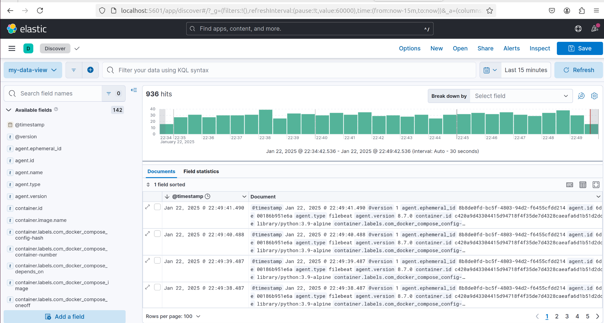
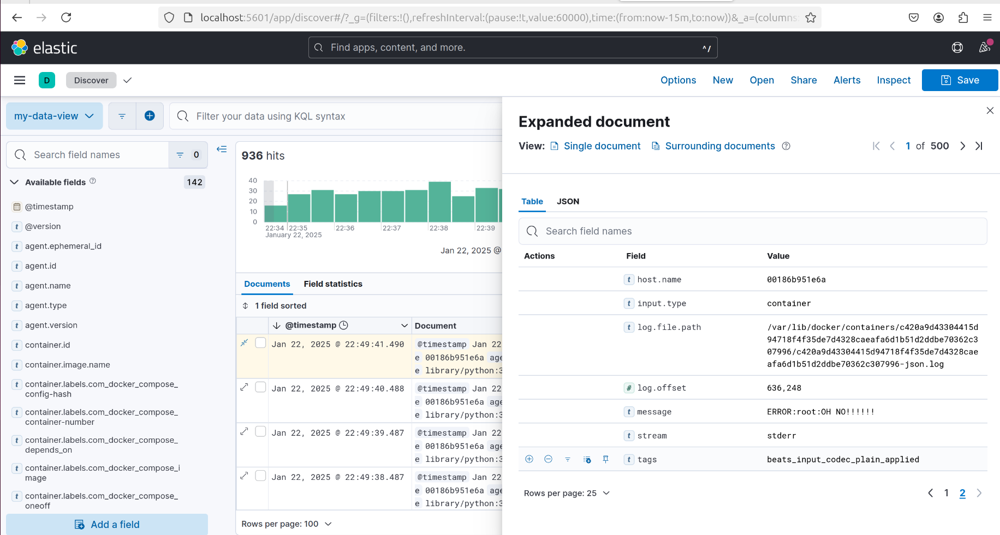
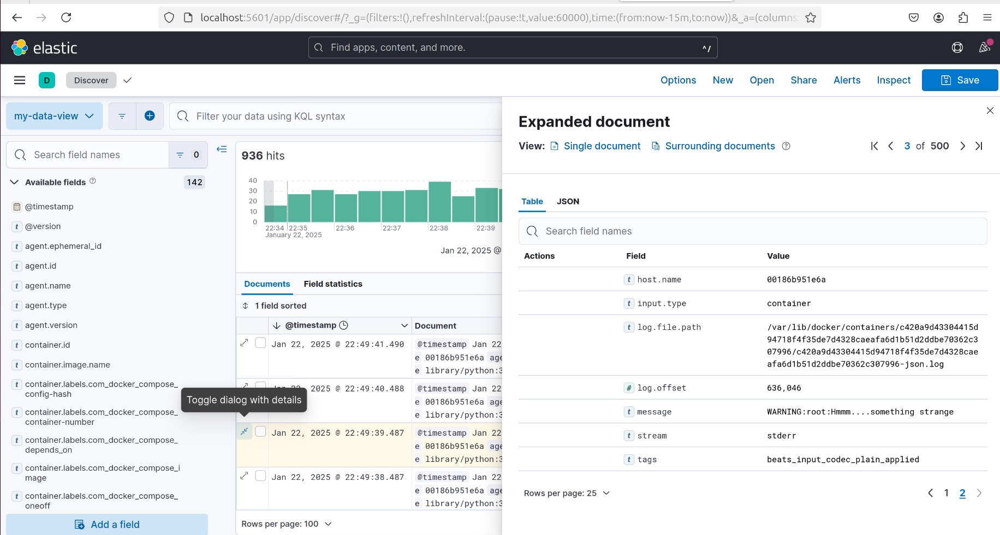
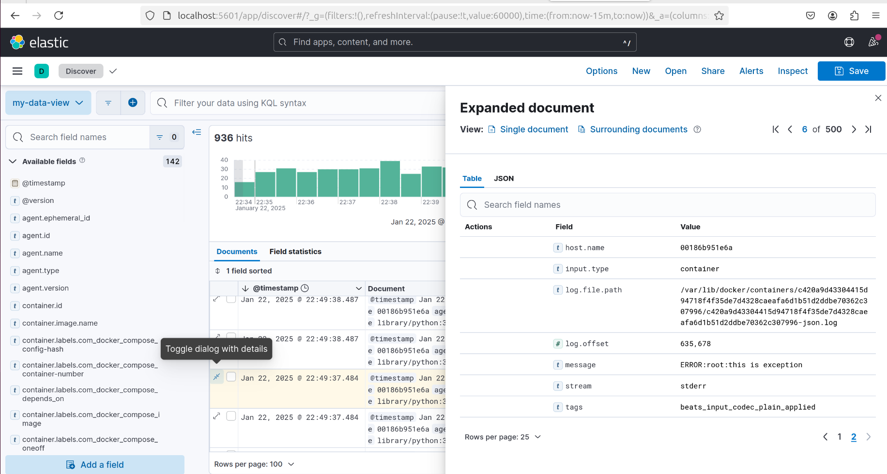

# Домашнее задание к занятию 15 «Система сбора логов Elastic Stack»
  
***  
### Задание 1 
1. docker ps  
  
  
2. интерфейс kibana  
  
  
### Задание 2  
1. Создание index-pattern  
  
  
2. kibana (Discover)  
  
 
3. Рандомные события  
  
  
  
  
  
  
***  
Файлы и скриншоты по задаче можно посмотреть [здесь](/)  
  

