# Домашнее задание к занятию «Вычислительные мощности. Балансировщики нагрузки»  
  
***  
### Задание 1. Yandex Cloud  
1. Создать бакет Object Storage и разместить в нём файл с картинкой  

  1.1. Подготовка Terraform  
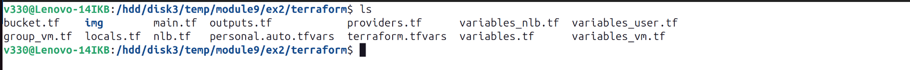  
  
  1.2. Output Terraform  
  
  
  1.3. Создать бакет в Object Storage, положить в бакет файл с картинкой  
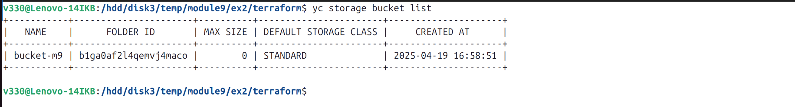  
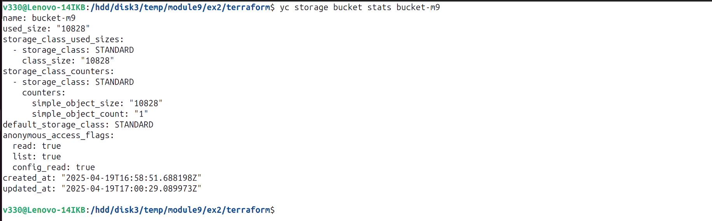  
  
  1.4. Сделать файл доступным из интернета.  
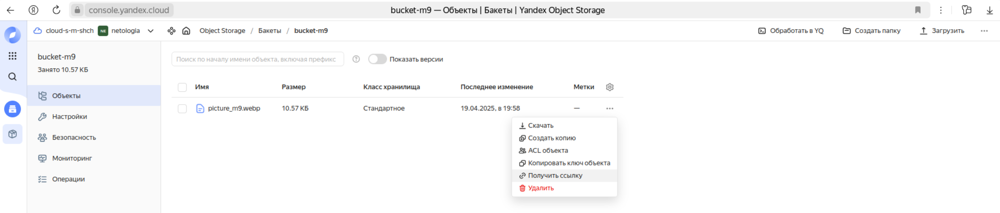  
  

2. Создать группу ВМ с тремя ВМ  
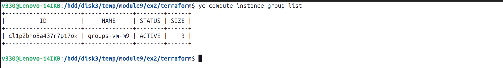  
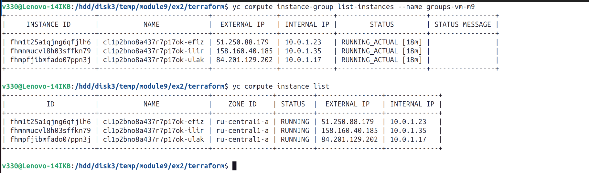  
  
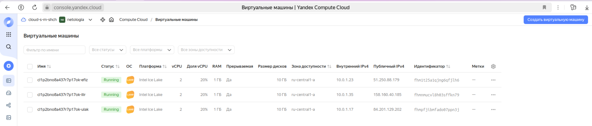  
  
  
  
3. Создать сетевой балансировщик  
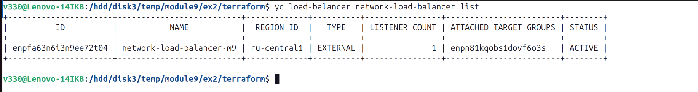  
  
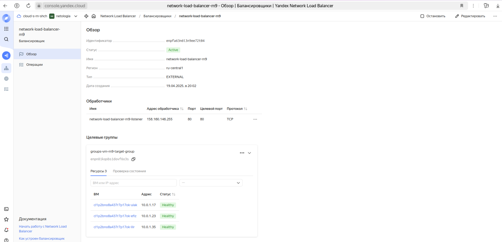  

Проверить работоспособность  
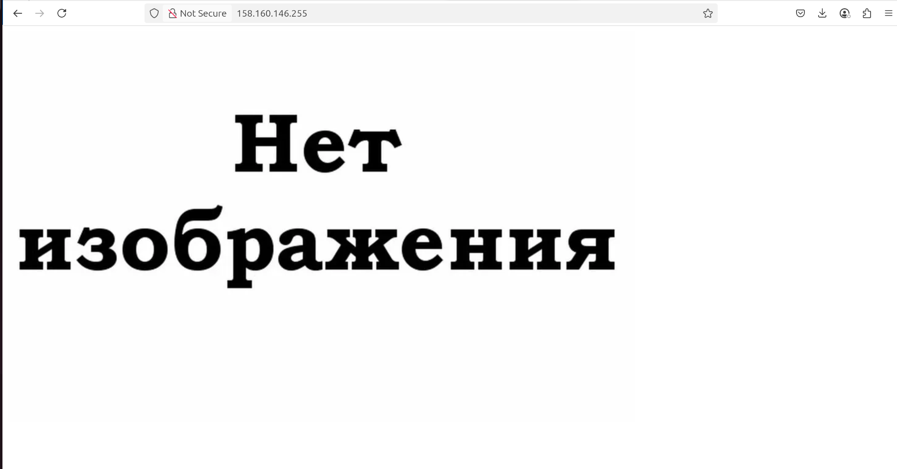  

Удалить одну или несколько машин, повторить операцию несколько раз, работа ВМ восстанавливается, сайт продолжает быть доступным  
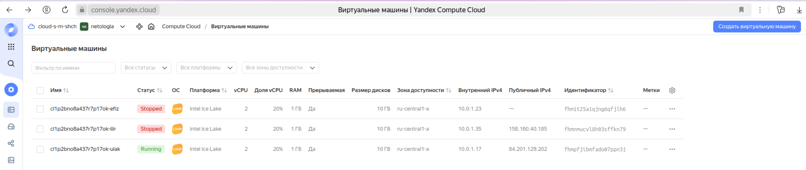  
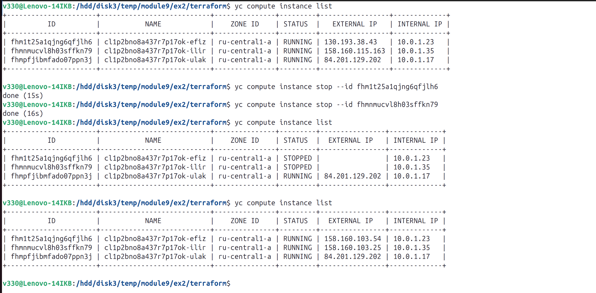  
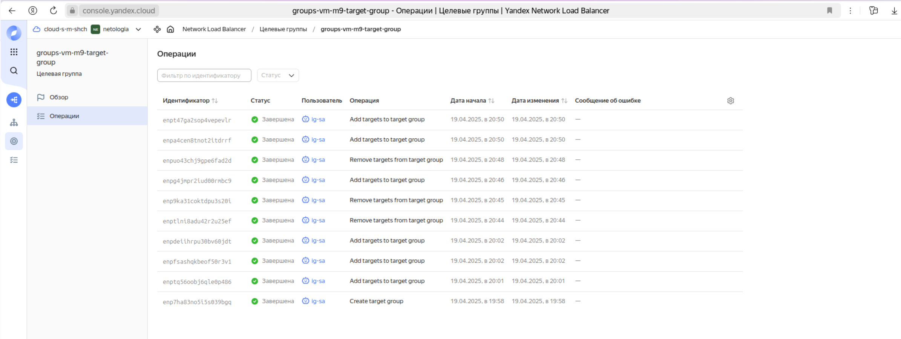  

Файлы по задаче можно посмотреть [здесь](/terraform_3)  

4. Создать Application Load Balancer  

Первые два пункта по созданию бакет Object Storage и группы ВМ  аналогичны предыдущему  

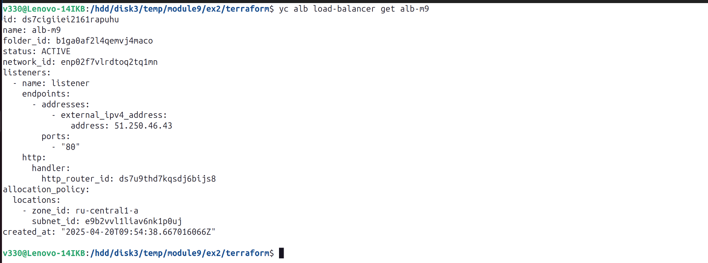  
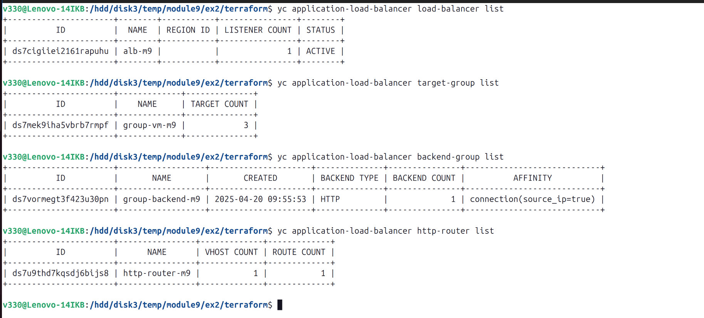  
 
Проверить работоспособность  
  

Удалить одну или несколько машин, повторить операцию несколько раз  
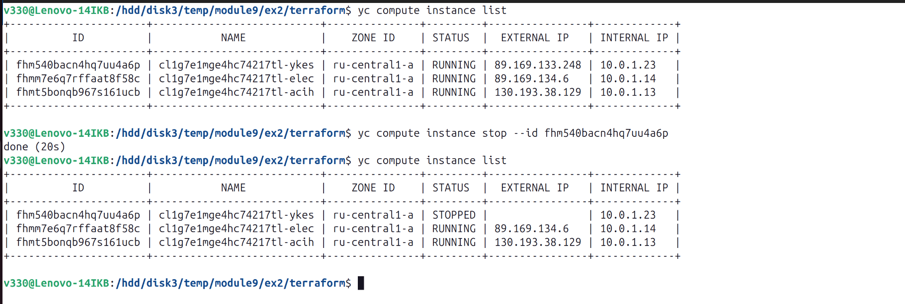  
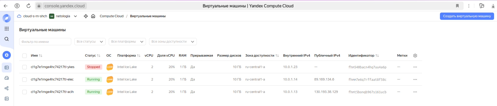  
  

Работа ВМ восстанавливается, сайт продолжает быть доступным  
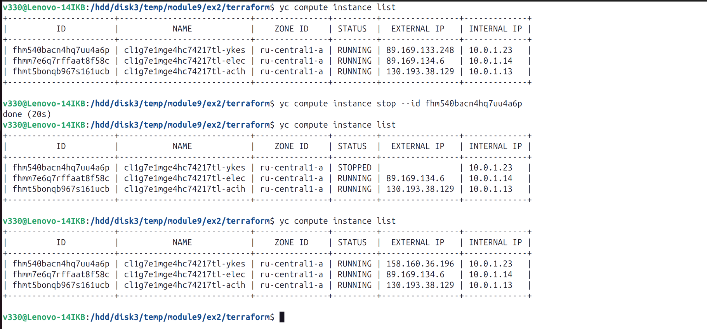  
  

Файлы по задаче можно посмотреть [здесь](/terraform_4)  

***  
Файлы и скриншоты по задаче можно посмотреть [здесь](/)  

