# Домашнее задание к занятию «Запуск приложений в K8S»  
  
***  
### Задание 1. Создать Deployment и обеспечить доступ к репликам приложения из другого Pod 
1. Манифест [Deployment](deployment.yml) приложения  
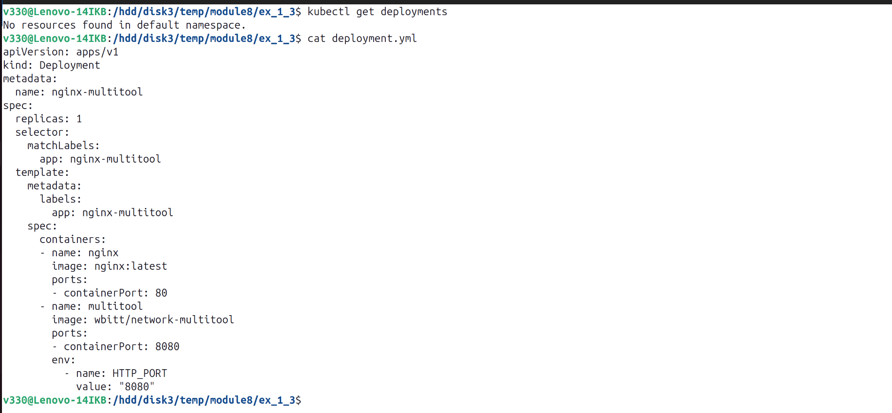  
  
2. Количество подов до масштабирования  
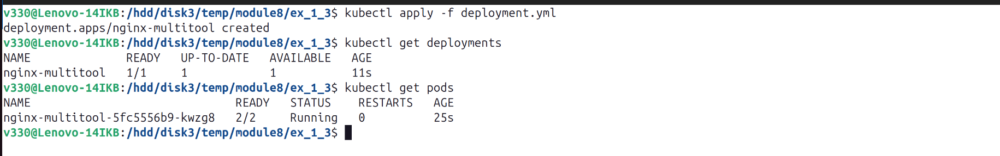  

3. Увеличение количества реплик работающего приложения до 2  
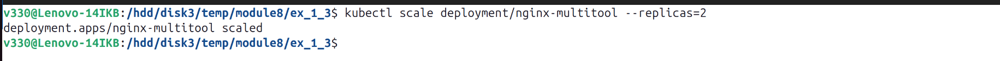  

4. Количество подов после масштабирования  
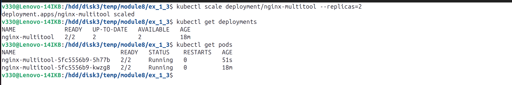  

5. [Service](nginx-multitool-svc.yml)  
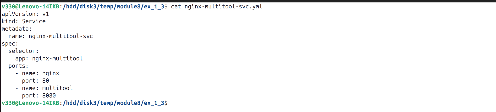  

6. Манифест [Pod](multitool-pod.yml) с приложением `multitool`  
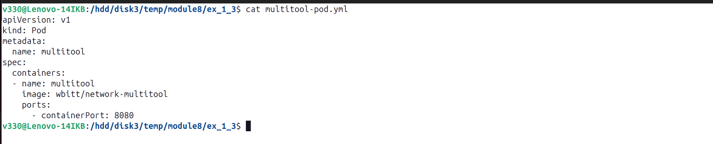  

7. Доступ до приложений  
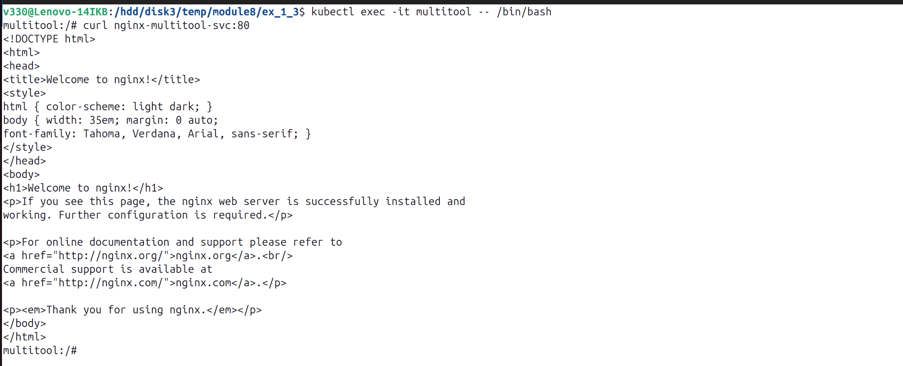  

  
### Задание 2. Создать Deployment и обеспечить старт основного контейнера при выполнении условий    
1. Манифест [Deployment](busybox-nginx.yml) приложения `nginx`  
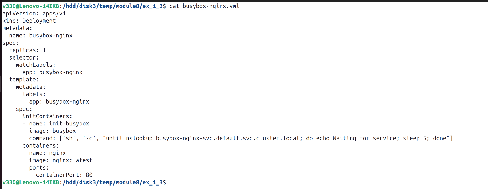  
  
2. Состояние пода до запуска сервиса  
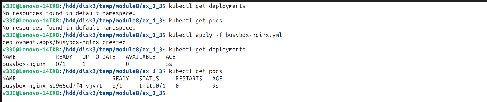  
 
3. [Service](busybox-nginx-svc.yml)  
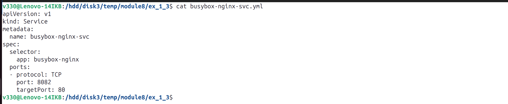  

4. Состояние пода после запуска сервиса  
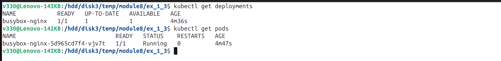  

  
***  
Файлы и скриншоты по задаче можно посмотреть [здесь](/)  

