# Домашнее задание к занятию «Как работает сеть в K8s»  
  
***  
### Задание 1. Создать сетевую политику или несколько политик для обеспечения доступа
1. Кластер K8s с установленным сетевым плагином Calico
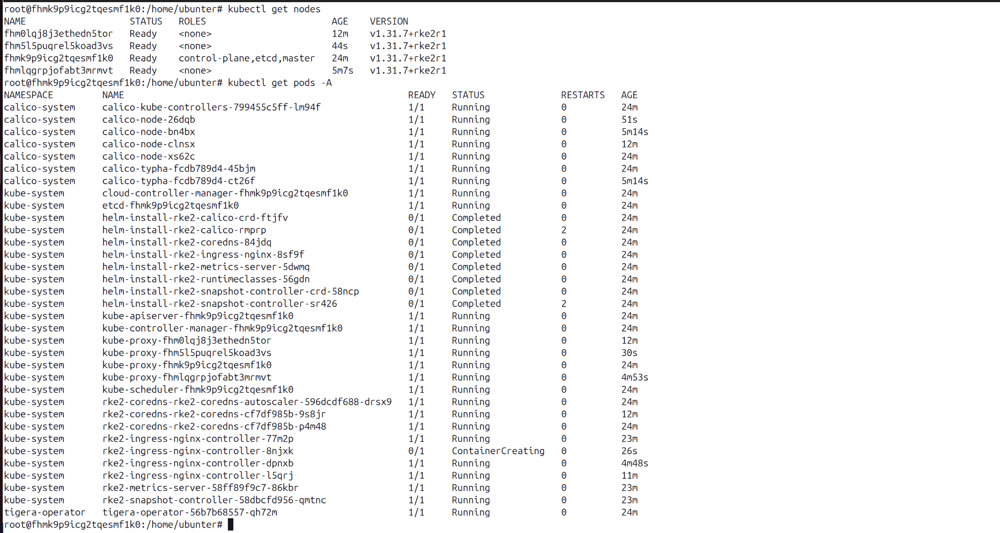  

2. Манифест [Deployment, Service](frontend.yml) приложения `frontend`  
  

3. Манифест [Deployment, Service](backend.yml) приложения `backend`  
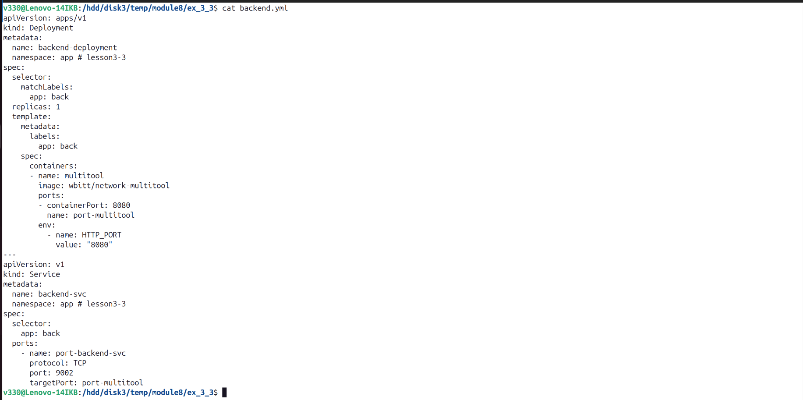  

4. Манифест [Deployment, Service](cache.yml) приложения `cache`  
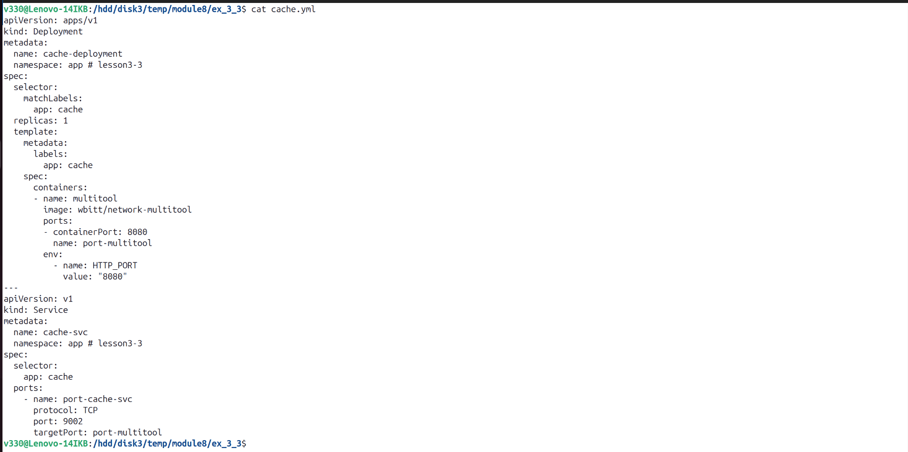  

5. Манифест [NetworkPolicy](frontend-to-backend-policy.yml) политики `frontend -> backend`  
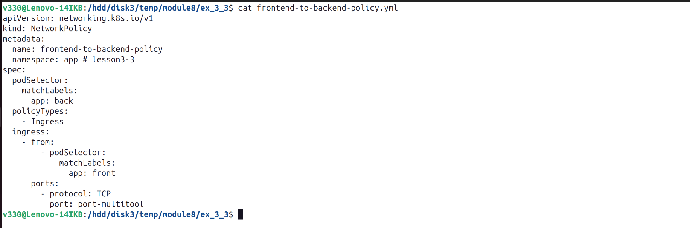  

6. Манифест [NetworkPolicy](backend-to-cache-policy.yml) политики `backend -> cache`  
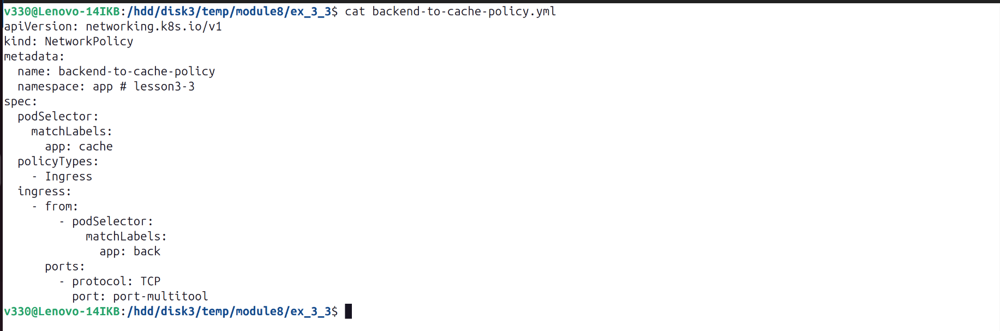  

7. Манифест [NetworkPolicy](forbid-ingress.yml) политики запрещения других подключений  
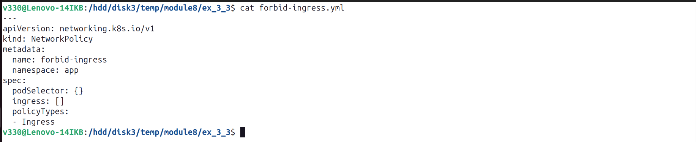  

8. Создать namespace `app`  
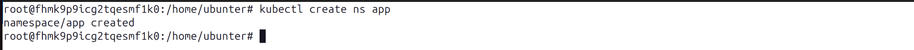  

9. Создать ресурсы кластера  
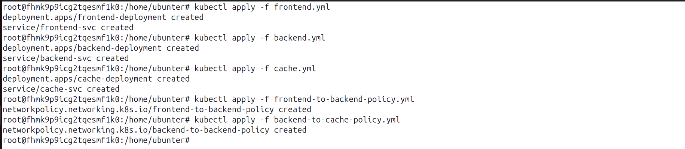  
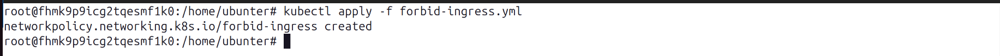  

10. Проверить ресурсы кластера  
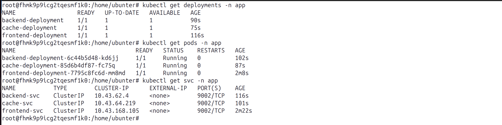  
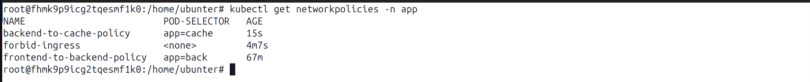  

11. Результат:  

    11.1. Проверить доступ с `frontend` (доступ разрешен только на `backend`)   
      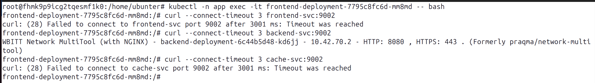  

    11.2. Проверить доступ с `backend` (доступ разрешен только на `cache`)   
      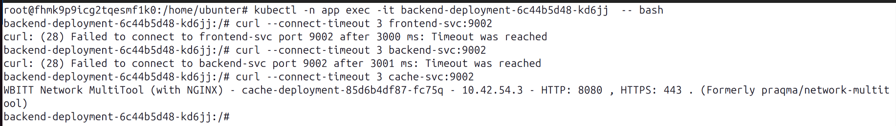  

    11.3. Проверить доступ с `cache` (доступ запрещён)   
      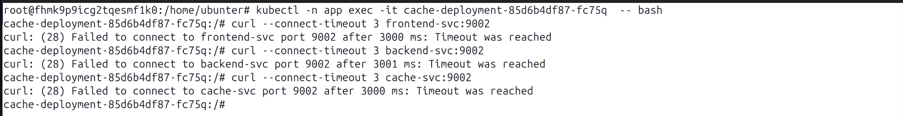  
  
***  
Файлы и скриншоты по задаче можно посмотреть [здесь](/)  

