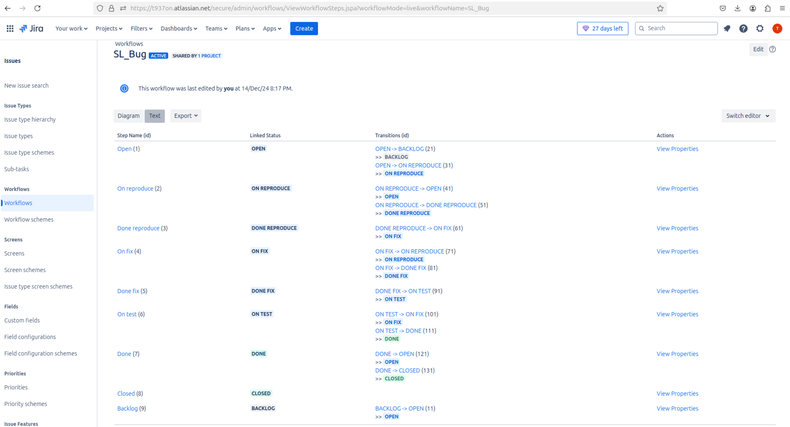
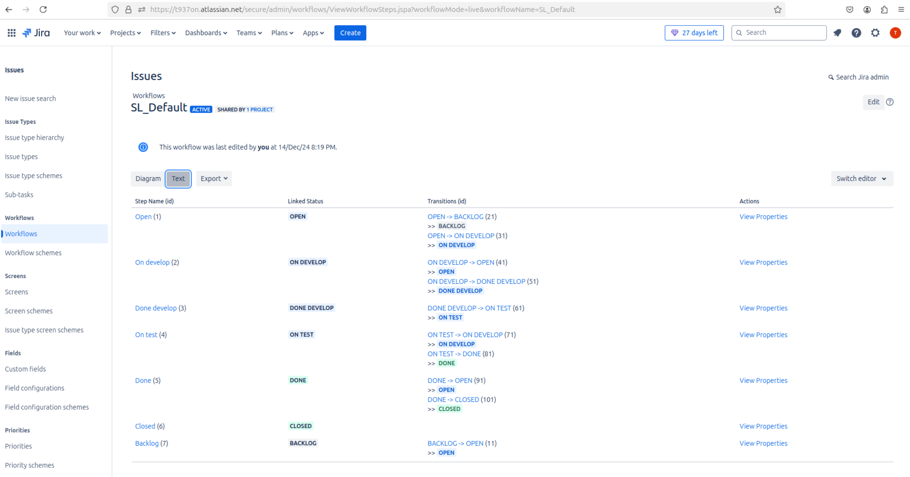

# Домашнее задание к занятию 1 «Жизненный цикл ПО»  
  
***  
## Основная часть  
  
скриншот workflow для типов задач Bug  
  
  
скриншот workflow для остальных типов задач  
  
  
  
XML файл схемы workflow для типов задач Bug [SL_Bug.xml](SL_Bug.xml).  
  
XML файл схемы workflow для остальных типов задач [SL_Default.xml](SL_Default.xml).  
  
***  
Файлы и скриншоты по задаче можно посмотреть [здесь](/),  

