# Домашнее задание к занятию «Сетевое взаимодействие в K8S. Часть 1»  
  
***  
### Задание 1. Создать Deployment и обеспечить доступ к контейнерам приложения по разным портам из другого Pod внутри кластера  
1. Манифест [Deployment](nginx-multitool-deploy.yml) приложения  
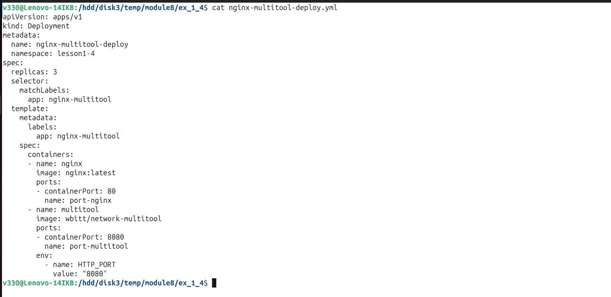  
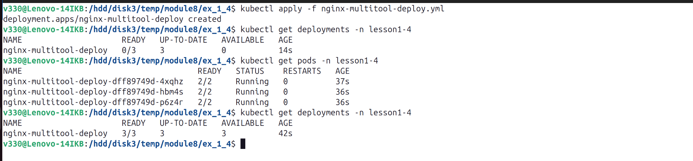  

2. Манифест [Service](nginx-multitool-svc.yml)  
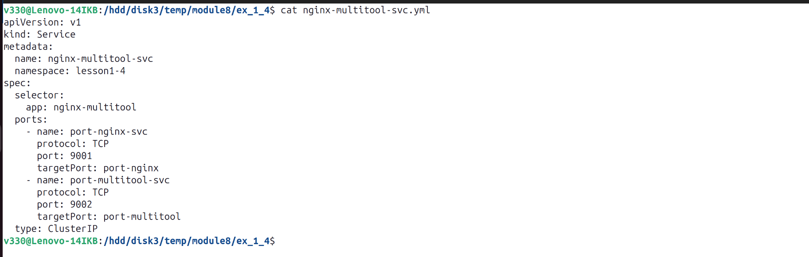  
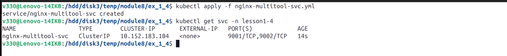  

3. Манифест [Pod](multitool-pod.yml) приложением `multitool`  
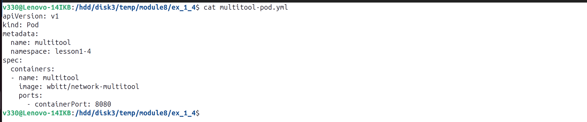  
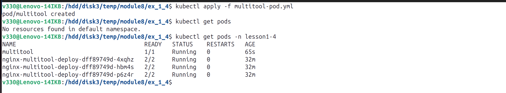  
  
4. Доступ из Pod до приложения по разным портам в разные контейнеры  
  
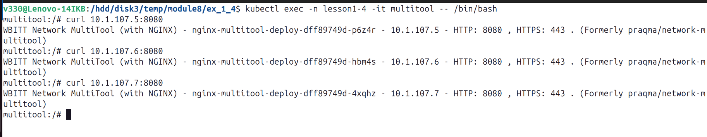  

5. Доступ из Pod по доменному имени сервиса  
  
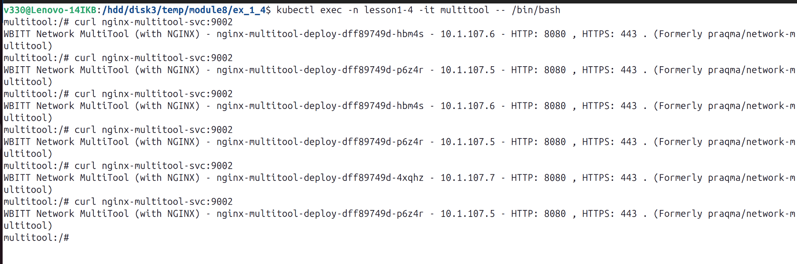  
или  
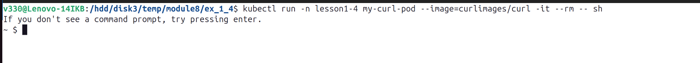  
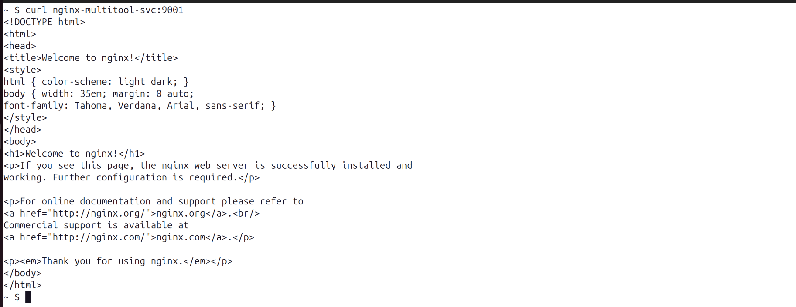  
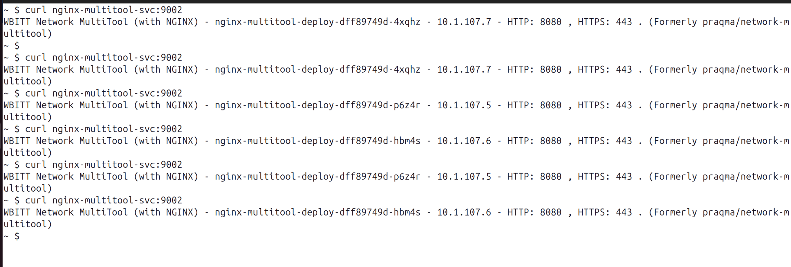  

### Задание 2. Создать Service и обеспечить доступ к приложениям снаружи кластера     
1. Манифест [Service](nginx-multitool-svc2.yml)  
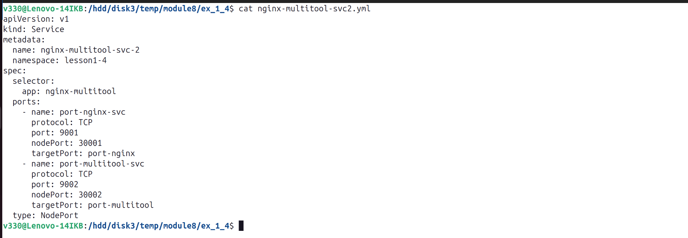  
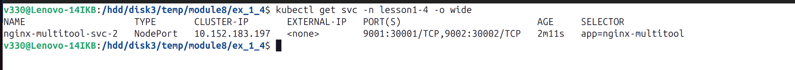  
  
2. Доступ с помощью браузера или curl с локального компьютера  
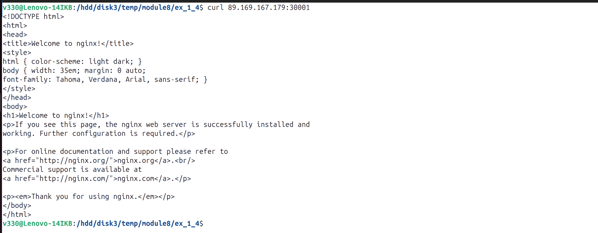  
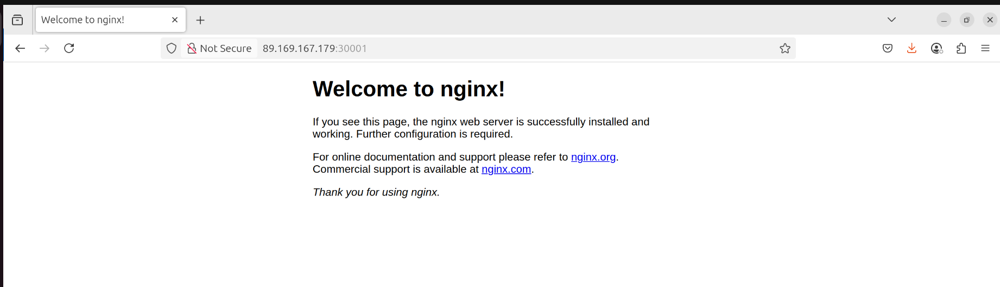   
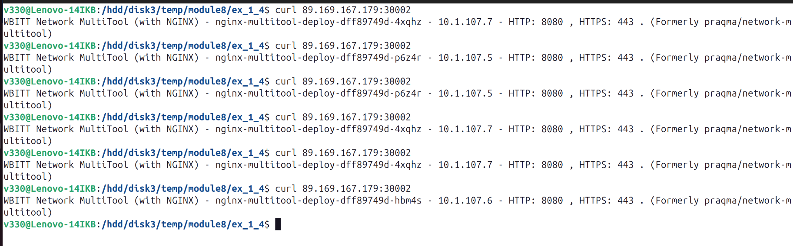  
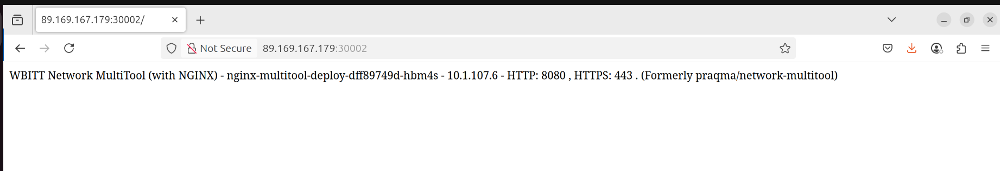  
  
***  
Файлы и скриншоты по задаче можно посмотреть [здесь](/)  

