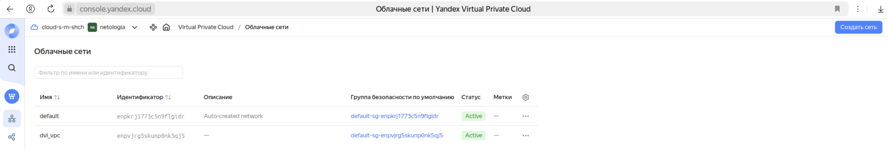
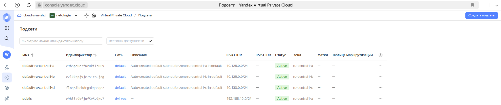
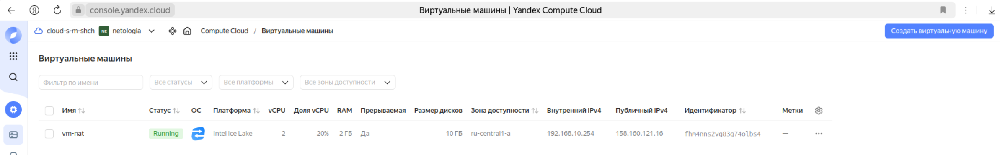
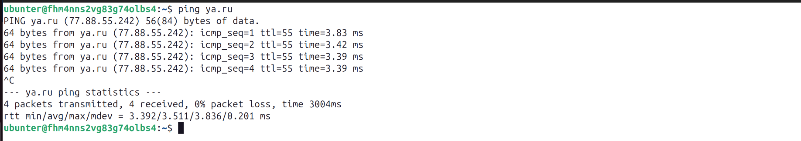
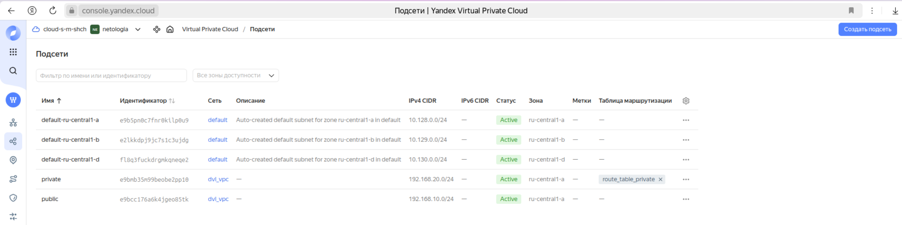
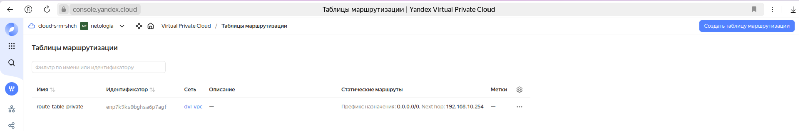
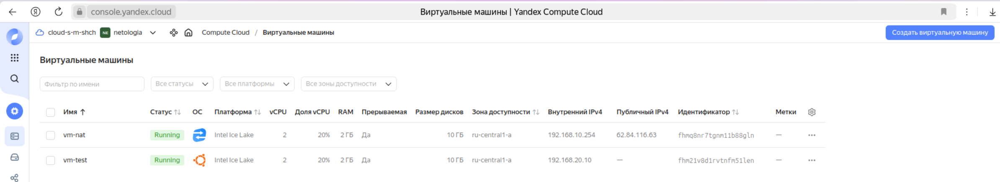
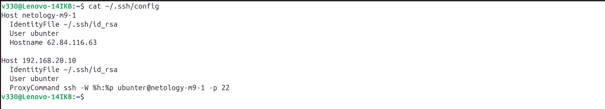
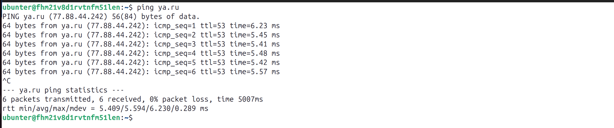

# Домашнее задание к занятию «Организация сети»
  
***  
### Задание 1. Yandex Cloud 
1. Создать пустую VPC  
  
  
2. Публичная подсеть  
  + 2.1. Создать в VPC subnet с названием public, сетью 192.168.10.0/24  
  
  
  + 2.2. Создать в этой подсети NAT-инстанс, присвоив ему адрес 192.168.10.254. В качестве image_id использовать fd80mrhj8fl2oe87o4e1  
  
  
  + 2.3. Убедиться, что есть доступ к интернету  
  
  
3. Приватная подсеть  
  + 3.1. Создать в VPC subnet с названием public, сетью 192.168.10.0/24  
  
  
  + 3.2. Создать route table. Добавить статический маршрут, направляющий весь исходящий трафик private сети в NAT-инстанс  
  
  
  + 3.3. Создать в этой приватной подсети виртуалку с внутренним IP  
  

  + 3.4. подключиться к ней через виртуалку, созданную ранее, и убедиться, что есть доступ к интернету  
  
  

  
***  
Файлы и скриншоты по задаче можно посмотреть [здесь](/)  

