## Домашнее задание к занятию «Использование Terraform в команде»

***
### Задание 1  
Проверка кода с помощью tflint   
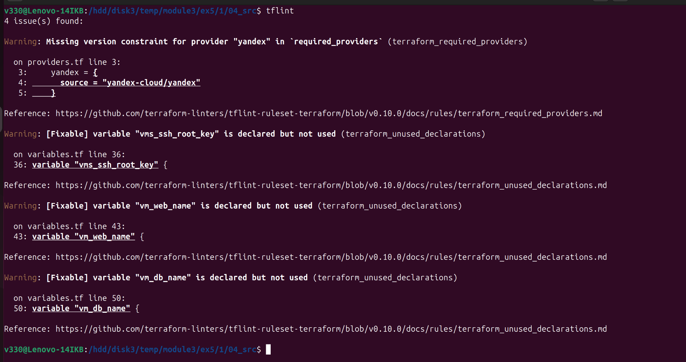  

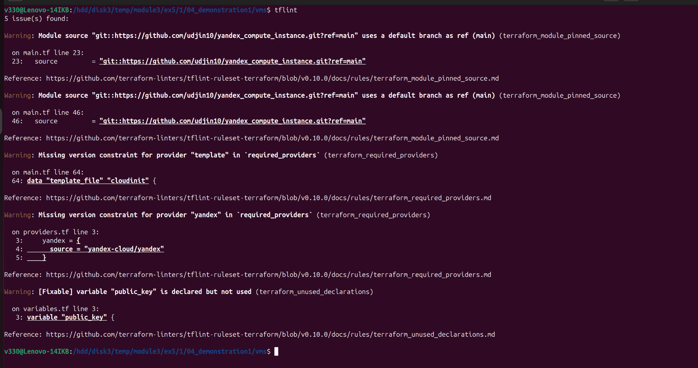  

Проверка кода с помощью checkov   
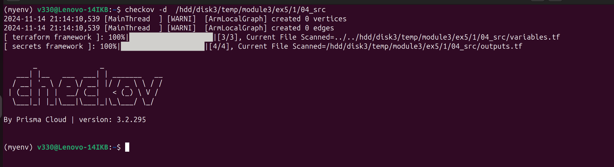  

Типы ошибок обнаружены в проекте:  
1. в tflint:  
 - Используется сылка на ветку поумолчанию  
 - Отсутствие атрибута required_version  
 - Неиспользуемые переменные  

2. в Checkov:  
 - Используется ссылка на модуль, не указывает на хеш коммита  
 - Используется ссылка на модуль, не указывает на тег версии  
 
***
### Задание 2  
Скриншоты процесса из лекции: YDB, S3 bucket, yandex service account  
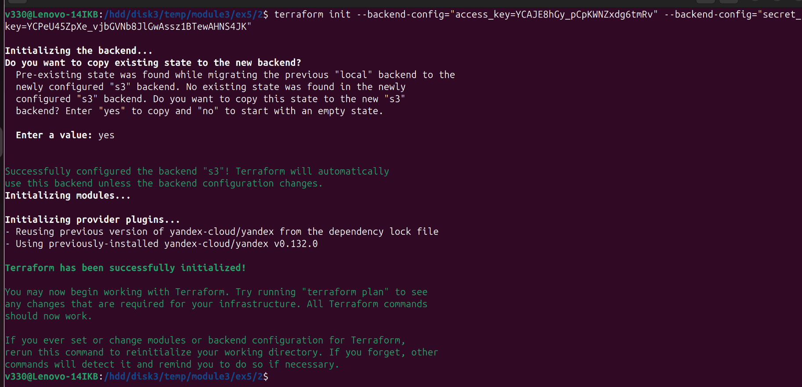  

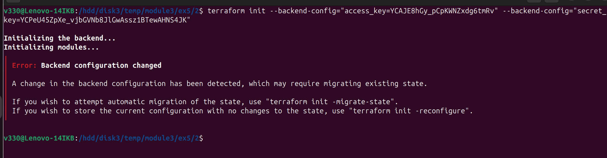  

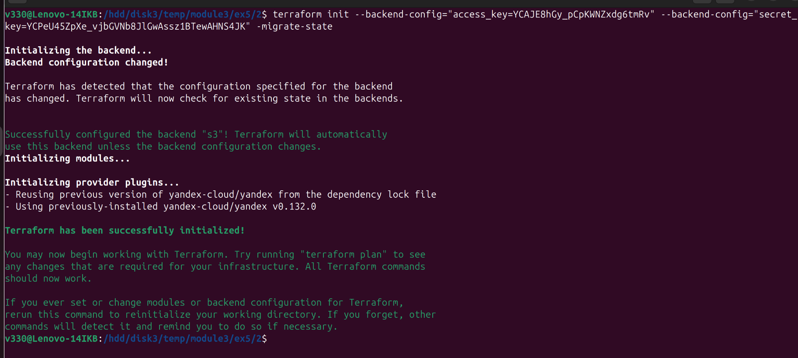  

  

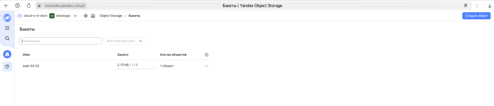  

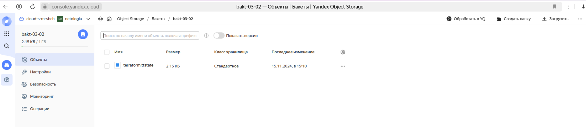  

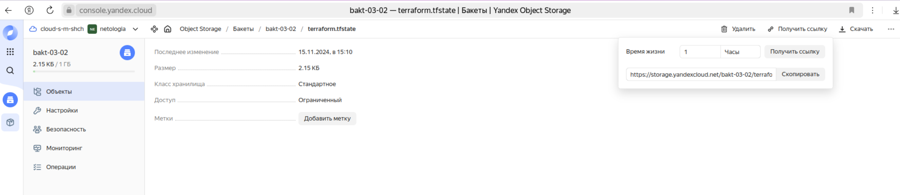  

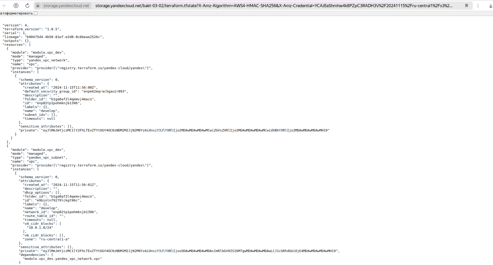  

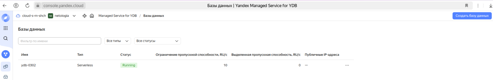  

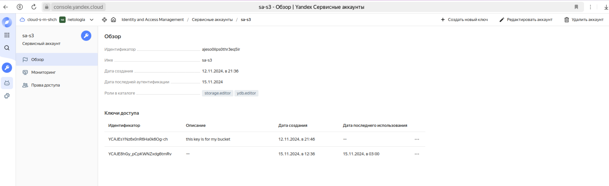  

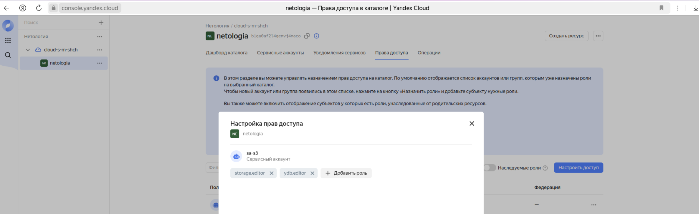  

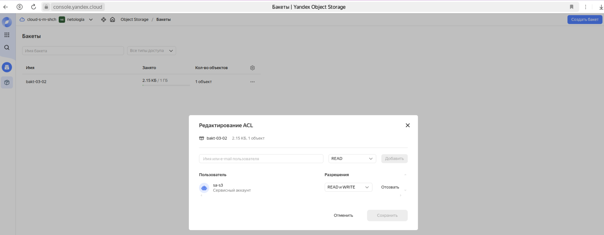  

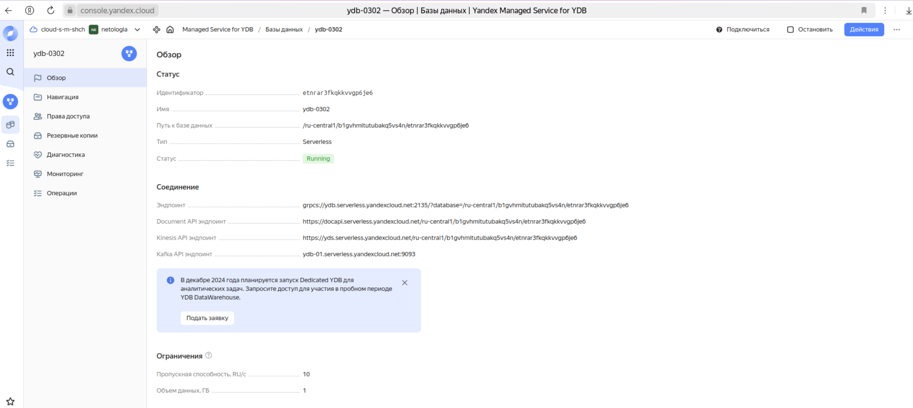  

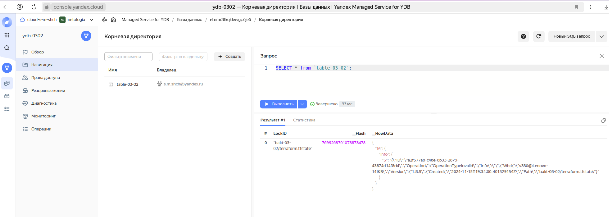  

terraform apply  в другом окне из этой же директории  
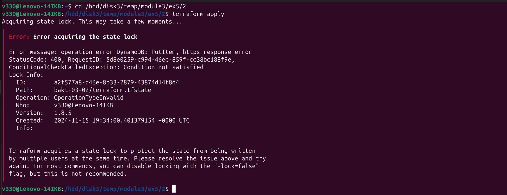  

Разблокировка  
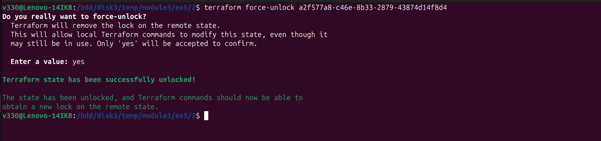  

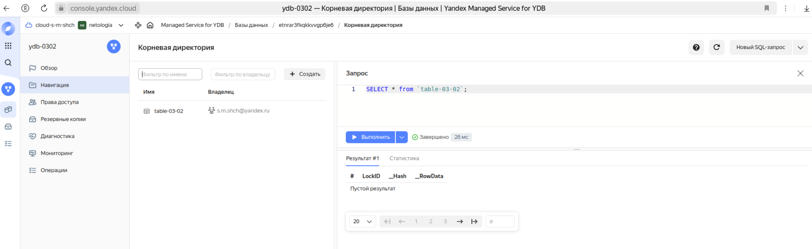  

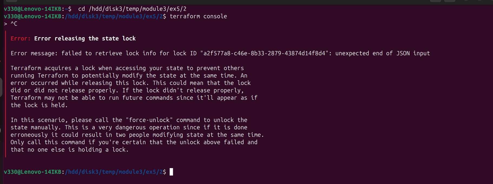  

***
### Задание 3  
Проверка кода с помощью tflint и checkov  
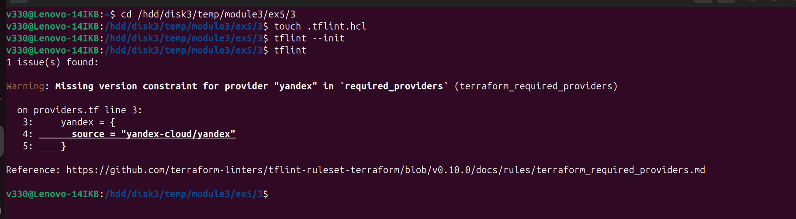  

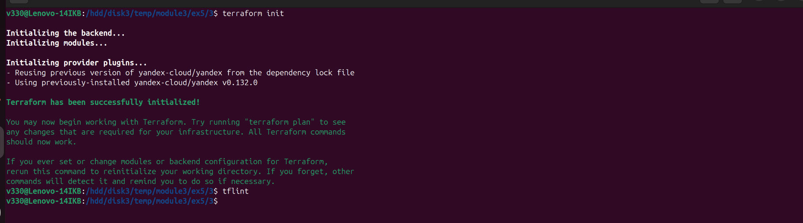  

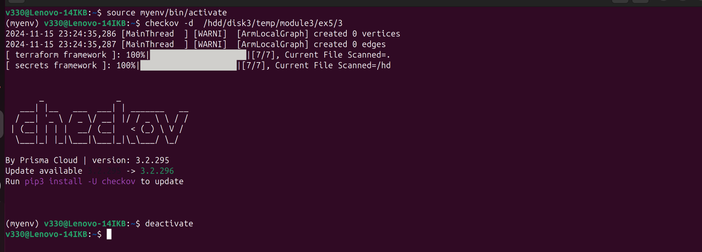  

ссылка на PR для ревью  
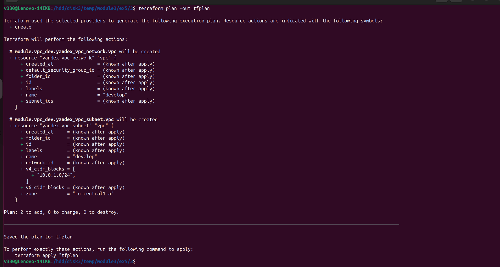  

***
### Задание 4  
Переменные с валидацией  
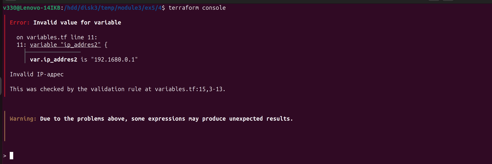  

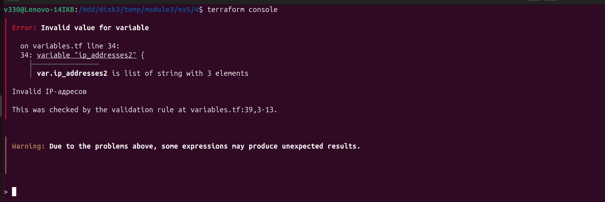  

Файл с переменными [The file](m3_ex5_4_variables.tf).  

***
### Задание 5  
Переменные с валидацией  
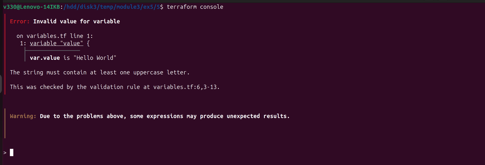  

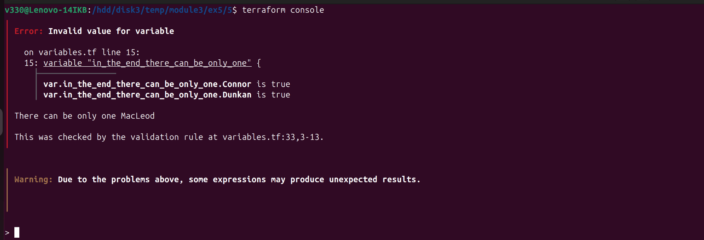  

Файл с переменными [The file](m3_ex5_5_variables.tf).  

