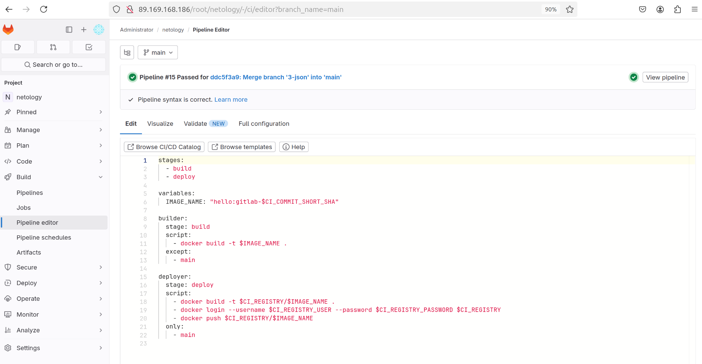
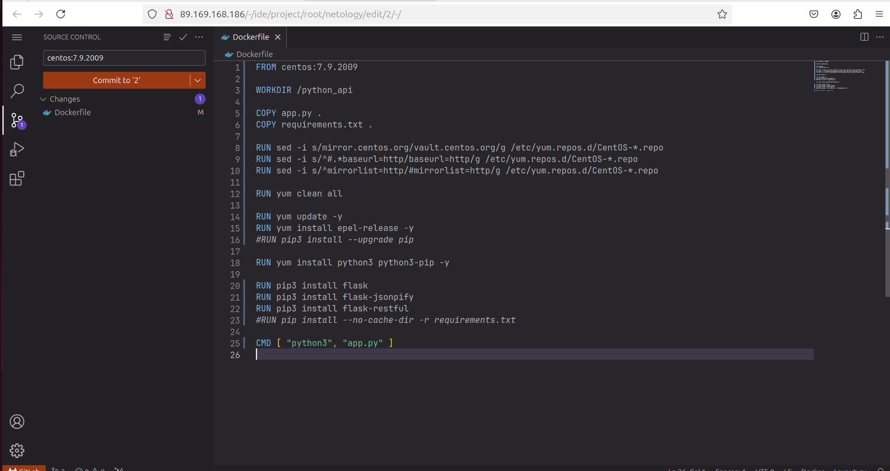
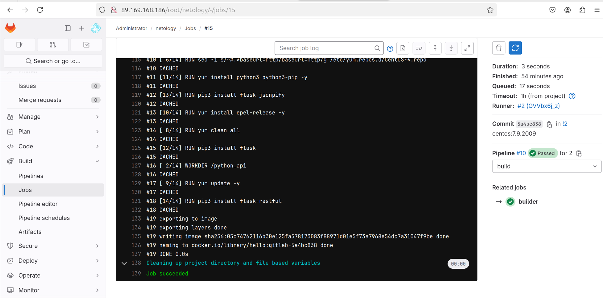
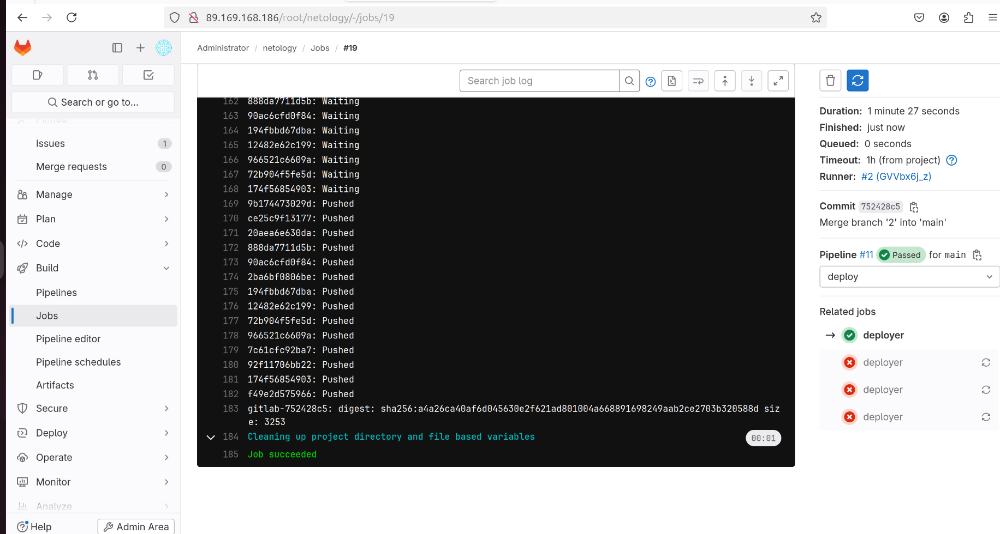
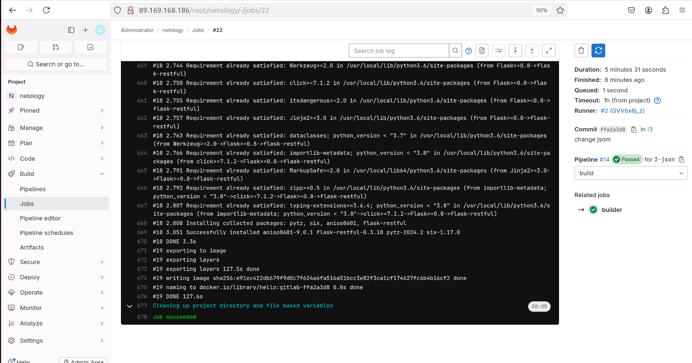
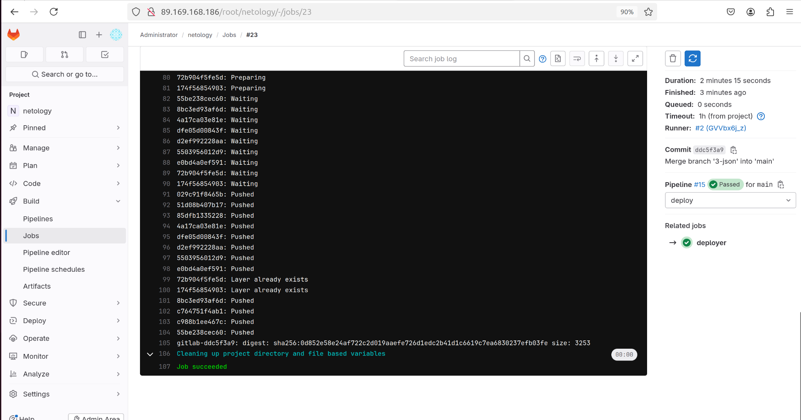
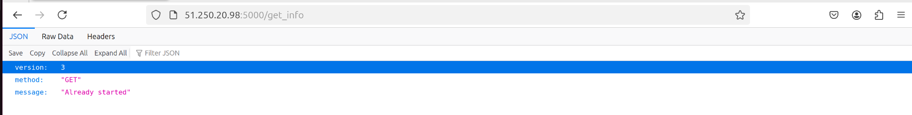
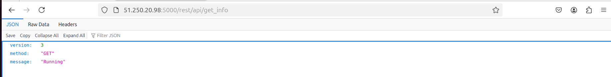
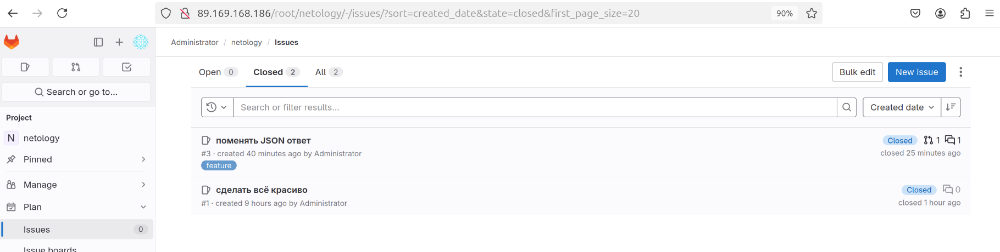

## Домашнее задание к занятию 6 «GitLab»   
  
***  
### Основная часть  
1. файл gitlab-ci.yml  
  
  
2. Dockerfile  
  
  
3. логи успешного выполнения пайплайна  
  - для первого Issue  
  
  stage build  
    
  
  stage deploy  
    
  
  - для второго Issue  
  
  stage build  
    
  
  stage deploy  
    
  
4. решённые Issue  
  

  

  

  
***  
Файлы и скриншоты по задаче можно посмотреть [здесь](/)  

