# Домашнее задание к занятию «Kubernetes. Причины появления. Команда kubectl»
  
***  
### Задание 1. Установка MicroK8S  
1. Установить MicroK8S на удалённую виртуальную машину  
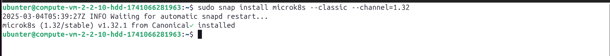  
  
2. Установить dashboard  
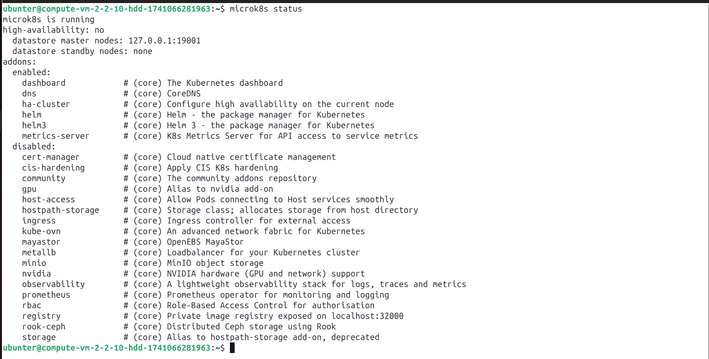  

3. Сгенерировать сертификат для подключения к внешнему ip-адресу  
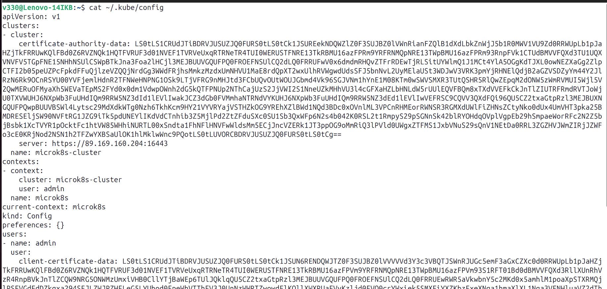  
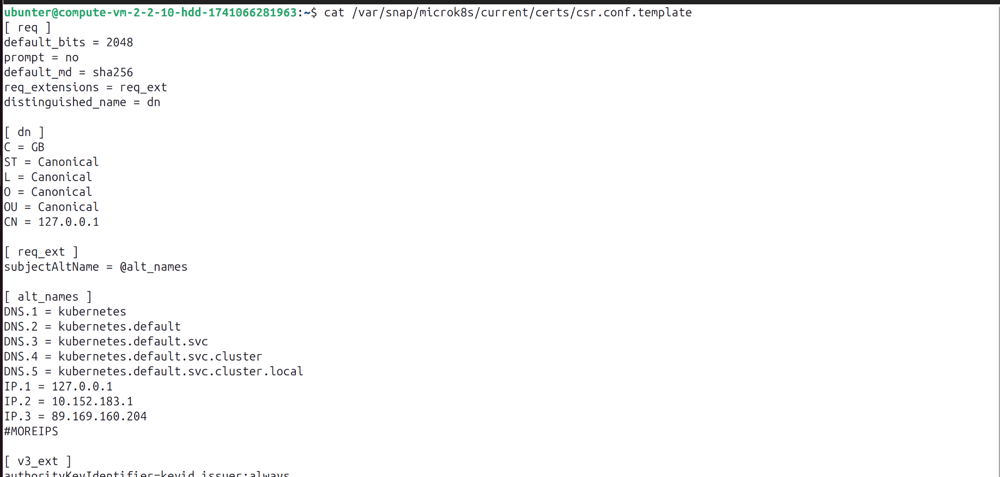  
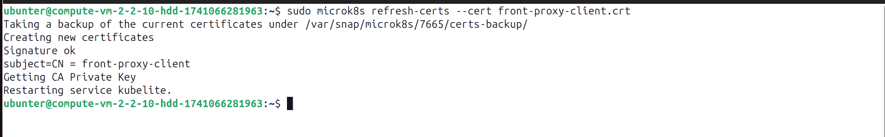  
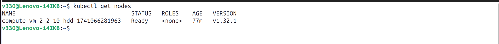  
  
### Задание 2. Установка и настройка локального kubectl    
1. Установить на локальную машину kubectl  
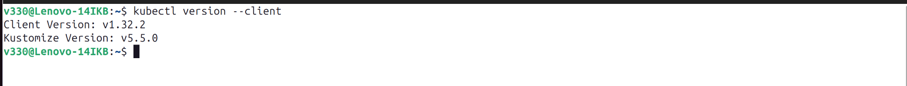  
  
2. Настроить локально подключение к кластеру  
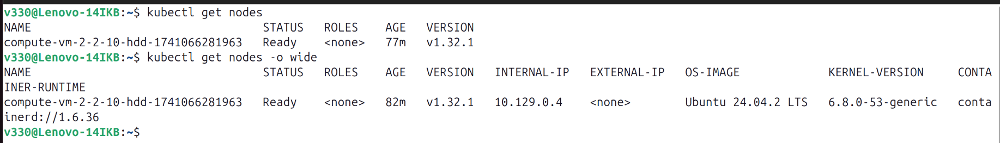  
 
3. Подключиться к дашборду с помощью port-forward  
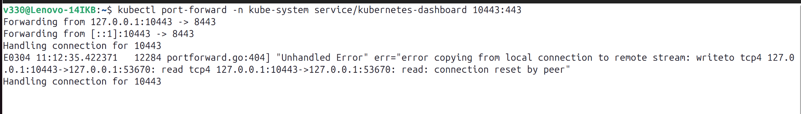  
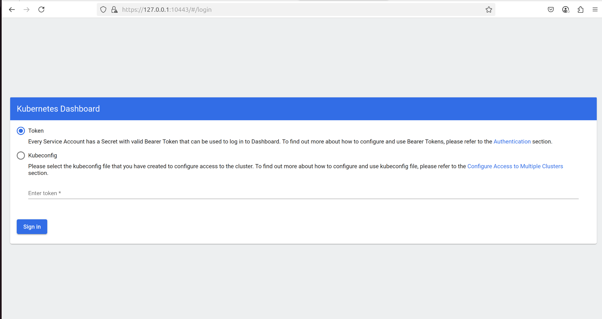  
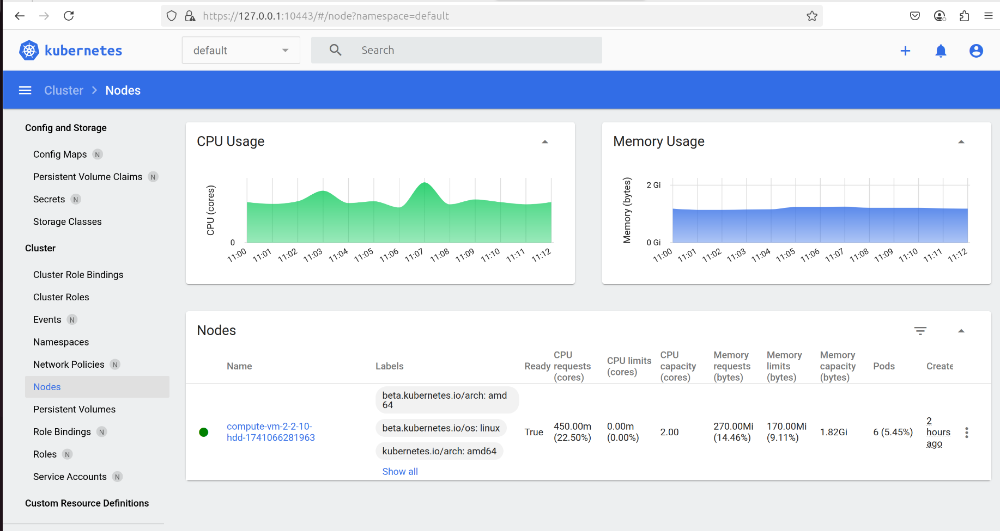  
  
***  
Файлы и скриншоты по задаче можно посмотреть [здесь](/)  
  

