# Домашнее задание к занятию «Helm»  
  
***  
### Задание 1. Подготовить Helm-чарт для приложения   
1. Манифест [Deployment](./netology-chart/templates/nginx-deploy.yml) приложения c `nginx`  
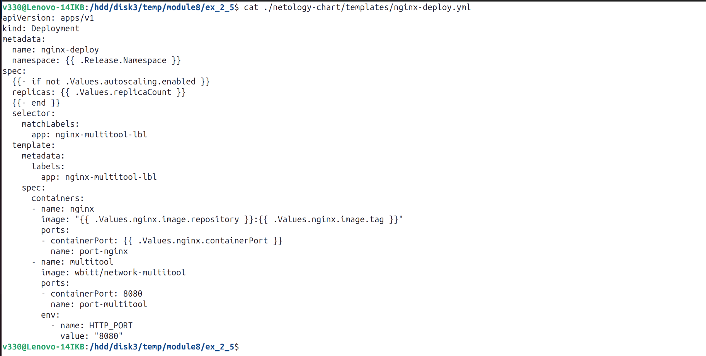  
  
2. Манифест [Deployment](./netology-chart/templates/multitool.yml) приложения c `multitool`  
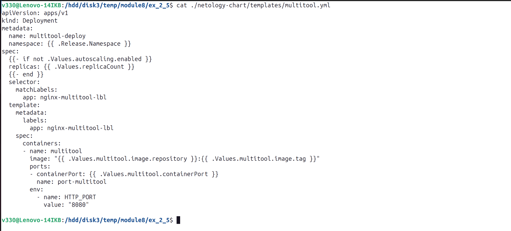  
  
3. Манифест [Service](./netology-chart/templates/nginx-multitool-svc.yml) приложения  
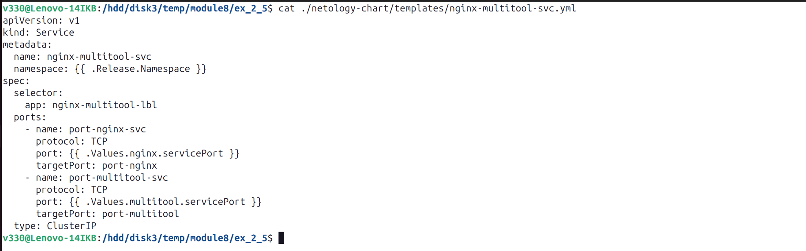  
  
4. Переменные [чарта](./netology-chart/values.yaml)  
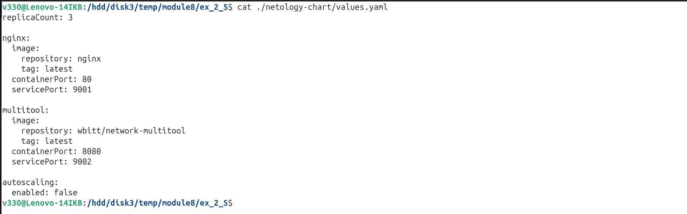  
  
5. Проверка манифестов без развертывания в кластере  
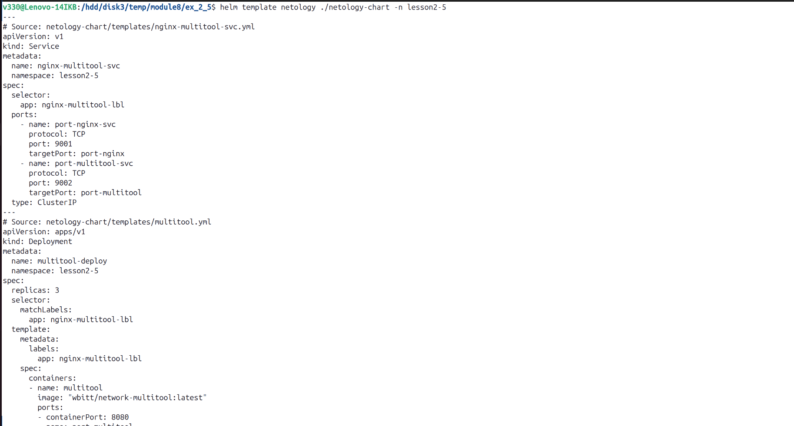  
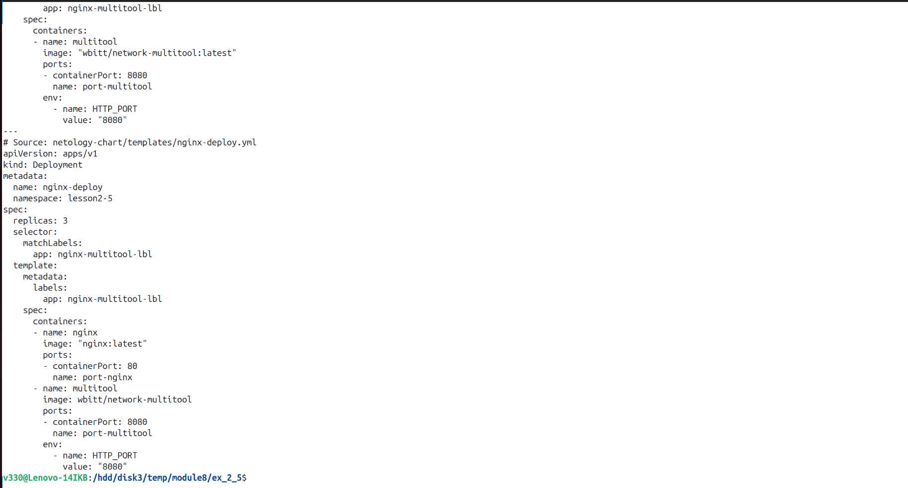  
  
6. Установка helm чарта в кластере  
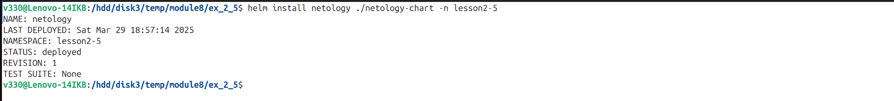  
  
7. Список объектов в Kubernetes  
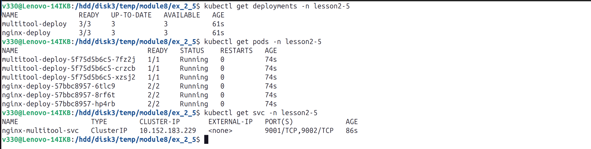  
  
8. Список релизов helm  
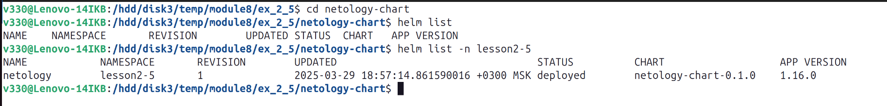  
  
9. Проверка результата  
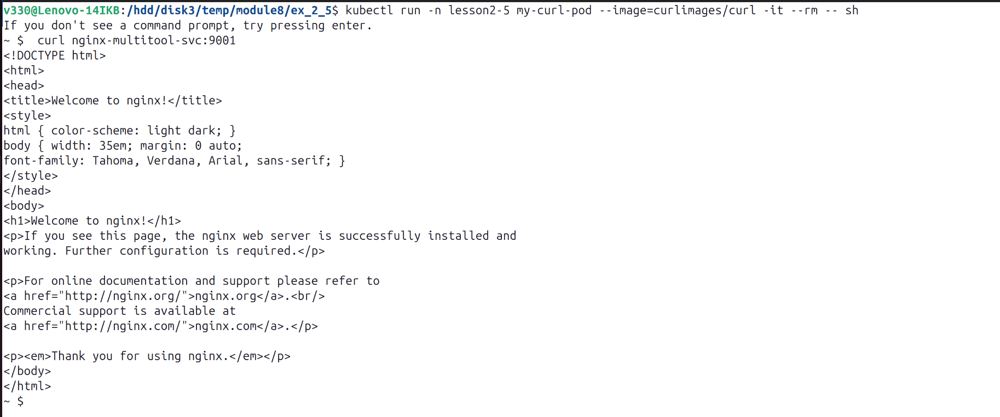  
  
***  
### Задание 2. Запустить две версии в разных неймспейсах  
1. Переменные [чарта](./netology-chart/values-app1.yaml) для namespace=app1  
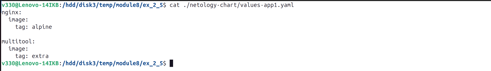  
  
2. Проверка манифестов без развертывания в кластере в namespace=app1  
  
  
  
3. Установка helm чарта в кластере в namespace=app1  
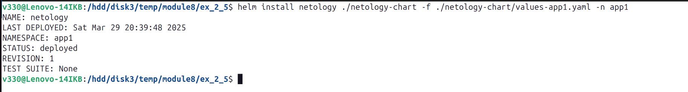  
  
4. Список объектов в Kubernetes в namespace=app1  
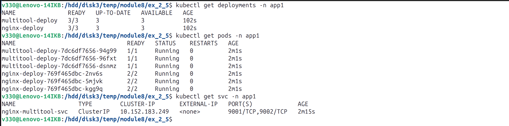  
  
5. Список релизов helm  
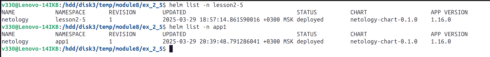  
  
6. Проверка результата в namespace=app1  
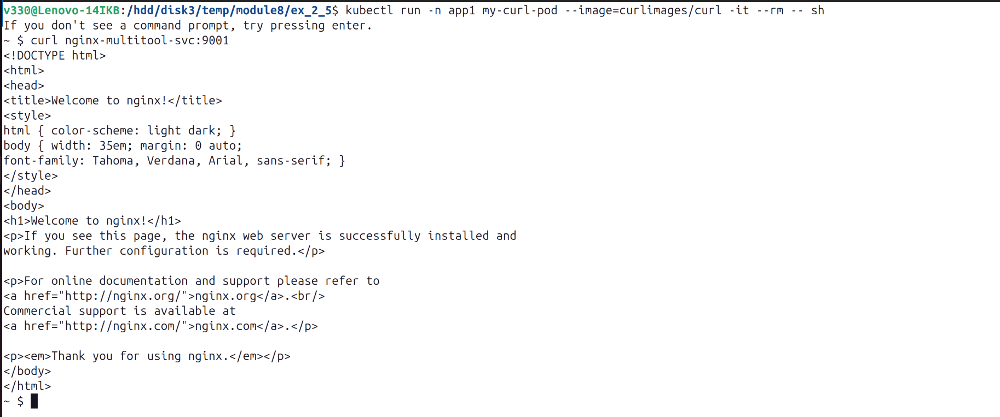  
  
7. Переменные [чарта](./netology-chart/values-app2.yaml) для namespace=app2  
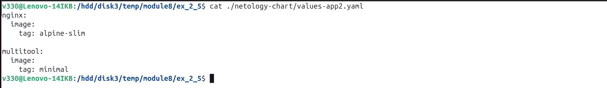  
  
8. Проверка манифестов без развертывания в кластере в namespace=app2  
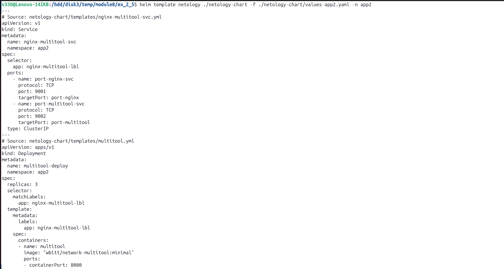  
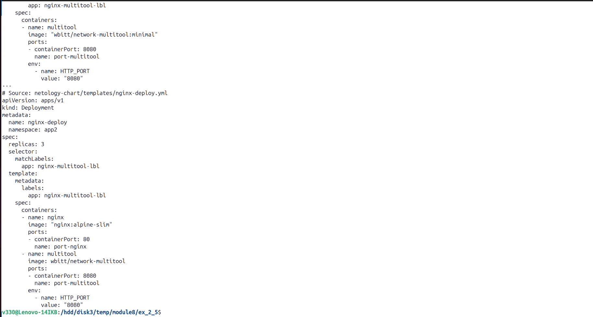  
  
9. Установка helm чарта в кластере в namespace=app2  
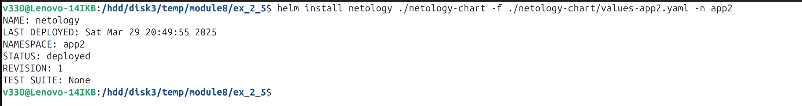  
  
10. Список объектов в Kubernetes в namespace=app2  
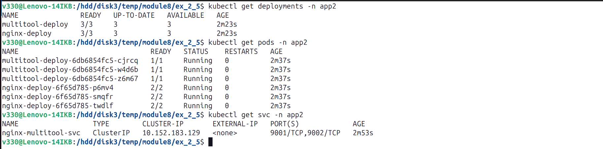  
  
11. Список релизов helm  
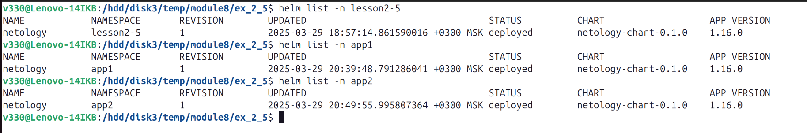  
  
12. Проверка результата в namespace=app2  
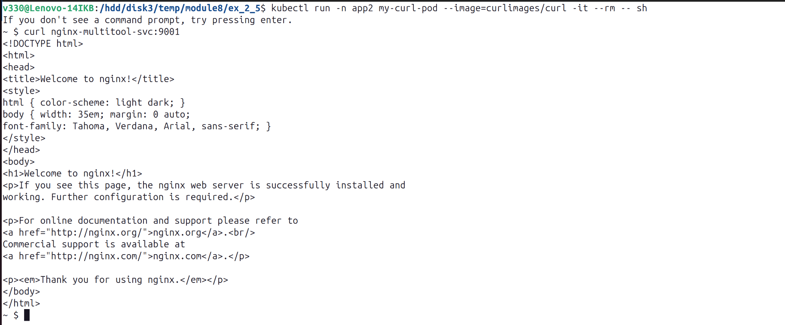  
  
13. Список объектов в Kubernetes в всех namespace  
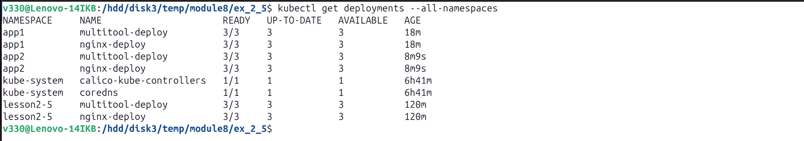  
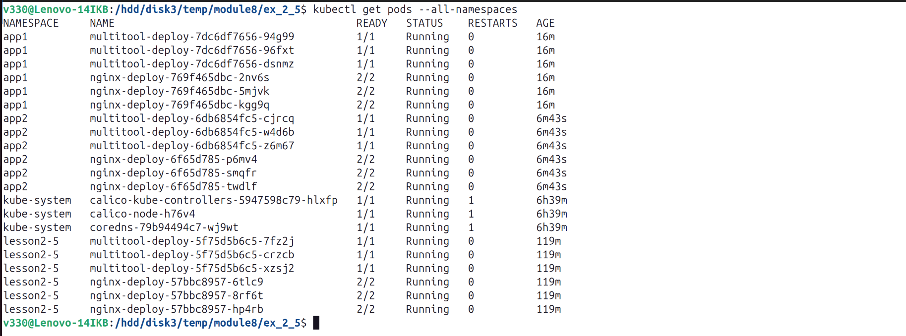  
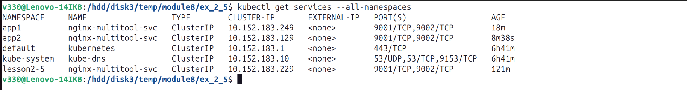  
  
  
***  
Файлы и скриншоты по задаче можно посмотреть [здесь](/)  

