# Домашнее задание к занятию «Базовые объекты K8S»
  
***  
### Задание 1. Создать Pod с именем hello-world  
1. Манифест (yaml-конфигурация) Pod [hello-world](hello-world.yml)  
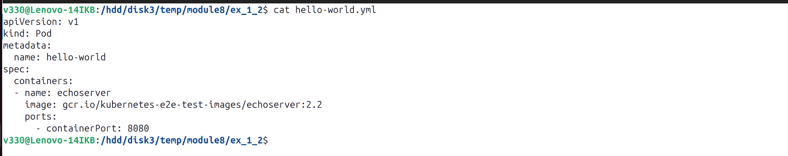  
  
2. Подключение локально к Pod с помощью `kubectl port-forward`  
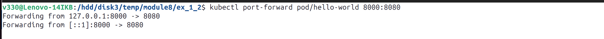  

3. Вывод значения (в браузере, curl)  
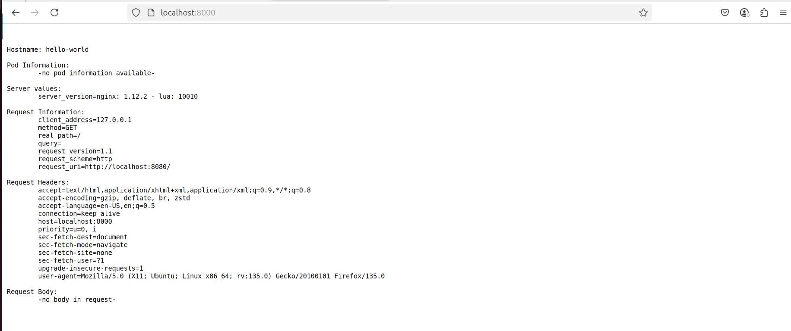  
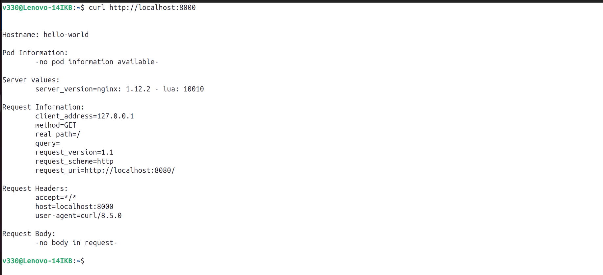  

  
### Задание 2. Создать Service и подключить его к Pod    
1. Pod с именем [netology-web](netology-web.yml)  
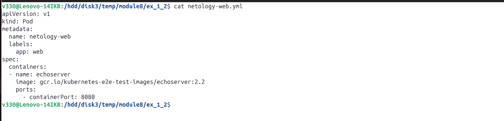  
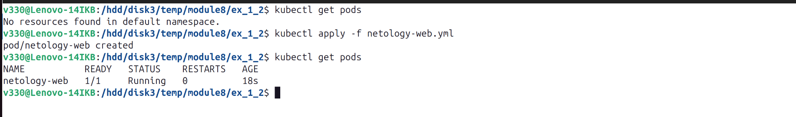  
  
2. Service с именем [netology-svc](netology-svc.yml)  
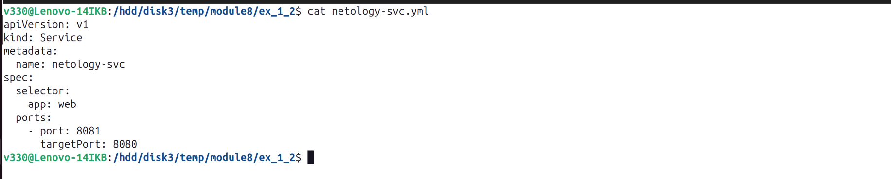  
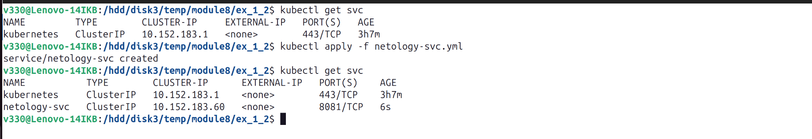  
 
3. Подключение локально к Service с помощью `kubectl port-forward`  
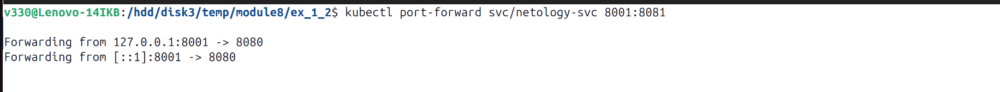  

4. Вывод значения (в браузере, curl)  
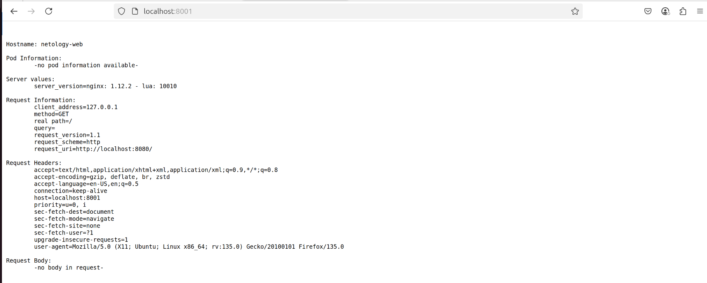  
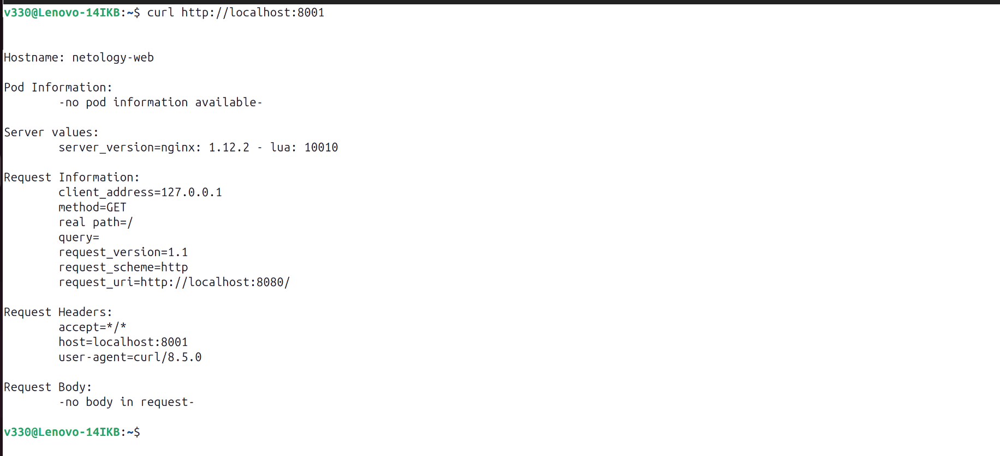  
  
***  
Файлы и скриншоты по задаче можно посмотреть [здесь](/)  
  

