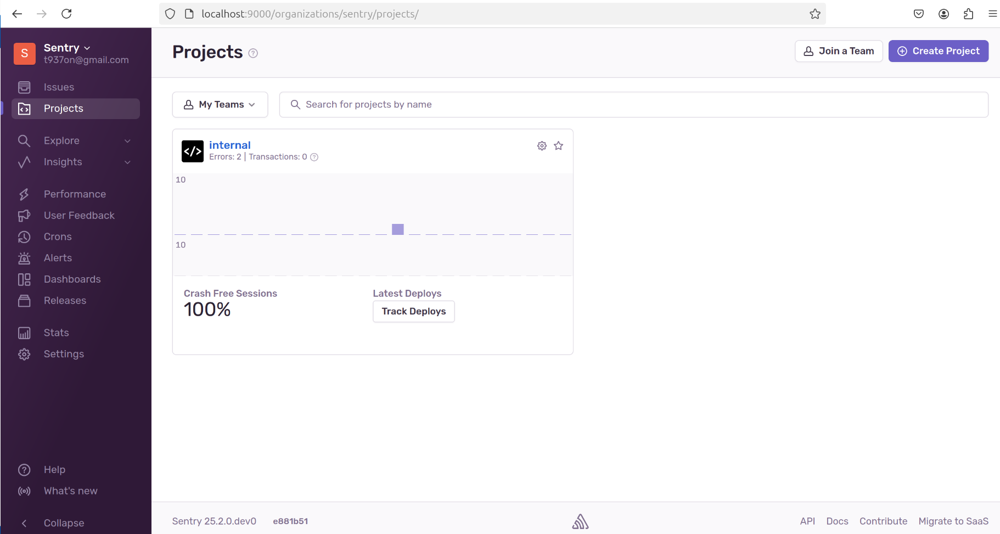
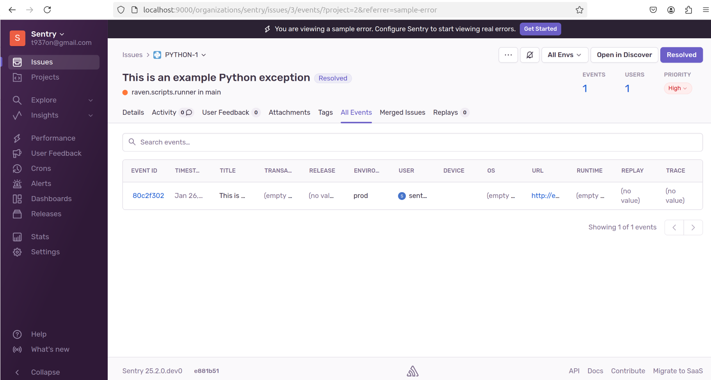
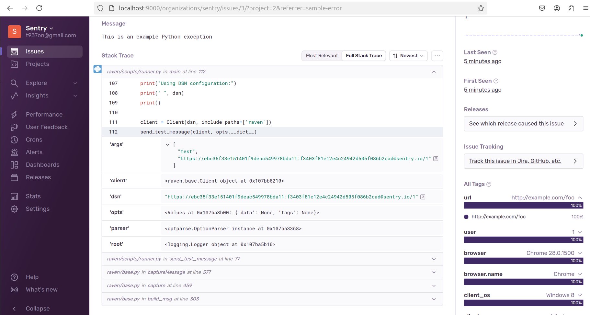
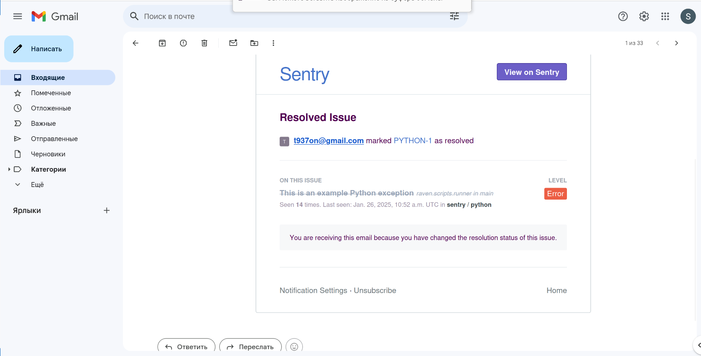

# Домашнее задание к занятию 16 «Платформа мониторинга Sentry»
  
***  
### Задание 1 
меню Projects  
  
  
### Задание 2  
список событий Resolved  
  

Stack trace  
  
  
### Задание 3  
оповещения на почте  
  
  

***  
Файлы и скриншоты по задаче можно посмотреть [здесь](/)  
  
