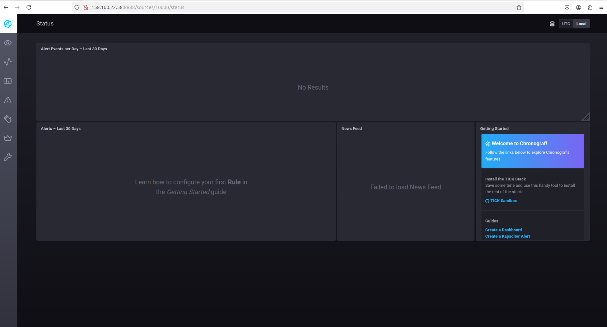
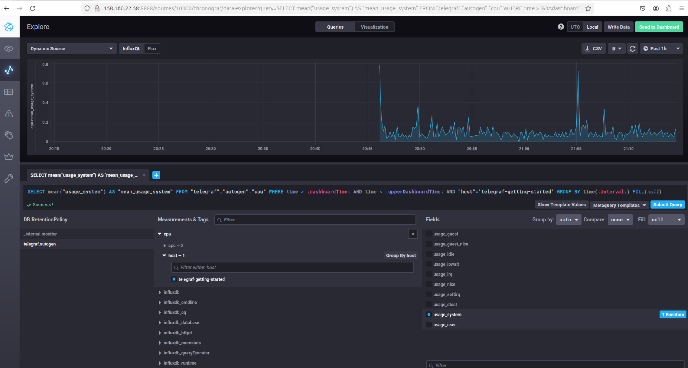
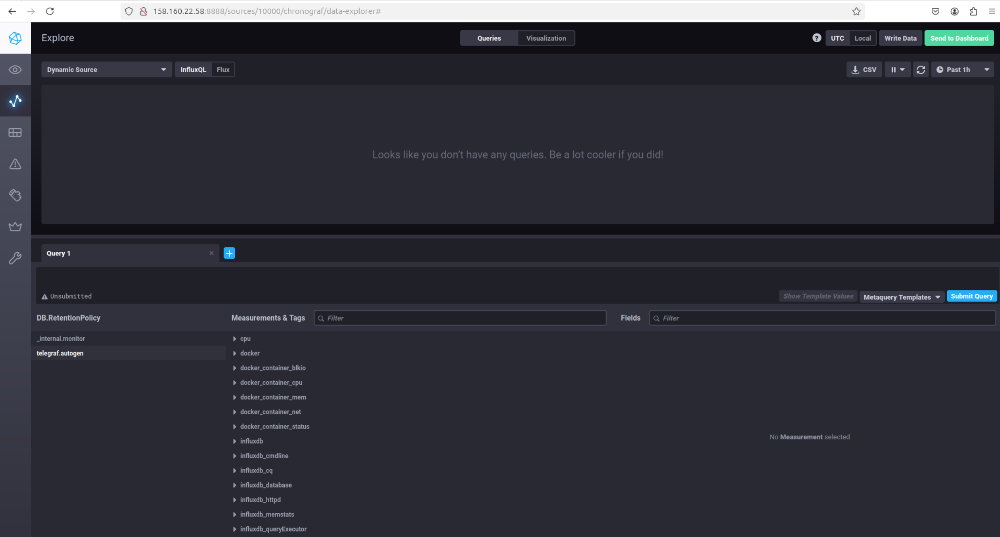

## Домашнее задание к занятию "13.Системы мониторинга"  
  
***  
### Обязательные задания  
  
Ответы на вопросы:  
1. Метирики в мониторинг:  
  - Использование ЦПУ  
      Поскольку вычисления нагружают ЦПУ, важно отслеживать процент использования процессора.  
      Это поможет понять, насколько эффективно используются ресурсы  
  - Свободное место на диске  
      Поскольку отчеты сохраняются на диск, важно следить за доступным пространством, чтобы избежать проблем с записью данных  
  - Ошибки  
      Отслеживание количества ошибок (например, 500-й код) позволяет быстро реагировать на сбои и улучшать стабильность системы  
  - Задержка обработки запросов  
      Измерение времени, необходимого для обработки HTTP-запросов, позволяет выявить проблемы с производительностью и задержками в ответах  
  - Количество запросов в секунду  
      Эта метрика показывает нагрузку на систему и помогает оценить её производительность под различными условиями нагрузки  
    
2.  
RAM - объем оперативной памяти, используемой приложением для выполнения задач  
Inodes - это  индексные узлы, представляют собой важную структуру данных в файловых системах, они хранят метаданные о файлах и каталогах, но не содержимое самих файлов. Каждый файл или каталог имеет свой уникальный номер inode, который используется для идентификации и доступа к метаданным.Если будет большое количество легковесных файлов-отчётов, то в какой-то момент inodes могут закончиться, при этом на диске может оставаться свободное пространство, но файлы не смогут создаваться  
CPU - это центральное обрабатывающее устройство - процессор , основной вычислительный ресурс системы  
  
для оценки качества обслуживания клиентов, можно использовать концепции SLO-SLA-SLI:  
  
SLO (Service Level Objectives) - определить целевые показатели для каждой метрики:  
  - использование RAM в процентном выражении за период времени  
  - загрузка ЦПУ в процентном выражении за период времени  
  - достаточно для хранения всех необходимых файлов с запасом  
  
SLA (Service Level Agreements) - соглашение об уровне обслуживания, установить соглашения с клиентами о том, что они могут ожидать:  
  - гарантирование, что время отклика системы составит не более определенного времени на заданный процент запросов  
  - обеспечиние доступности сервиса на высоком уровне в процентном выражении  
  
SLI (Service Level Indicators) - индикатор уровня обслуживания , определить метрики, которые будут использоваться для оценки выполнения SLO и SLA, например:  
  - Измерение времени отклика на запросы  
  - Процент успешных запросов по сравнению с общим количеством запросов  
  
3.  
предложить  настроить логирование непосредственно в приложениях:  
  - логирование в файл - разработчики могут настроить свои приложения на запись ошибок в локальные файлы  
  - отправка уведомлений по электронной почте -в случае критических ошибок можно настроить автоматическую отправку уведомлений по электронной почте разработчикам  
  - настроить интеграцию с существующими системами мониторинга например, Prometheus, Zabbix или Grafana  для сбора метрик и логов  
  
4.  
возможны проблемы с конфигурацией сервера, запросы возвращают статус-коды, отличные от 2xx, например, коды перенаправления 3xx. Возможны и другие коды - информационные 1хх  
  
5.   
Push-систем мониторинга  
Плюсы:  
  - Простота настройки: В push-модели агенты (приложения) отправляют метрики на центральный сервер, что упрощает настройку и развертывание. Не требуется настраивать доступ к каждому приложению для сбора данных  
  - Гибкость: Приложения могут отправлять данные в любое время, что позволяет легко управлять короткоживущими процессами, которые не могут быть опрошены  
  - Независимость от сетевой конфигурации: Push-модель не требует, чтобы сервер мониторинга имел доступ к каждому приложению, что упрощает работу в условиях ограниченного доступа  
Минусы:  
  - Проблемы с обнаружением недоступности: Если агент не может отправить данные (например, из-за сетевых проблем), это может привести к потере информации о состоянии системы, и выявление проблемы может занять больше времени  
  - Усложнение конфигурации: Каждое приложение должно знать, куда отправлять метрики и как аутентифицироваться, что может увеличить сложность конфигурации  
  - Потенциальная потеря данных: Если приложение не может отправить метрики в момент их генерации (например, при сбоях), данные могут быть утеряны  
  
Pull-систем мониторинга  
Плюсы:  
  - Централизованное управление: Все настройки и параметры сбора метрик хранятся на центральном сервере, что упрощает управление и настройку системы мониторинга  
  - Быстрое обнаружение проблем: Pull-модель позволяет быстро выявлять недоступность приложений или сервисов, так как сервер мониторинга активно проверяет состояние всех агентов  
  - Отсутствие зависимости от агентов: Если агент не работает или недоступен, это сразу видно на центральном сервере без необходимости анализа логов приложений  
Минусы:  
  - Сложности с короткоживущими процессами: Pull-модель неэффективна для приложений с коротким временем жизни, так как сервер может не успеть опросить их перед завершением работы  
  - Необходимость настройки доступа: Сервер мониторинга должен иметь доступ к каждому приложению для получения метрик, что может быть сложно в условиях ограниченного доступа  
  - Задержка в получении данных: Данные собираются по расписанию, что может привести к задержкам в получении актуальной информации о состоянии системы  

6.  
Prometheus: Основная модель работы — pull  
TICK: Эта система (Telegraf, InfluxDB, Chronograf, Kapacitor) использует push-модель  
Zabbix: Работает преимущественно по pull модели, хотя может использовать push  
VictoriaMetrics: Поддерживает как push, так и pull модели  
Nagios: Преимущественно использует pull модель  
  
  
7. Веб-интерфейс ПО chronograf  
  
  
8. Метрики утилизации cpu из веб-интерфейса  
  
  
9. Метрики, связанные с docker  
  
    
  
***  
Файлы и скриншоты по задаче можно посмотреть [здесь](/)  
  

