## Домашнее задание к занятию «Продвинутые методы работы с Terraform»

***
### Задание 1  
Скриншот консоли ВМ yandex cloud с их метками  
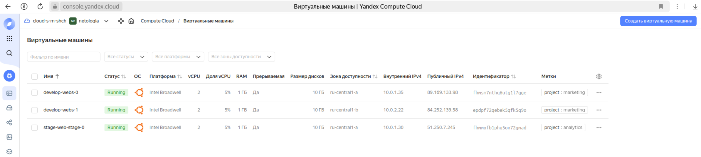  

Скриншот подключения к консоли и вывод команды `sudo nginx -t`  
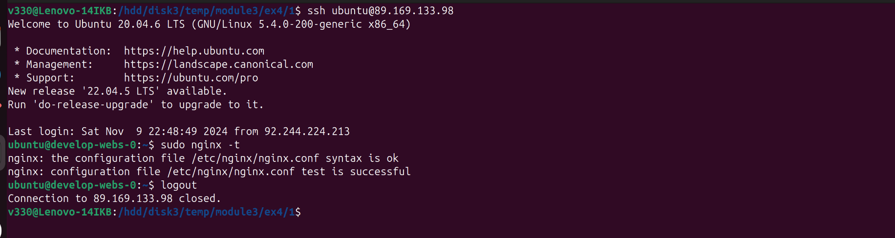  

Скриншот содержимого модуля  
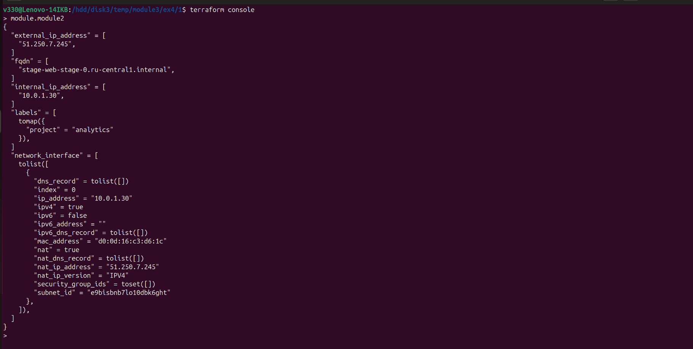  

Файлы и скриншоты по задаче можно посмотреть [здесь](1/)  

***
### Задание 2  
Скриншот содержимого модуля  
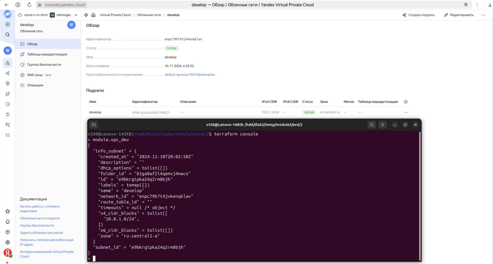  

Скриншот документации к модулю   
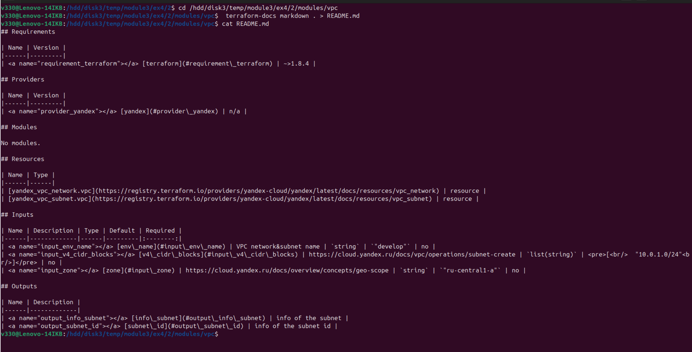  

Файлы и скриншоты по задаче можно посмотреть [здесь](2/)  

***
### Задание 3  
Скриншот список ресурсов в стейте  
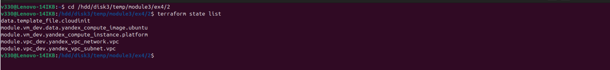  

Скриншот удаления из стейта модуля vpc   
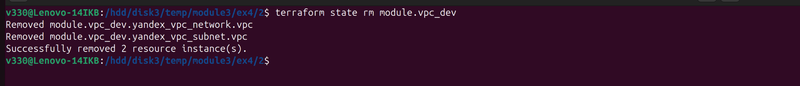  

Скриншот удаления из стейта модуля vm   
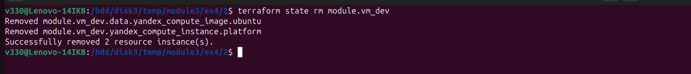  

Скриншот импорт всё обратно   
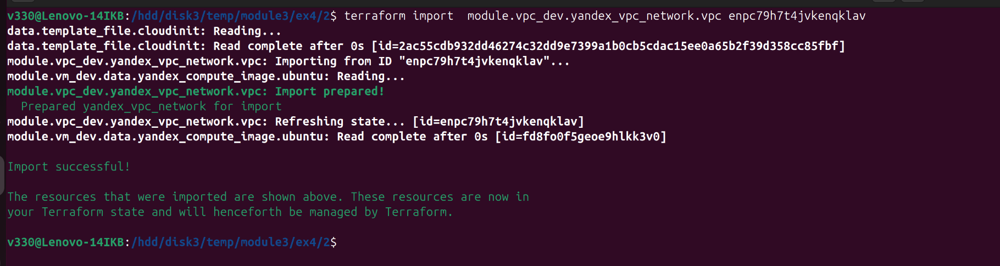  
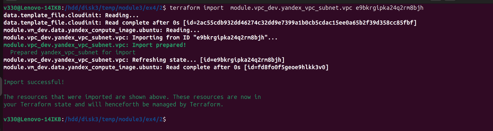  
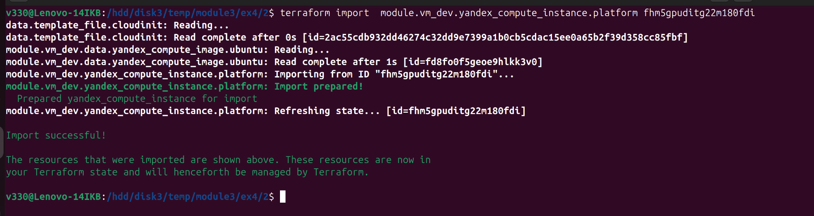  

Скриншот terraform plan   
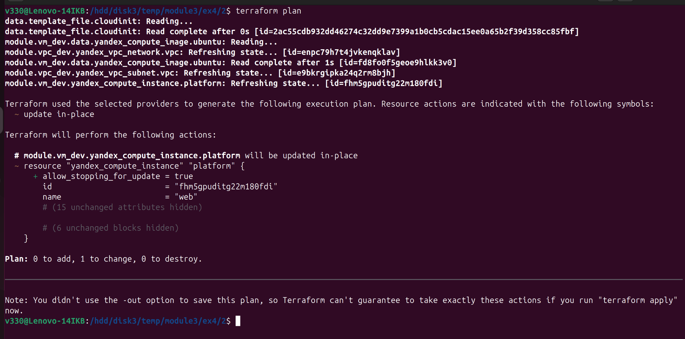  

Файлы и скриншоты по задаче можно посмотреть [здесь](3/)  

***
### Задание 5  
Скриншот кластера managed БД Mysql  
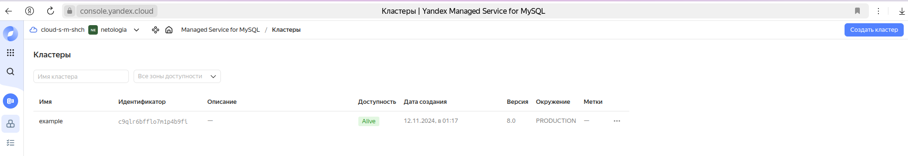  

Скриншот хосты кластера  
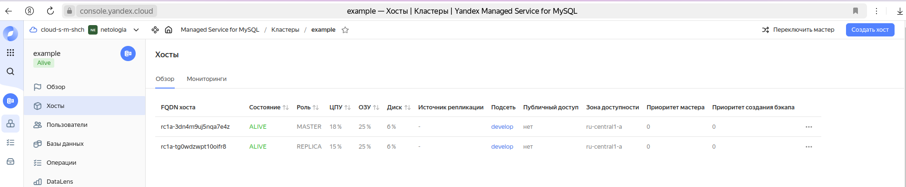  

Скриншот пользователя  
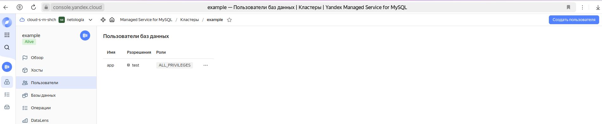  

Скриншот базы данных  
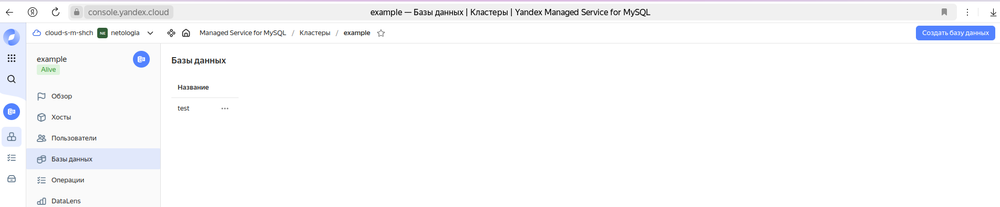  

Файлы и скриншоты по задаче можно посмотреть [здесь](5/)  

***
### Задание 6  
Скриншот Object Storage  
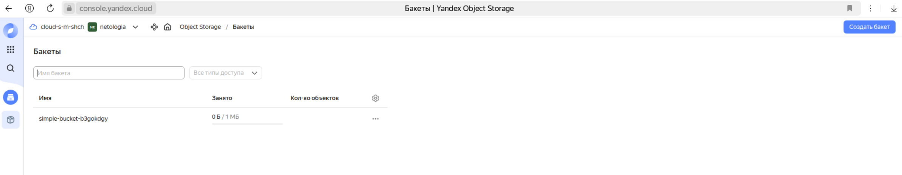  

Скриншот terraform output  
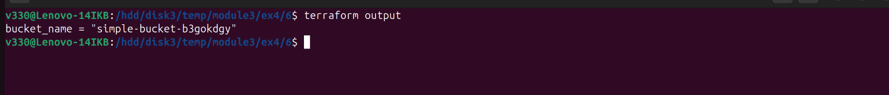  

Файлы и скриншоты по задаче можно посмотреть [здесь](6/)  

