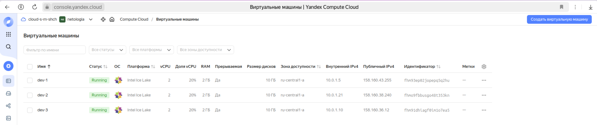
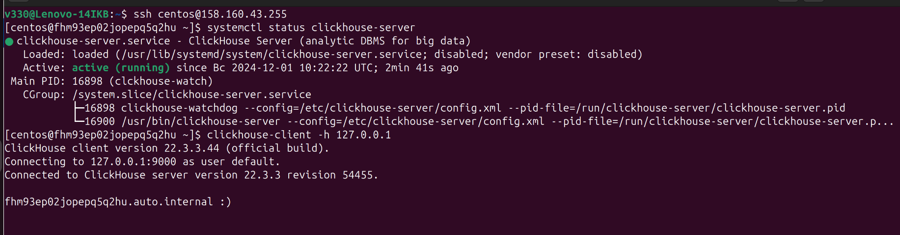
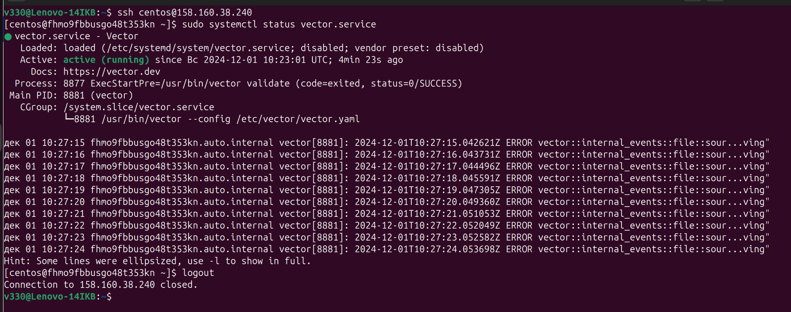
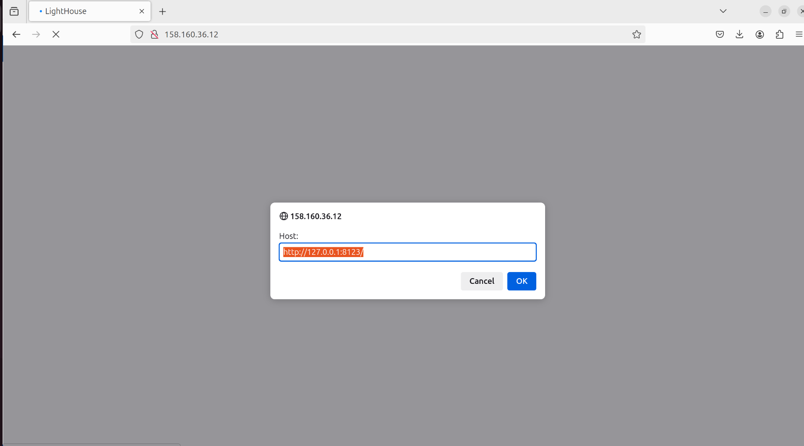
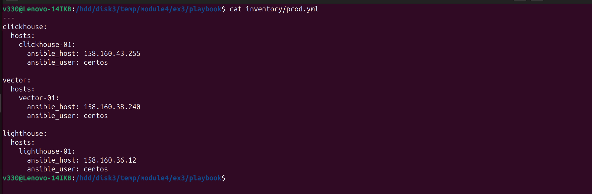
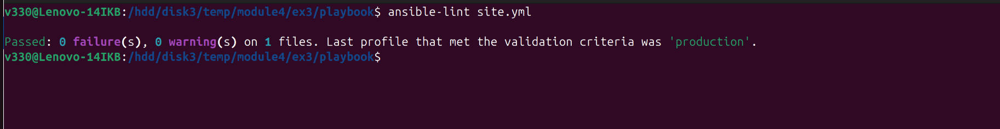
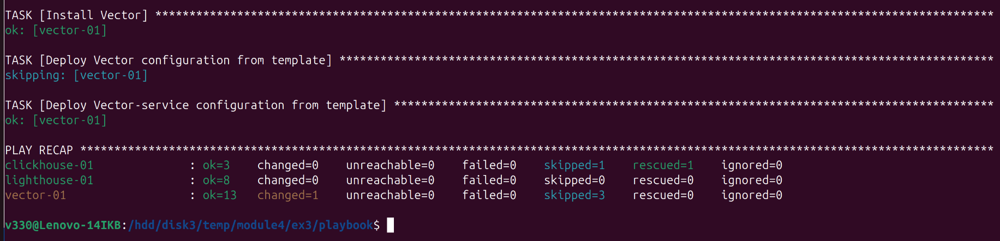
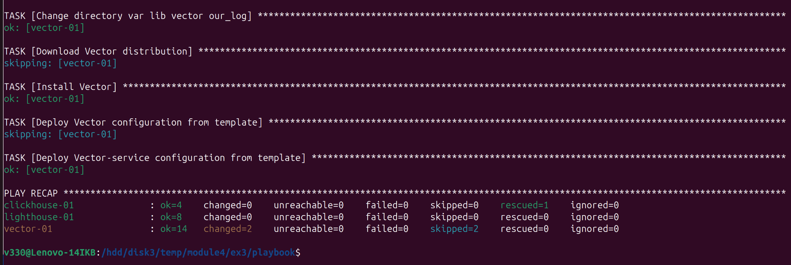
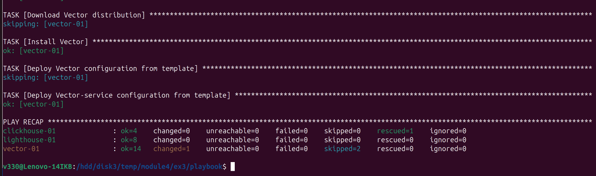

## Домашнее задание к занятию «Использование Ansible»  

***  
### Подготовка к выполнению  
1. Подготовка в Yandex Cloud трех хостов  
  

***
### Основная часть  
1. Результат ansible playbook  

  - Результат запуска на хостe clickhouse  
  

  - Результат запуска на хостe vector  
  

  - Результат запуска на хостe lighthouse  
  

4. inventory-файл `prod.yml`  
  

5. `ansible-lint` - проверка для исправления ошибок  
  

6. Запуск с флагом `--check`  
  

7. Запуск с флагом `--diff`  
  

8. Повторный запуск с флагом `--diff`, последующие запуски дают одинаковый результат  
  

9. Документация ansible playbook  
playbook `site.yml` предназначен для управления установкой и разворачивания конфигураций `Clickhouse`, `Vector` и `LightHouse`  
playbook содержит четыре play с названиями `Install Nginx`, `Install Lighthouse`, `Install Clickhouse` и `Install Vector`  
play связаны с хостами группы `lighthouse`, `clickhouse` и `vector`  
Параметры хостов описаны в  inventory-файл `prod.yml`, имеют следующие параметры:  
  - ansible_host - IP адрес виртуальной машины в яндекс-облако  
  - ansible_user - login пользователя с привелигированными правами centOS:7  

playbook содержит четыре Jinja2-шаблона:  
  - nginx_config.j2 - конфигурационный файл Nginx  
  - lighthouse_config.j2 - дополнение к конфигурационному файлу Nginx для приложения LightHouse  
  - vector_config.j2 - конфигурационный файл Vector  
  - vector_service_config.j2 - конфигурационный файл сервиса Vector  

play `Install Vector` содержит следующие tasks:  
  - Get Vector version - предназначен для проверки версии Vector  
  - Create/Change directory - предназначен для создания и/или изменения прав доступа  
  - Download Vector distibution - предназначен для скачивания дистрибутива Vector  
  - Unarchive Vector distribution - предназначени для разархивирования скачанного дистрибутива  
  - Install Vector - предназначен для установки пакета  
  - Deploy from template - предназначен для создания конфигурационного файла на основании шаблона template-файла jinja2  
  
play `Install Vector` содержит обработчики:  
  - Restart Vector - предназначен для перезапуска Vector  

play `Install Nginx` содержит следующие tasks:  
  - Install epel-release - предназначен для дополнительных пакетов для дистрибутивов centOS  
  - Install nginx - предназначен для установки пакета Nginx  
  - Create nginx config - предназначен для установки конфигурационного файла по шаблону  

play `Install Nginx` содержит обработчики:  
  - Start nginx - предназначен для запуска Nginx  
  - Reload nginx - предназначен для перезагрузки Nginx  
    
    
play `Install Lighthouse` содержит следующие tasks:  
  - Install git - предназначен для установки пакета Git  
  - Clone Lighthouse repository - предназанчен для клонирования  
  - Create Lighthouse config - предназначен для установки конфигурационного файла по шаблону  

play `Install Lighthouse` содержит обработчики:  
  - Restart nginx - предназначен для перезагрузки Nginx  

***  
Файлы и скриншоты по задаче можно посмотреть [здесь](/),  
проект с изменённым [playbook](playbook/)  

