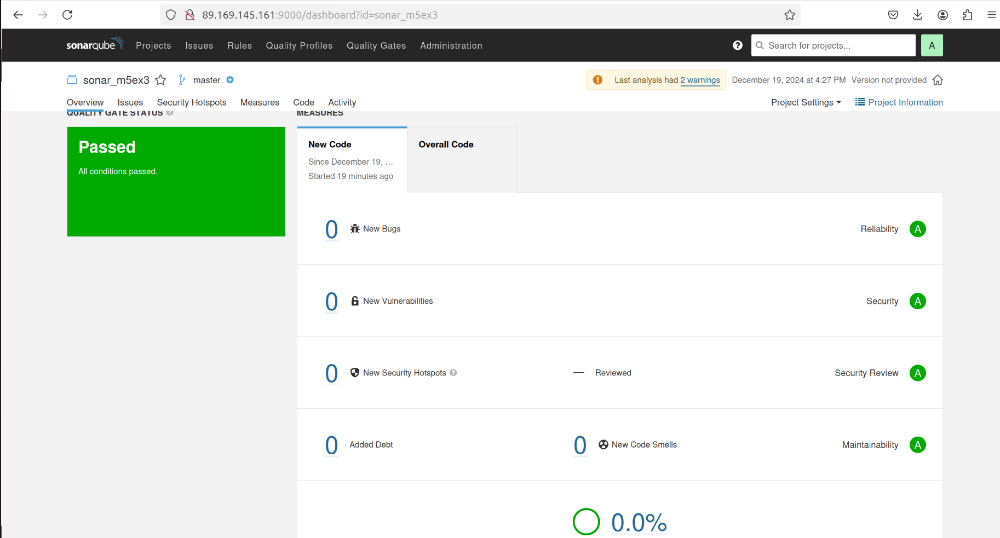
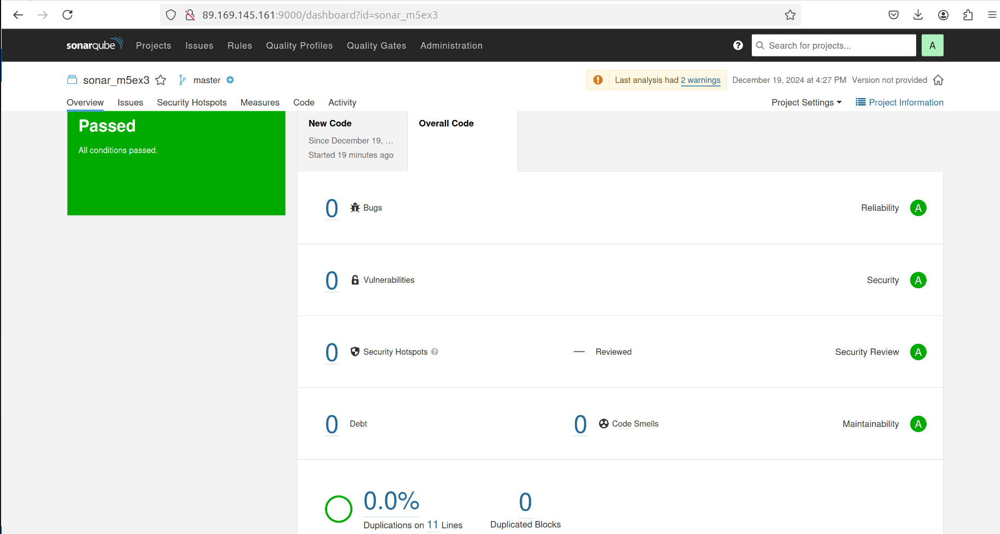

## Домашнее задание к занятию 3 «Процессы CI/CD»   
  
***  
### Знакомоство с SonarQube  
Скриншот успешного прохождения анализа  
  
  - New Code  
  
  
  - Overall Code  
  
  
  
***  
### Знакомство с Nexus  
xml-файл для артефакта [maven-metadata.xml](maven-metadata.xml)  
  
***  
### Знакомство с Maven  
Исправленный файл с блоком с зависимостями под артефакт [pom.xml](pom.xml)  
  
  
***  
Файлы и скриншоты по задаче можно посмотреть [здесь](/)  

