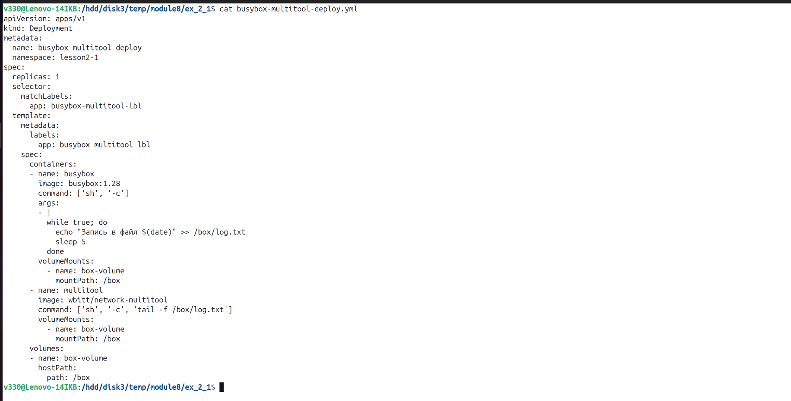
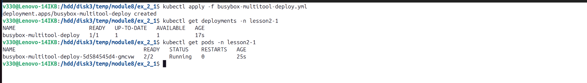
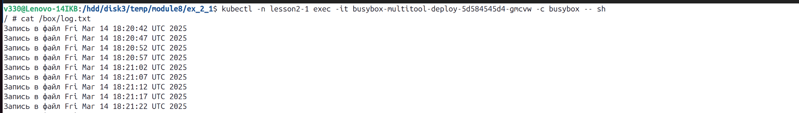
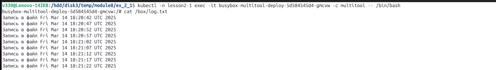
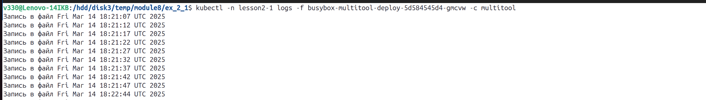
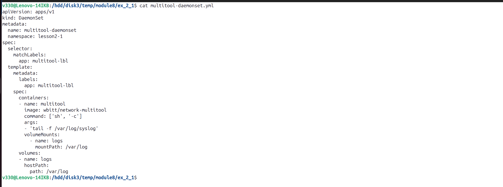
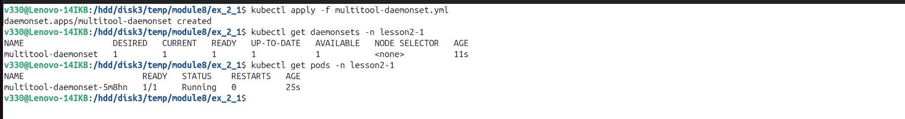
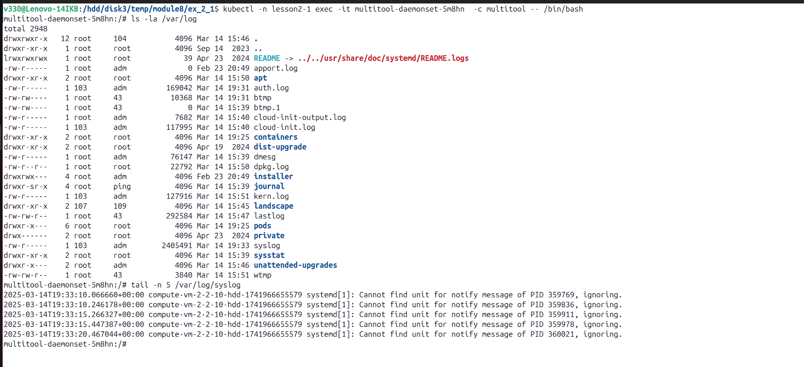
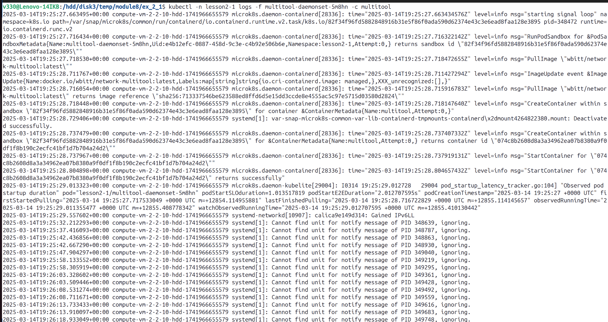

# Домашнее задание к занятию «Хранение в K8s. Часть 1»  
  
***  
### Задание 1. Создать Deployment приложения, состоящего из двух контейнеров и обменивающихся данными.  
1. Манифест [Deployment](busybox-multitool-deploy.yml) приложения  
  
  
  
2. `busybox` пишет каждые пять секунд в файл   
  
  
3. Чтение файла контейнером `multitool`  
  
  
  
  
### Задание 2. Создать DaemonSet приложения, которое может прочитать логи ноды.  
1. Манифест [DaemonSet](multitool-daemonset.yml) приложения  
  
  
  
2. Чтение файла `/var/log/syslog` кластера `MicroK8S` изнутри пода  
  
  
  
  
***  
Файлы и скриншоты по задаче можно посмотреть [здесь](/)  

