# Домашнее задание к занятию «Установка Kubernetes»  
  
***  
### Задание 1. Установить кластер k8s с 1 master node  
1. Установка на ноде control plane под root пользователем  
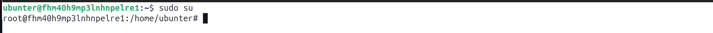  

    1.1. Скачать RKE2 - Rancher Kubernetes Engine  
      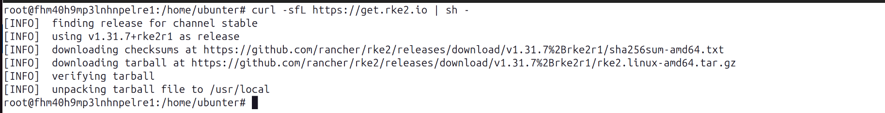  
    
    1.2. Создать конфигурационный файл  
      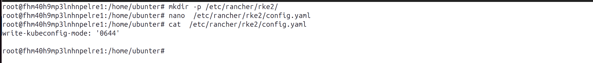  

    1.3. Запустить сервис  
      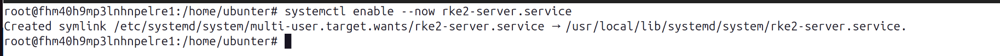  
      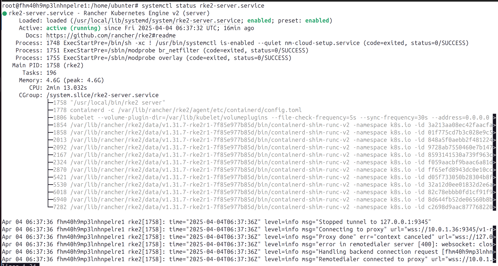  

    1.4. Настроить ссылки  
      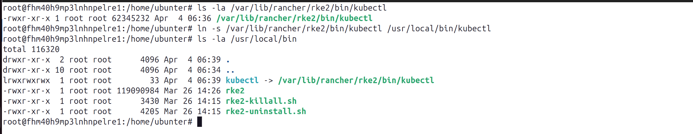  

    1.5. Проверить работоспособность кластера  
      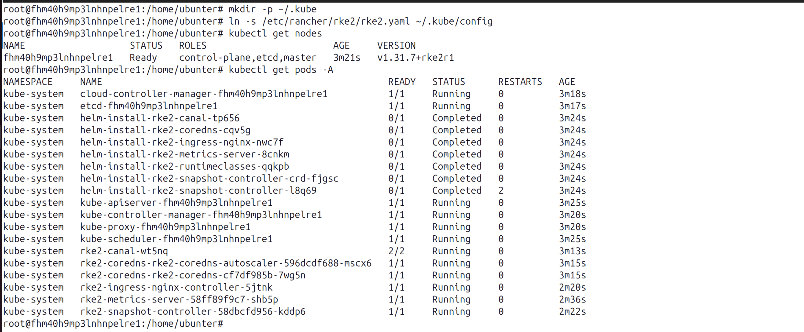  

    1.6. Получить токен авторизации для подключения нод к кластеру  
      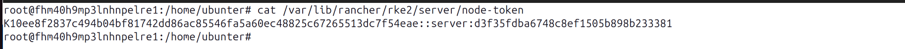  

2. Установка на ноде worker plane под root пользователем  
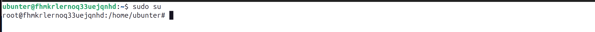  

    2.1. Скачать RKE2 агент  
      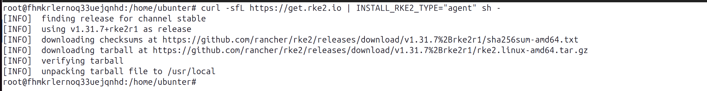  

    2.2. Создать конфигурационный файл, исползуется локальный IP ноды control plane   
      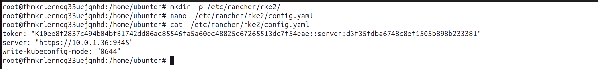  

    2.3. Запустить сервис  
      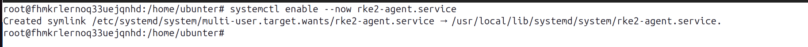  
      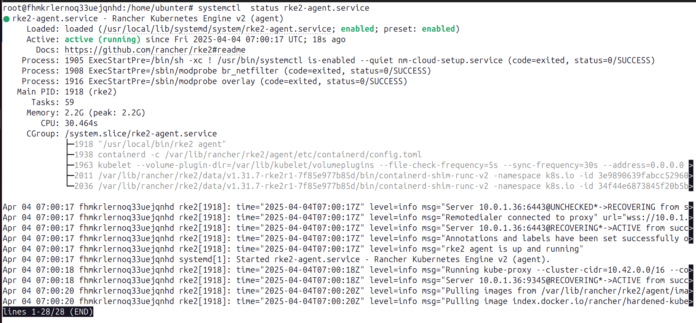  

    2.4. Проверить статус подключения worker ноды на сервере master ноды   
      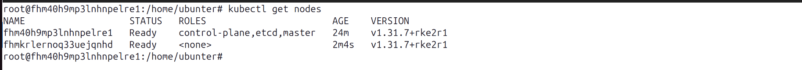  

3. Аналогично установить RKE2 на остальных worker нодах  
    3.1. Проверить статус подключения worker нод на сервере ноды control plane   
      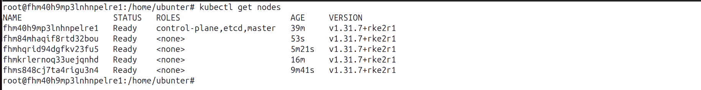  

  
***  
Файлы и скриншоты по задаче можно посмотреть [здесь](/)  

