# Домашнее задание к занятию «Управление доступом»  
  
***  
### Задание 1. Создайте конфигурацию для подключения пользователя  
1. Создание rsa-ключа  
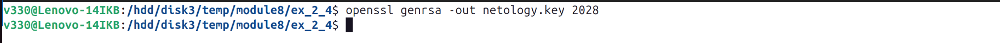  
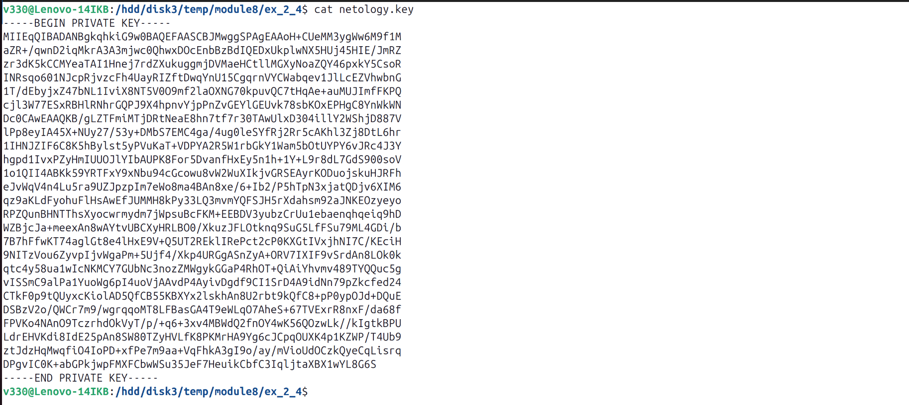  
  
2. csr-запрос на создание сертификата  
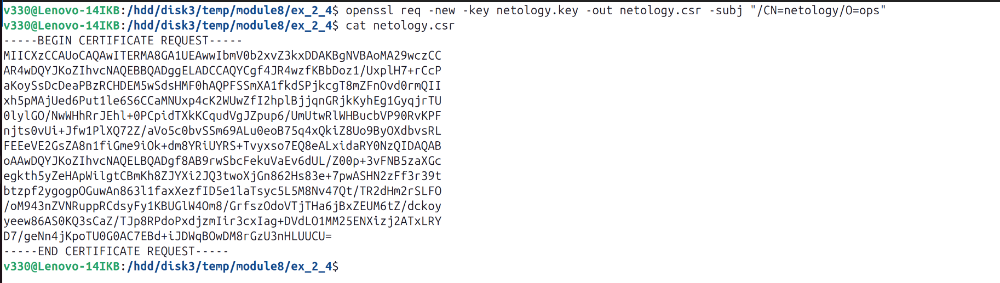  
  
3. Корневые ключ и серт с сервера  
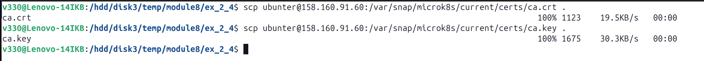  
  
4. Подписание запроса на сертификат  
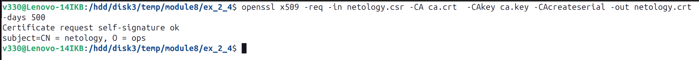  
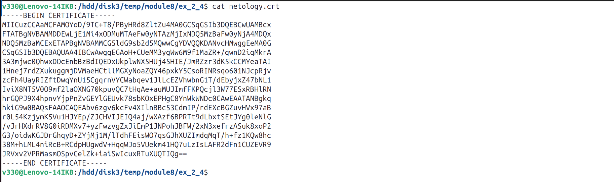  
  
5. Добавление в ~/.kube/config нового пользователя  
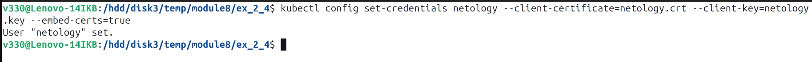  
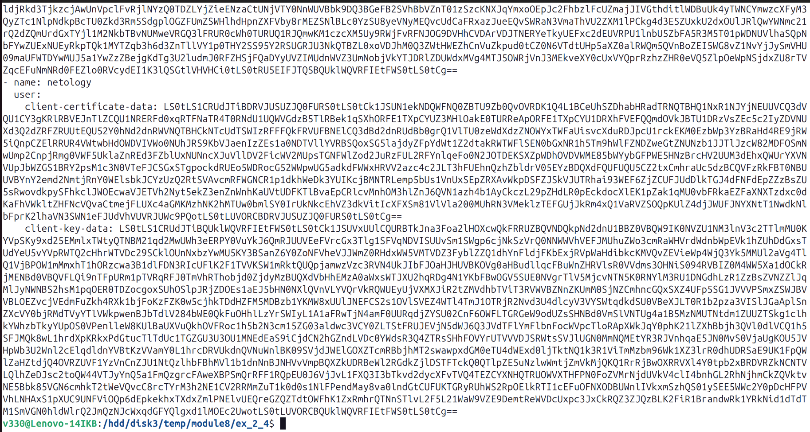  
  
6. Создание нового контекста  
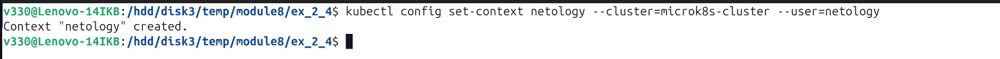  
  
7. Подключение к кластеру от имени нового пользователя  
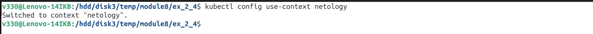  
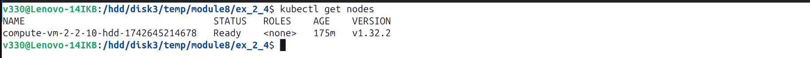  
  
8. Включить rbac  
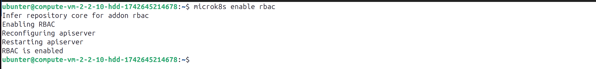  
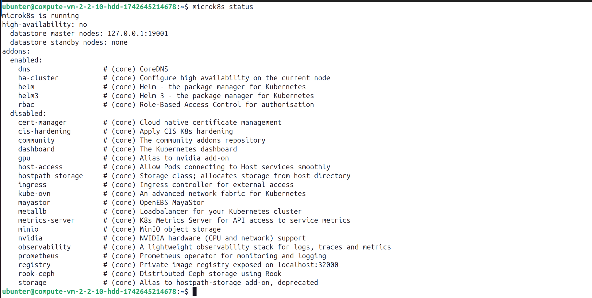  
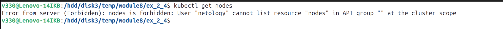  
  
9. Установка контекста microk8s  
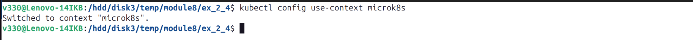  
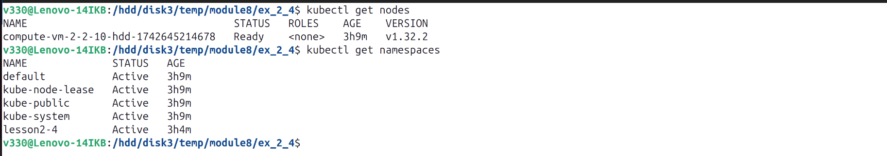  
  
10. Манифест [Deployment, Service](nginx.yml) приложения  
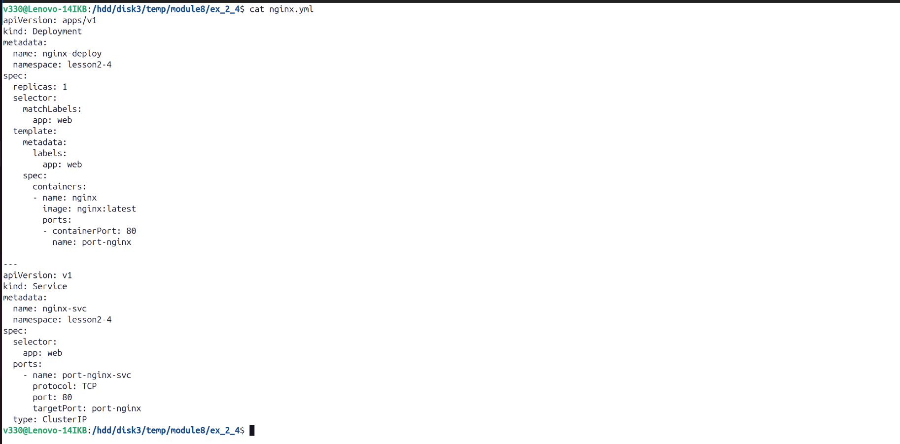  
  
11. Развернуть приложение  
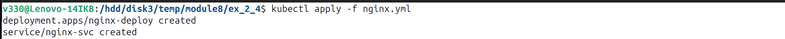  
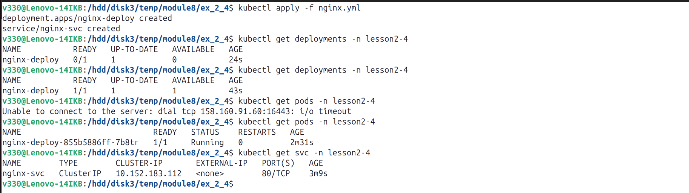  
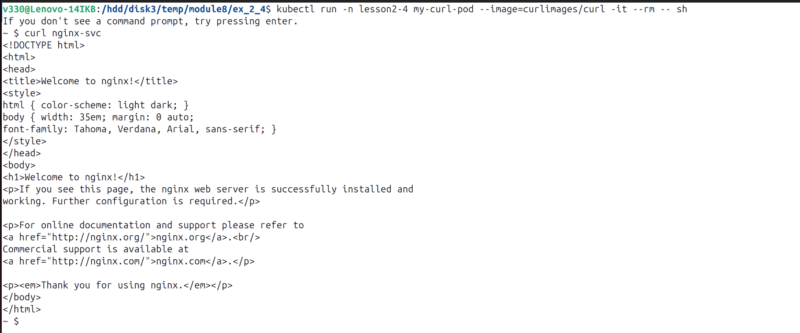  
  
12. Манифест [Role](role.yml)  
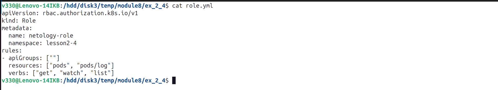  
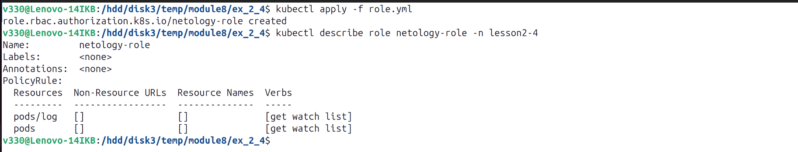  
  
13. Манифест [RoleBinding](role-binding.yml)  
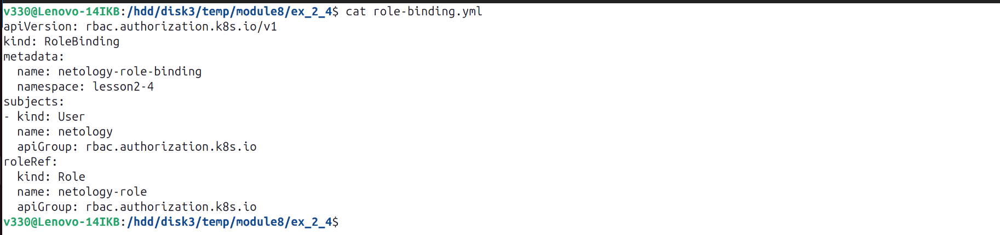  
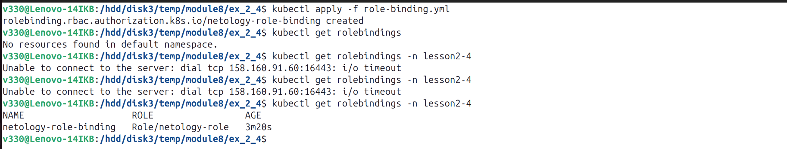  
  
14. Установка контекста нового пользователя  
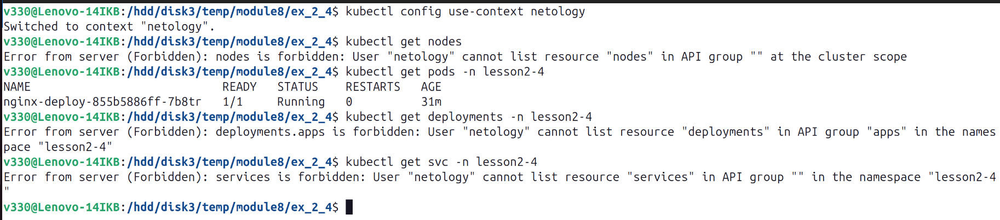  
  
15. Просмотр логов   
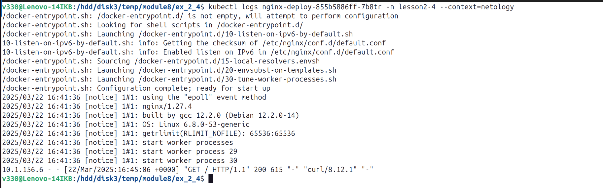  
  
16. Просмотр конфигурации pod  
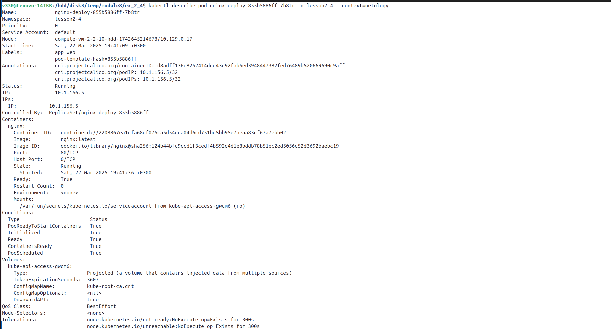  
  
***  
Файлы и скриншоты по задаче можно посмотреть [здесь](/)  

