# Домашнее задание к занятию «Конфигурация приложений»  
  
***  
### Задание 1. Создать Deployment приложения и решить возникшую проблему с помощью ConfigMap. Добавить веб-страницуs  
1. Манифест [Deployment](nginx-multitool-deploy.yml) приложения из контейнеров `nginx` и `multitool`  
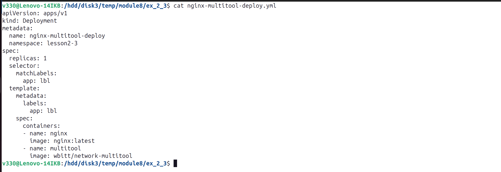  
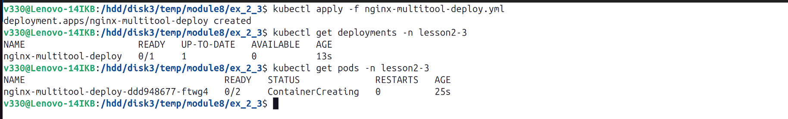  
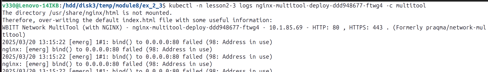  
  
2. Манифест [ConfigMap и Deployment](nginx-multitool-deploy-2.yml) приложения   
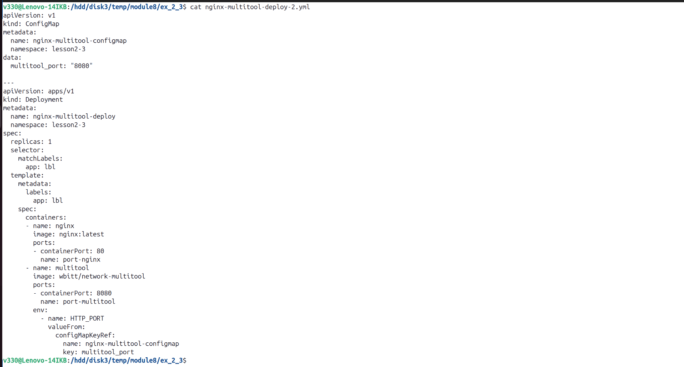  
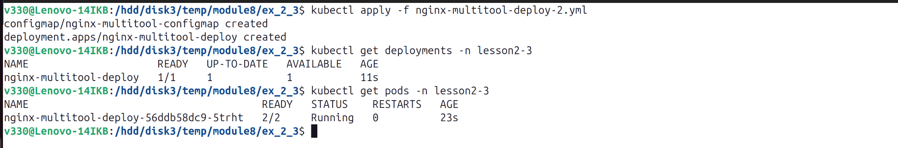  
  
3. Манифест [ConfigMap, Deployment, Service](nginx-multitool-deploy-3.yml) приложения   
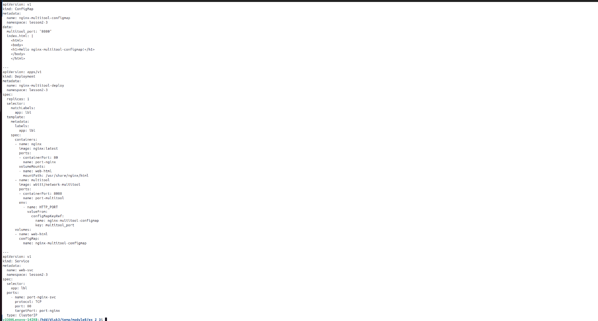  
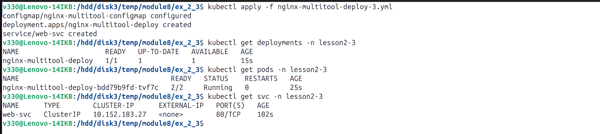  
  
4. Вывод `curl`   
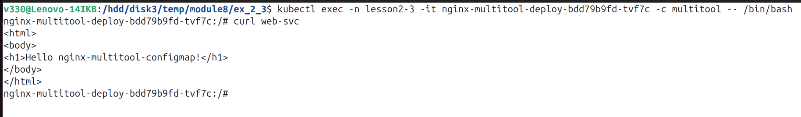  
  
  
### Задание 2. Создать приложение с вашей веб-страницей, доступной по HTTPS  
1. Манифест [ConfigMap, Deployment, Service](nginx.yml) приложения `nginx`  
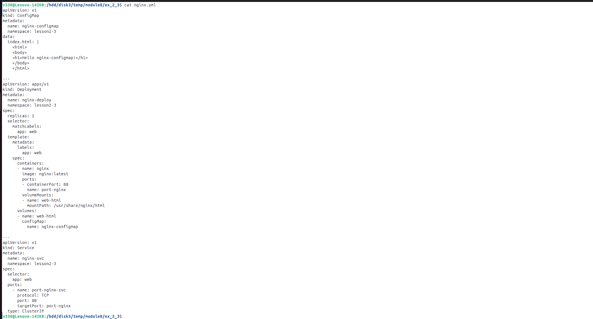  
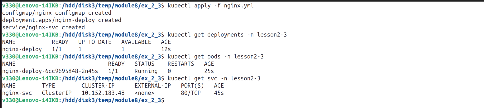  
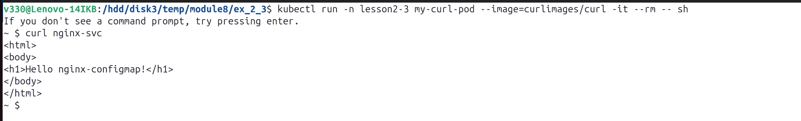  
  
2. Выпуск самоподписного сертификата SSL  
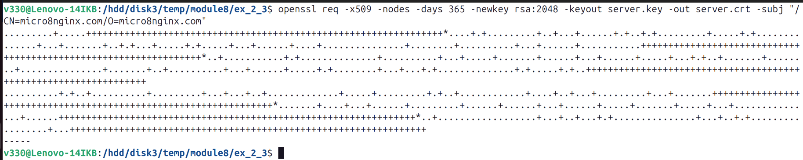  
  
3. Манифест [Secret](nginx-secret.yml) сертификата  
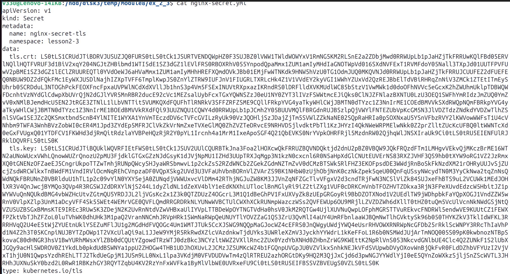  
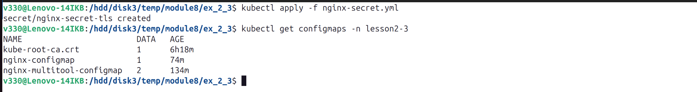  
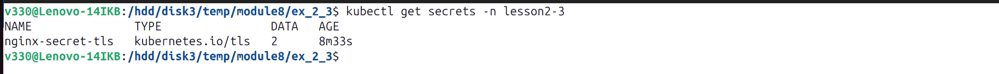  
  
4. Манифест [Ingress](nginx-ingress.yml)  
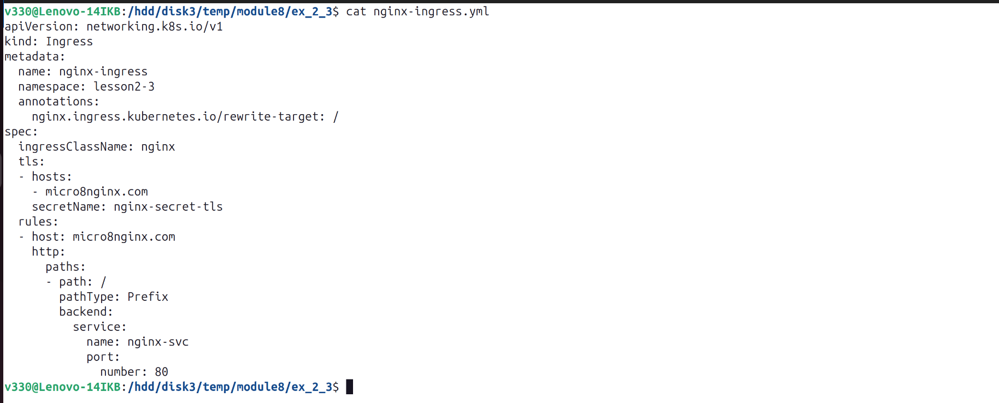  
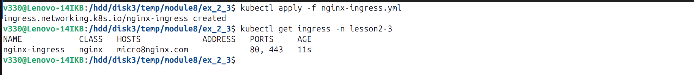  
  
5. Доступ к приложению по HTTPS  
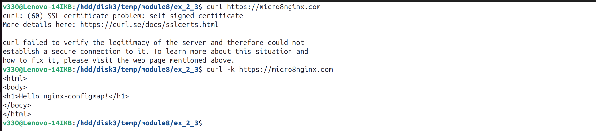  
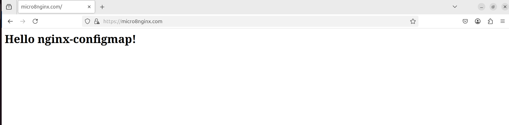  
  
***  
Файлы и скриншоты по задаче можно посмотреть [здесь](/)  

