## Домашнее задание к занятию 4 «Jenkins»   
  
***  
### Подготовка к выполнению  
1.  Виртуальные машины в яндекс облаке  
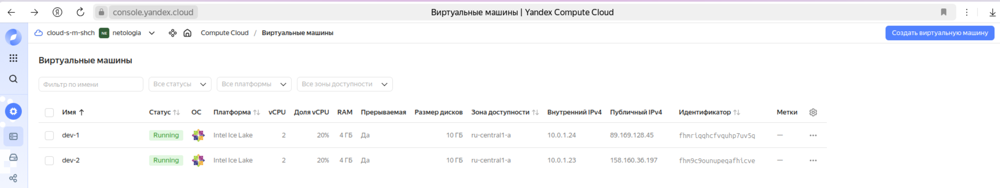  
  
2. Установка с помощью playbook  
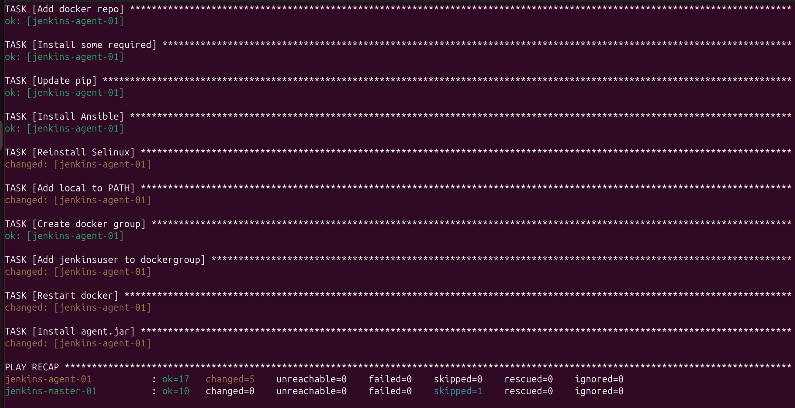  
  
3. Работоспособность  
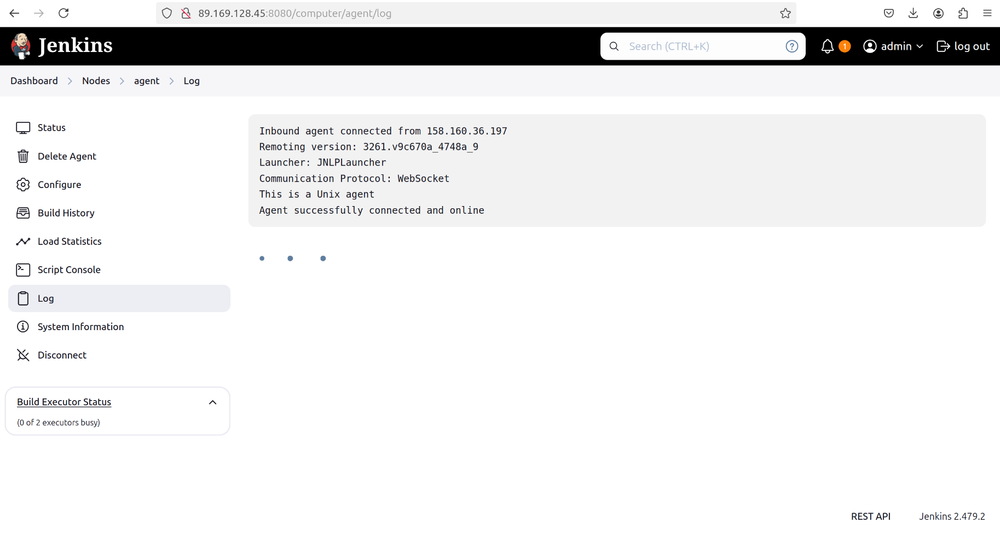  
  
4. Первоначальная настройка  
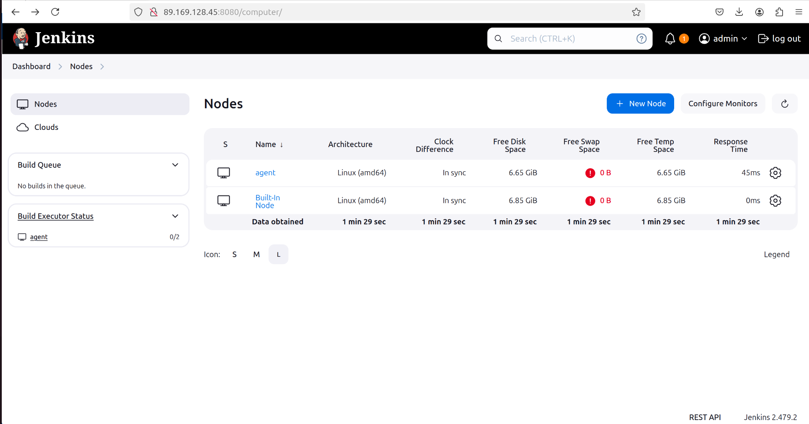  
  
  
***    
### Основная часть    
1. Freestyle Job  
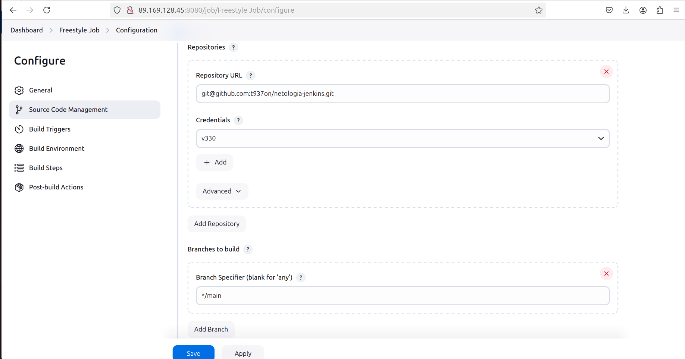  
  
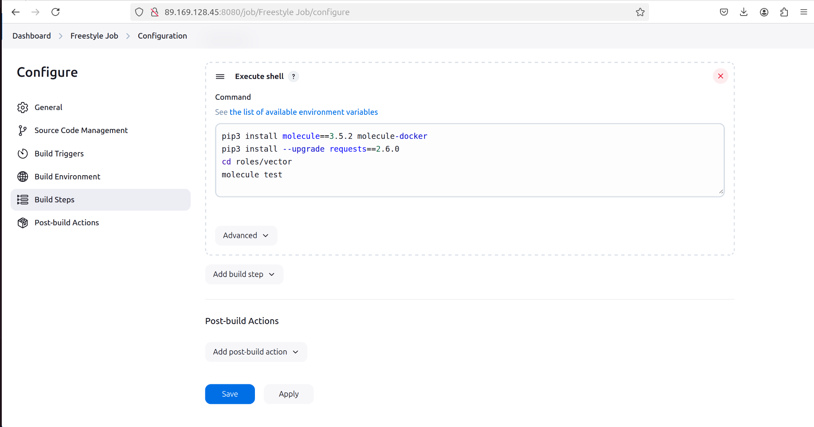  
  
2. Declarative Pipeline Job  
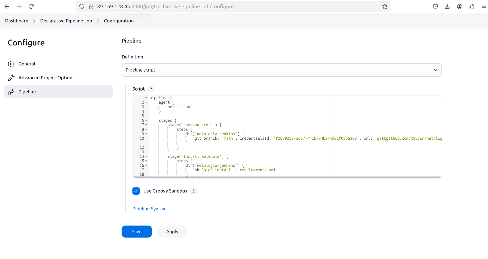  
  
3. Declarative Pipeline в файл [Jenkinsfile](Jenkinsfile)  
  
4. Multibranch Pipeline  
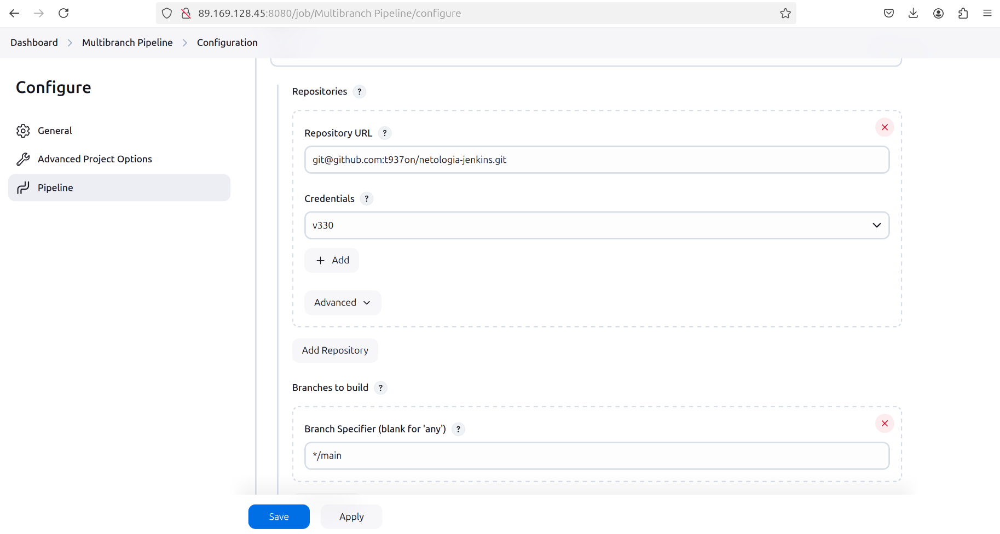  
  
5. Scripted Pipeline  
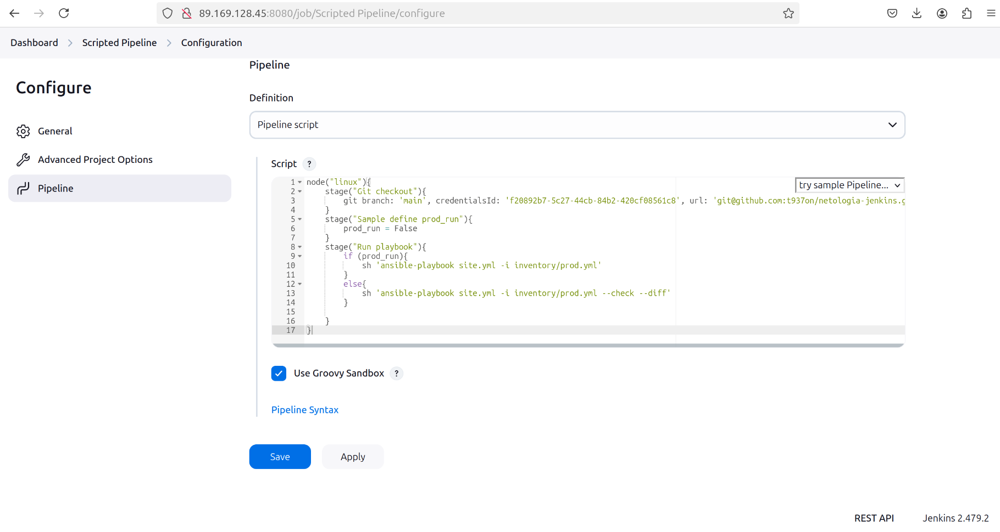  

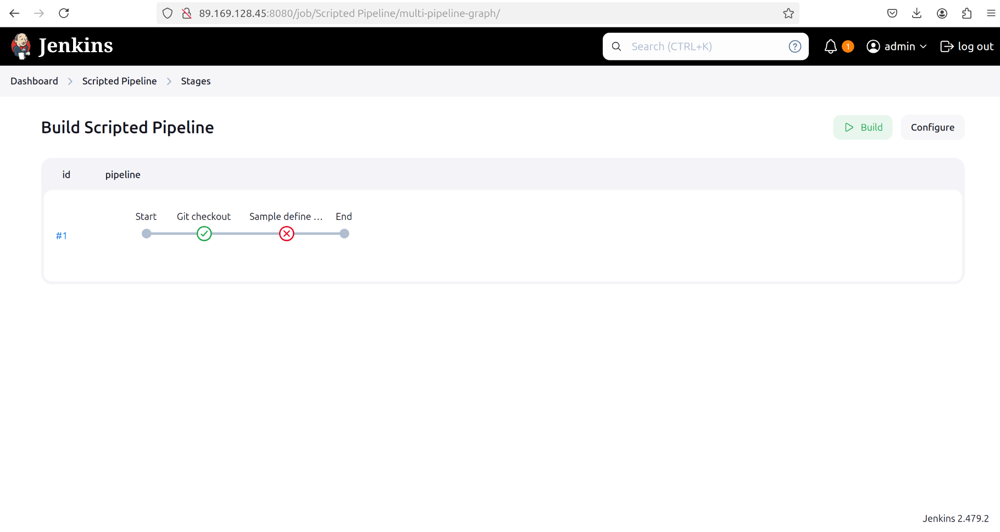  
  
6. Изменения с параметрами  
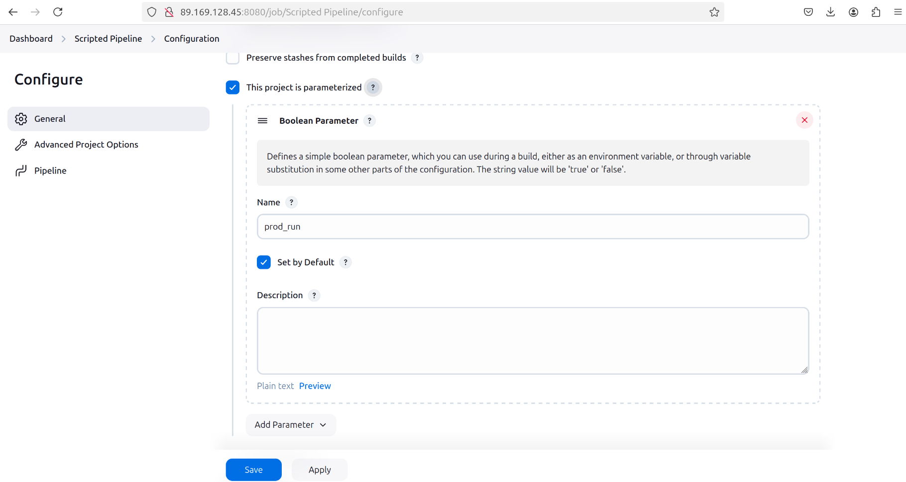  
  
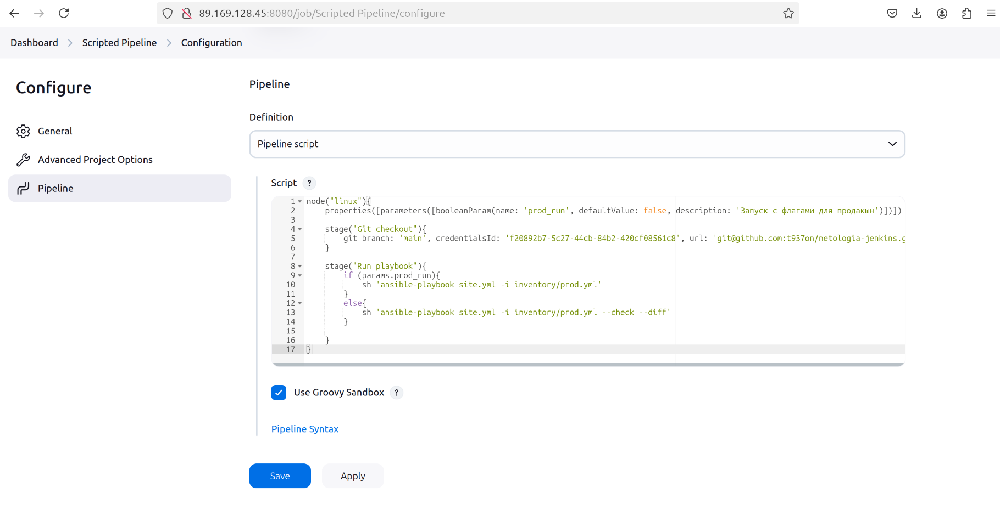  
  
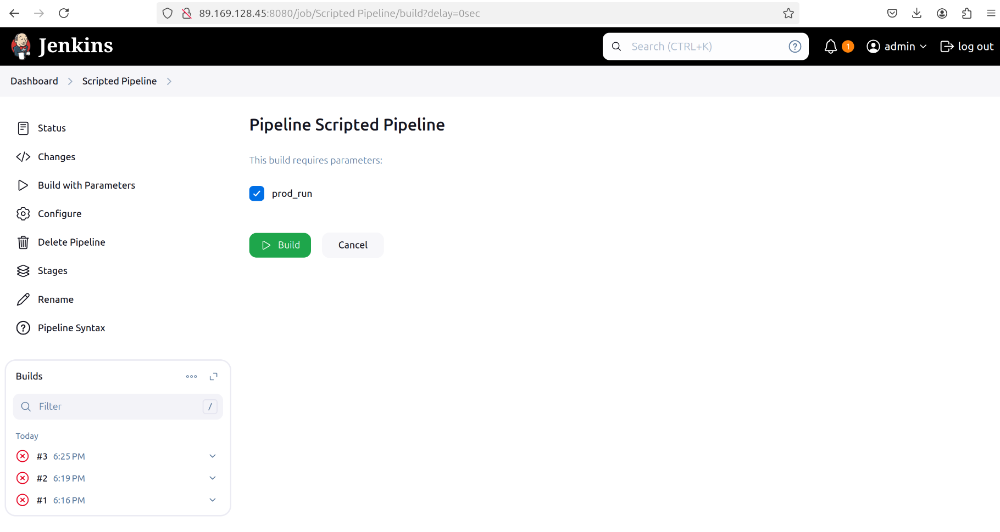  
 
7. Scripted Pipeline в файл [ScriptedJenkinsfile](ScriptedJenkinsfile)  
  
8. Ссылки:  
  - ссылка на репозиторий с ролями [https://github.com/t937on/netologia-jenkins.git](https://github.com/t937on/netologia-jenkins.git)  
  - ссылка на [Declarative Pipeline](https://github.com/t937on/netologia-jenkins/blob/main/Jenkinsfile)  
  - ссылка на [Scripted Pipeline](https://github.com/t937on/netologia-jenkins/blob/main/ScriptedJenkinsfile)  

  
***  
Файлы и скриншоты по задаче можно посмотреть [здесь](/)  

