# Домашнее задание к занятию «Сетевое взаимодействие в K8S. Часть 2»  
  
***  
### Задание 1. Создать Deployment приложений backend и frontend    
1. Манифест [Deployment и Service](frontend.yml) приложения frontend  
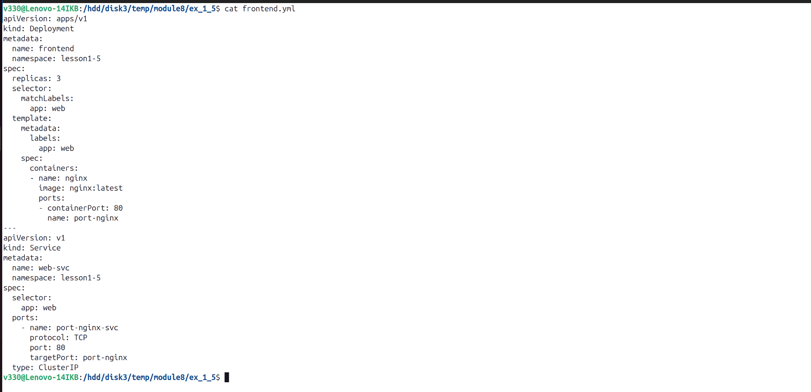  

2. Манифест [Deployment и Service](backend.yml) приложения backend  
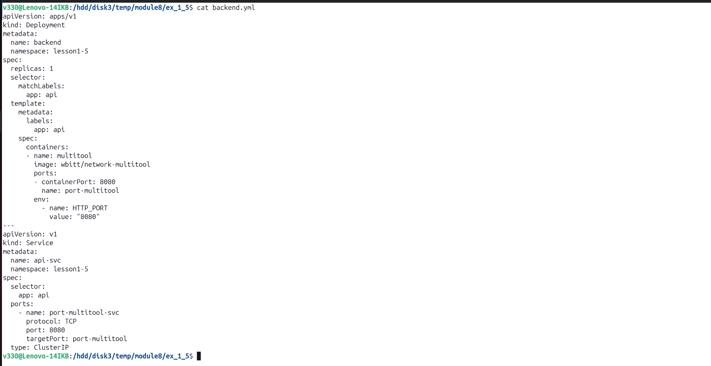  

3. Приложения видят друг друга с помощью `Service`  
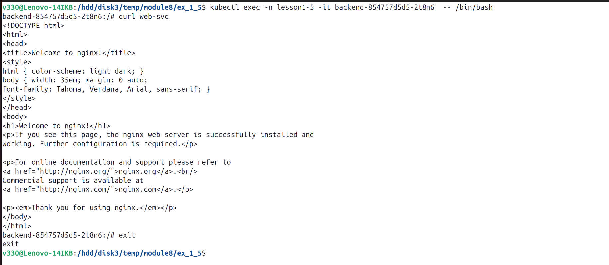  
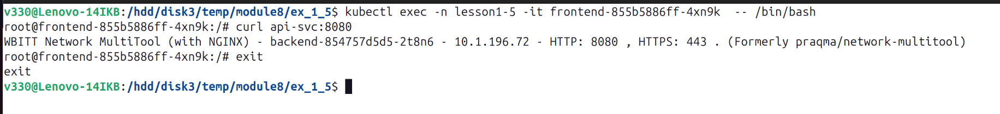  
  
### Задание 2. Создать Ingress и обеспечить доступ к приложениям снаружи кластера     
1. Включить Ingress-controller в MicroK8S  
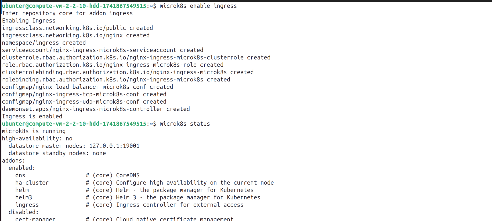  
  
2. Манифест [Ingress](ingress.yml)   
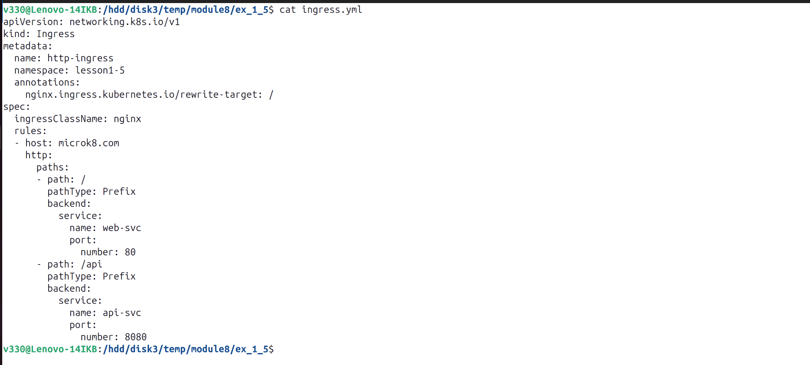  
  
3. Доступ с помощью браузера и curl с локального компьютера  
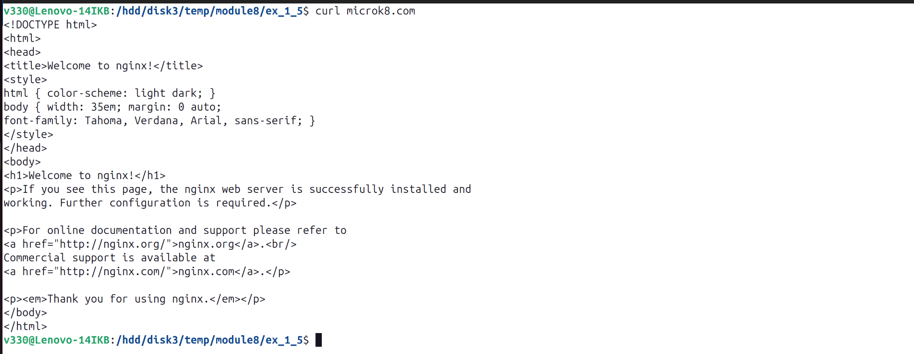  
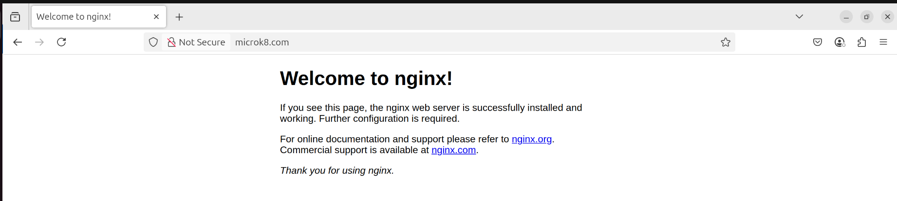  
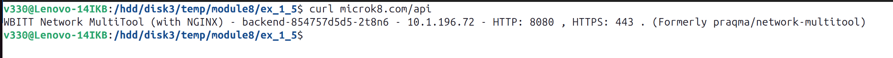  
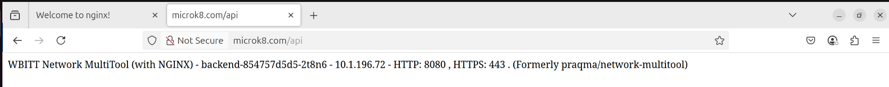  
  
4. Выпуск самоподписанного SSL сертификата  
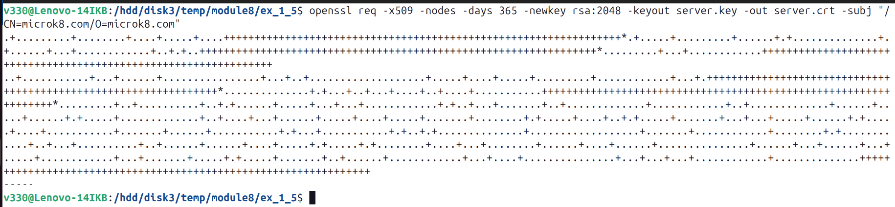  
  
5. Манифест [Ingress](ingress.yml)   
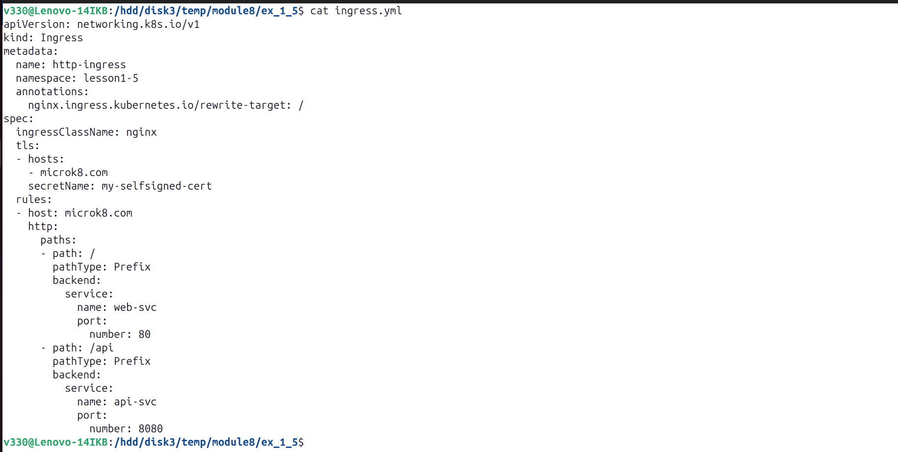  
  
6. Доступ по `https` с помощью браузера и curl с локального компьютера  
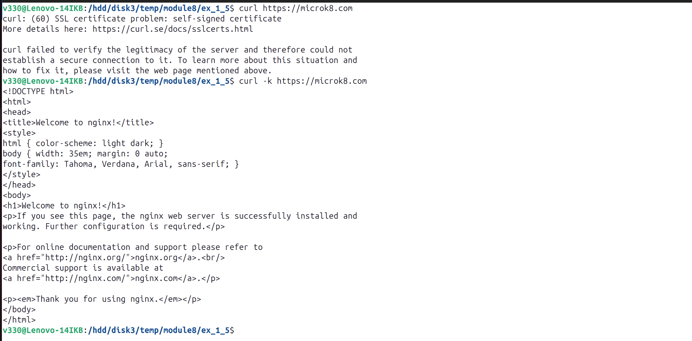  
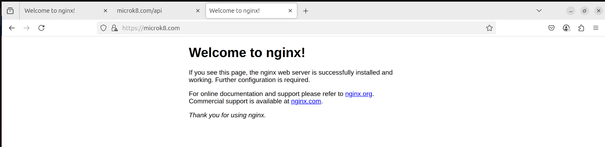  
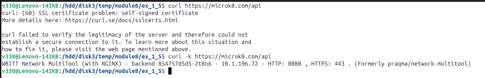  
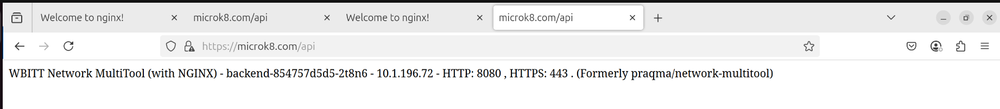  
  
  
***  
Файлы и скриншоты по задаче можно посмотреть [здесь](/)  

