# Домашнее задание к занятию «Хранение в K8s. Часть 2»  
  
***  
### Задание 1. Создать Deployment приложения, использующего локальный PV, созданный вручную.  
1. Манифест [Deployment](busybox-multitool-deploy.yml) приложения  
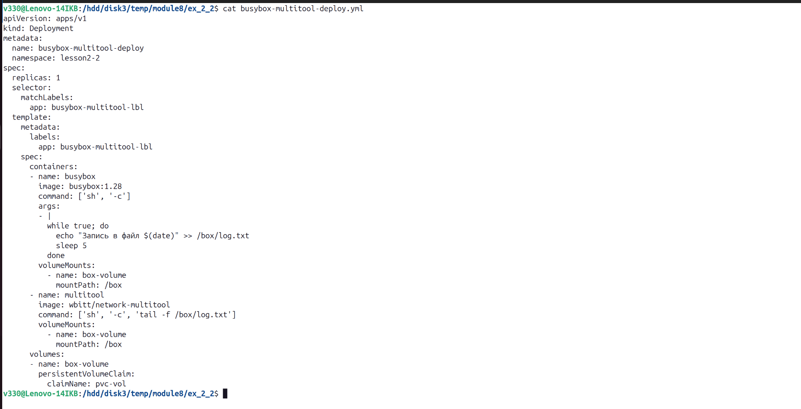  
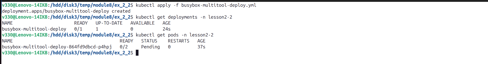  
  
2. Манифест [PV и PVC](busybox-multitool-volume.yml)  
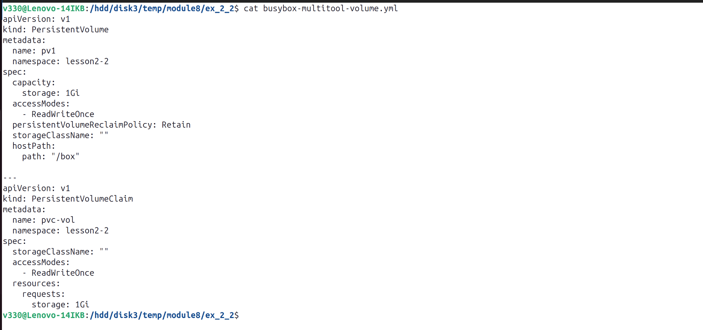  
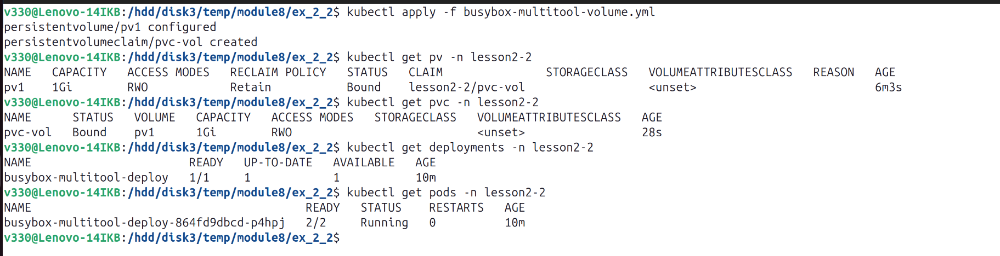  
  
3. `busybox` пишет каждые пять секунд в файл   
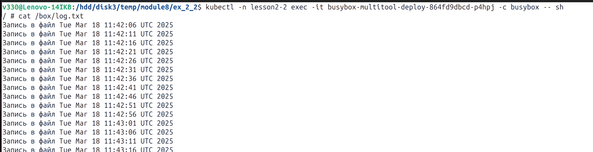  
  
4. Чтение файла `multitool`  
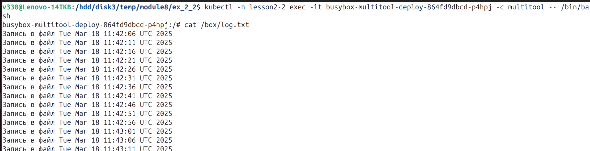  
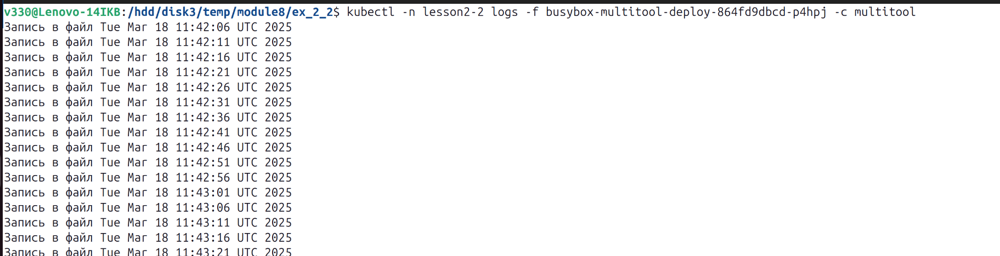  
  
5. Удалить Deployment  
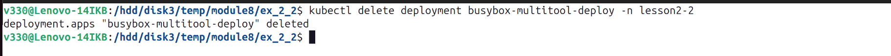  
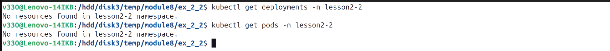  
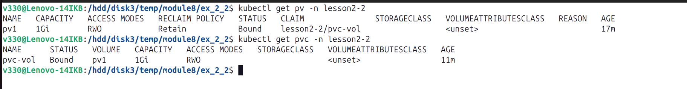  
  
6. Удалить PVC  
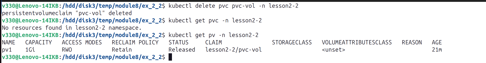  
  
Мы не можем удалить pv, пока есть pvc, который к нему привязан. Мы не можем удалить pvc, пока он присоединен к какому-то pod  
  
В нашем случае pod удален, поэтому pvc тоже удален.   
pv остается со статусом `Released`, показываюшим что больше нет привязанного к нему pvc `lesson2-2/pvc-vol`  
PV остаётся в состоянии Released, потому что политика persistentVolumeReclaimPolicy установлена на Retain. Это означает, что PV не будет автоматически удалено и будет ждать ручного управления

7. Файл сохранился на локальном диске ноды  
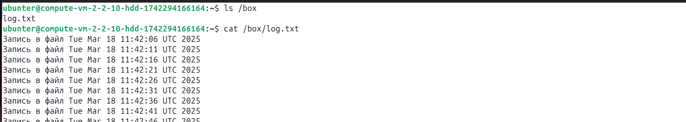  
  
8. Удалить PV  
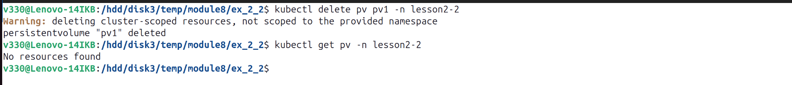  
  
pv удалился, потому что нет ни pod, ни pvc, к которому он привязан  
  
9. Файл сохранился на локальном диске ноды  
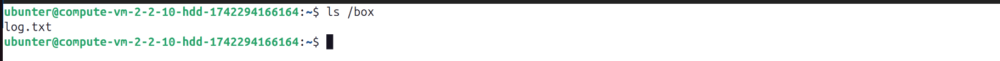  
  
данные на локальном диске не удаляются, потому что PV просто указывает на директорию на ноде, а не управляет ею напрямую
  
  
### Задание 2. Создать Deployment приложения, которое может хранить файлы на NFS с динамическим созданием PV.       
1. Включить NFS-сервер на `MicroK8S`  
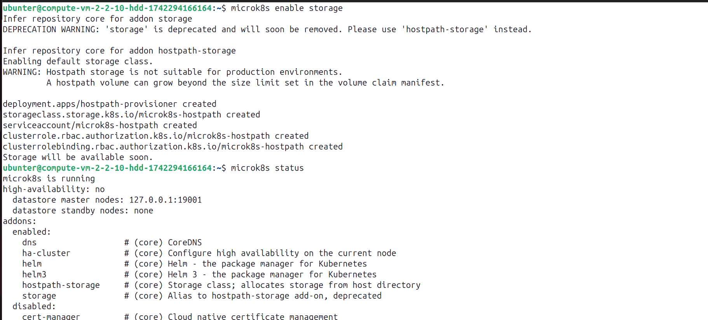  
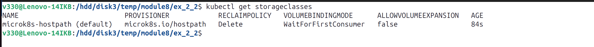  
  
2. Манифест [Deployment](multitool-nfs.yml) приложения `multitool`  
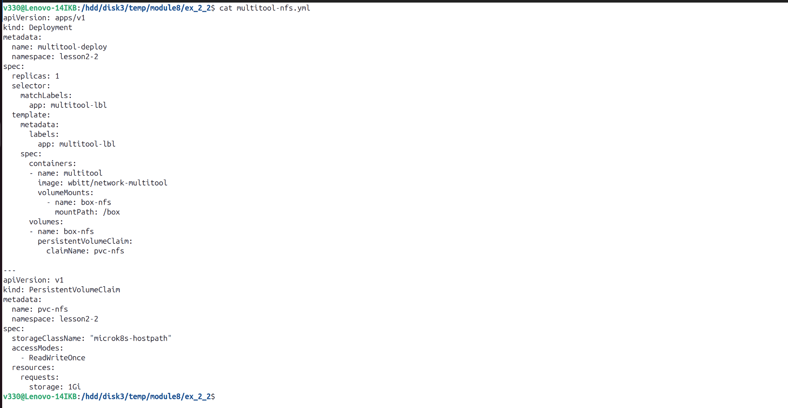  
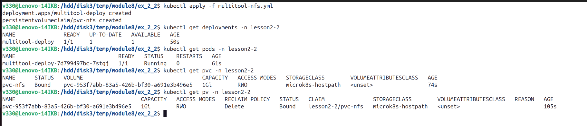  
  
3. Чтение и запись файла изнутри пода  
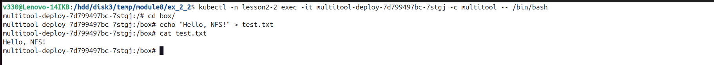  
  
4. Проверка файла на ноде  
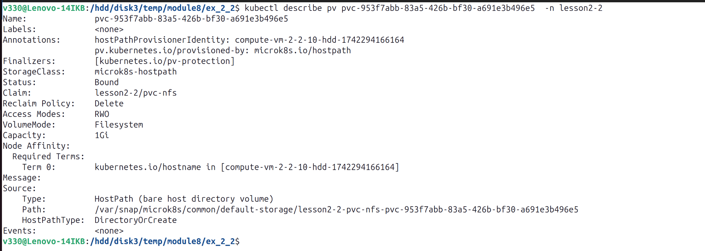  
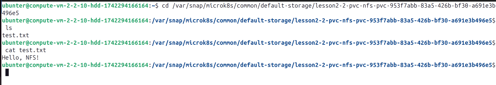  
  
***  
Файлы и скриншоты по задаче можно посмотреть [здесь](/)  

