# Домашнее задание к занятию «Безопасность в облачных провайдерах»   
  
***  
### Задание 1. Yandex Cloud  
1. С помощью ключа в KMS необходимо зашифровать содержимое бакета  

  1.1. Подготовить [Terraform](/terraform)  
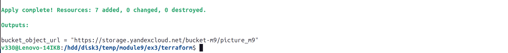  
  
  1.2. Output Terraform  
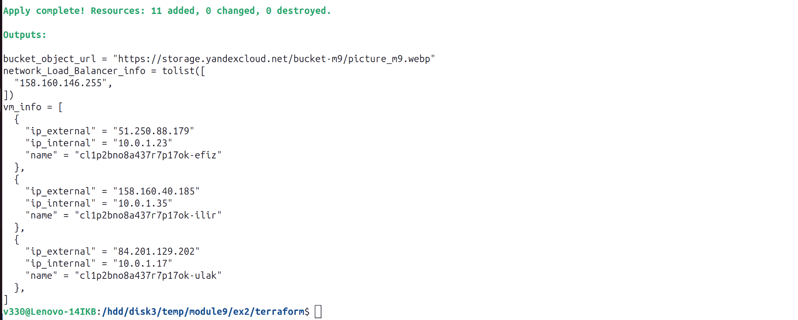  
  
  1.3. Создать ключ в KMS  
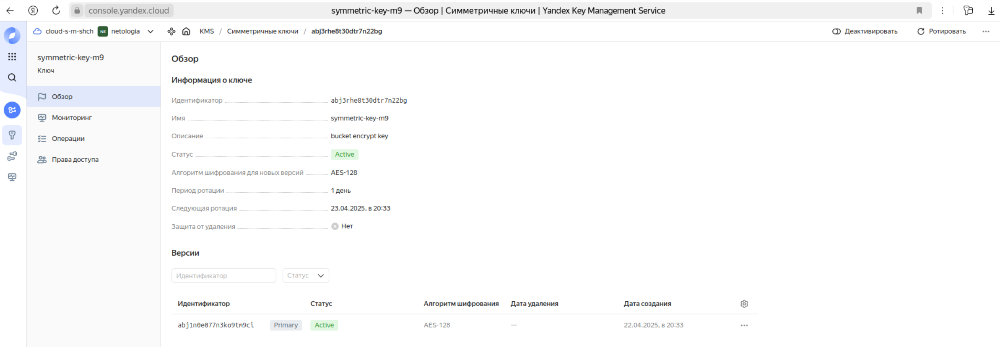  
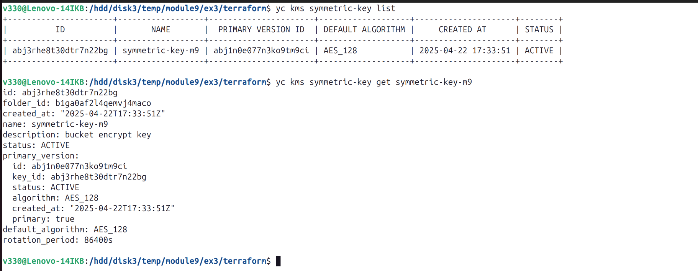  

  1.4. С помощью ключа зашифровать содержимое бакета  
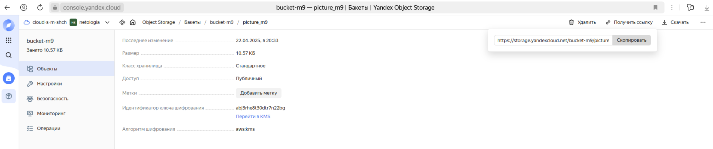  
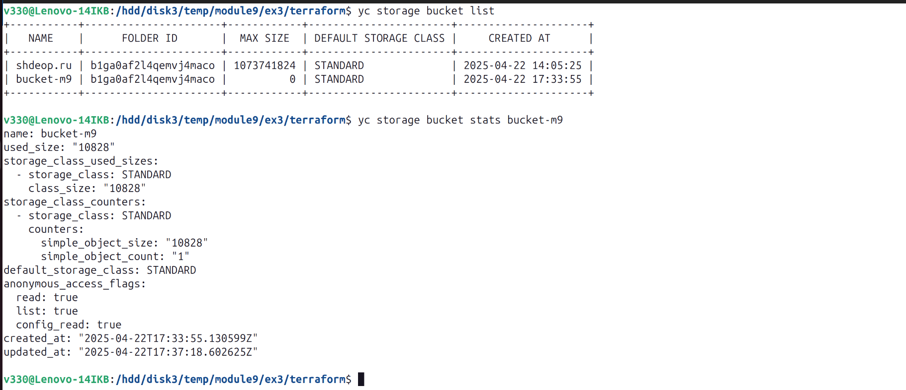  

  1.5. Результат  
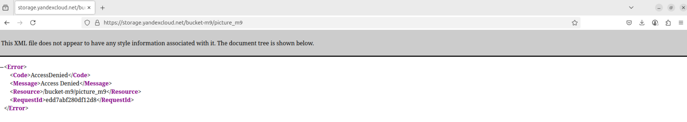  

2. Создать статический сайт в Object Storage c собственным публичным адресом и сделать доступным по HTTPS  

  2.1. Зарегистрировать домен на Рег.ру (Список DNS-серверов: ns1.yandexcloud.net и ns2.yandexcloud.net )  
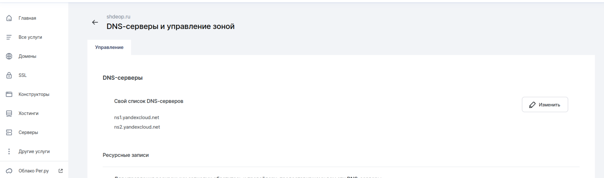  

  2.2. Создать зону в Cloud DNS  
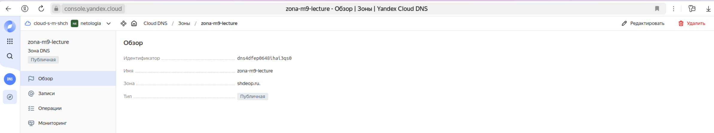  
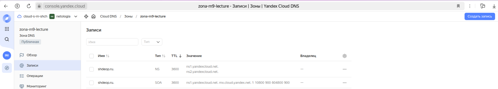  

  2.2. Создать сертификат  
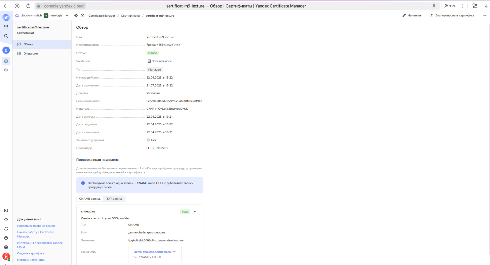  

  2.3. Создать статическую страницу в Object Storage и применить сертификат HTTPS  
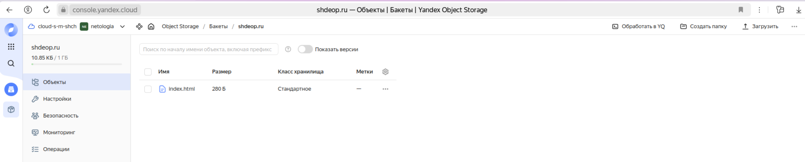  
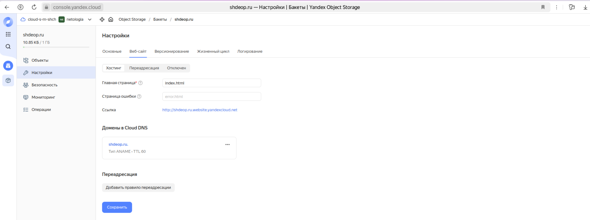  
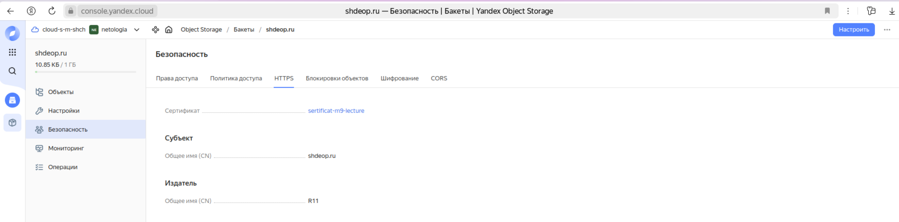  

  2.4. Предоставить скриншот на страницу с сертификатом в заголовке (замочек)  
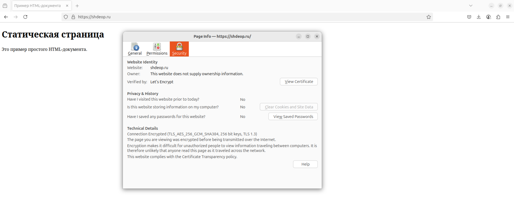  

***  
Файлы и скриншоты по задаче можно посмотреть [здесь](/)  

